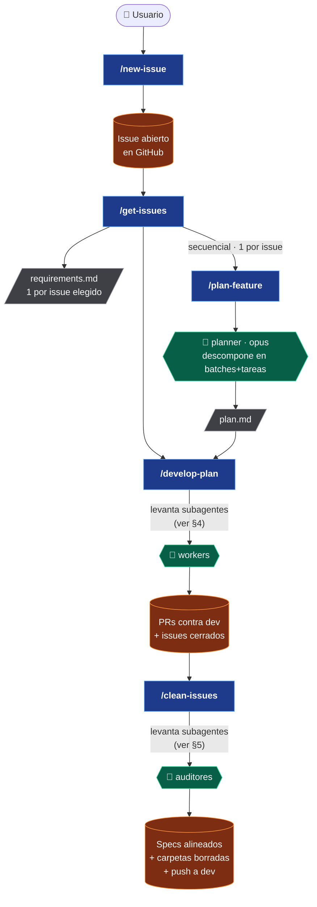
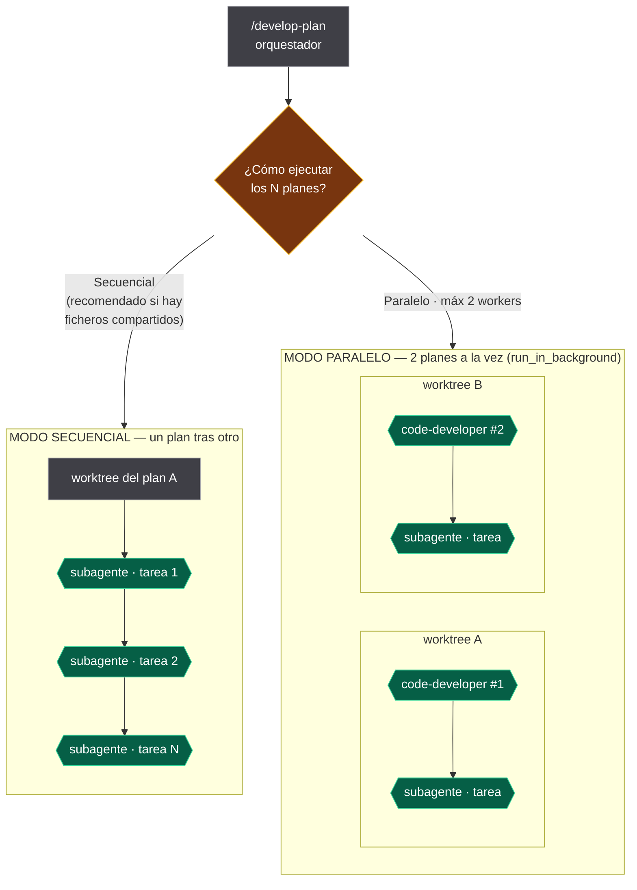
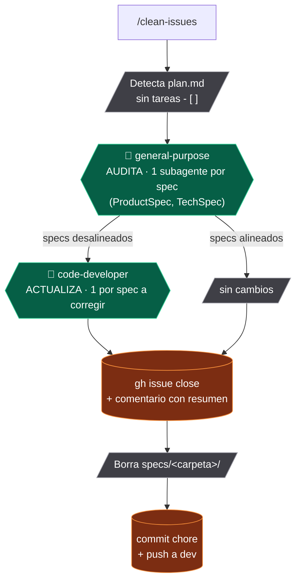
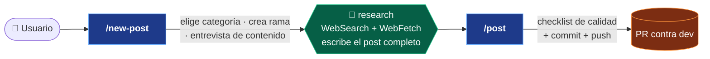
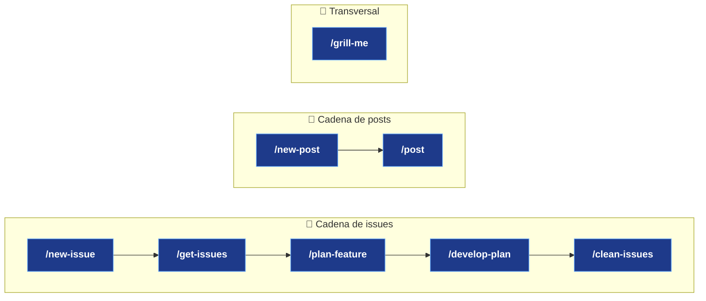

# `.claude/` — Guía del tooling agéntico

> **Para humanos.** Este documento NO lo lee Claude automáticamente (Claude solo carga `CLAUDE.md`, `settings.json`, las skills, los comandos y los agentes). Sirve para que tú y tus colaboradores entendáis de un vistazo **qué piezas hay aquí, en qué orden se usan, qué subagentes levanta cada una y dónde hay paralelización**.

---

## 1. Qué hay en esta carpeta

```
.claude/
├── settings.json      # Configuración del proyecto — registra los hooks
├── commands/          # Skills (comandos /slash) — el "qué hacer"
│   ├── new-issue.md
│   ├── get-issues.md
│   ├── plan-feature.md
│   ├── develop-plan.md
│   ├── clean-issues.md
│   ├── new-post.md
│   ├── post.md
│   └── grill-me.md
├── agents/            # Subagentes — los "trabajadores" que las skills levantan
│   ├── planner.md
│   ├── research.md
│   ├── code-developer.md
│   ├── code-reviewer.md
│   ├── test-developer.md
│   └── tester.md
└── hooks/             # Validaciones automáticas (ver §10)
    ├── session_context.py   # SessionStart — inyecta el modelo de ramas
    ├── protect_config.py    # PreToolUse — confirma antes de tocar config
    ├── protect_delete.py    # PreToolUse — confirma antes de borrar .md de docs/
    ├── validate_post.py     # PostToolUse — valida frontmatter y estructura
    └── build_check.py       # Stop — mkdocs build --strict si cambió docs/
```

- Una **skill** (`commands/*.md`) es un flujo orquestado: hace preguntas, lee/escribe ficheros, llama a `gh` y **delega trabajo pesado en subagentes**.
- Un **agente** (`agents/*.md`) es un trabajador con un rol y un set de herramientas acotado. No se invoca solo: lo **levanta una skill** (o el agente principal) con la herramienta `Agent`.

---

## 2. Las dos cadenas principales

El repo tiene dos flujos de trabajo independientes:

1. **Cadena de issues / features** → de una idea o bug hasta una PR fusionable y los specs alineados.
2. **Cadena de contenido (posts)** → de un tema hasta una PR con el post escrito y referenciado.

Y una skill transversal: **`/grill-me`**, que no pertenece a ninguna cadena (interroga y reescribe cualquier documento).

---

## 3. Cadena de issues — flujo completo

Este es el recorrido de punta a punta. Cada caja `/skill` es un comando; cada `{{ }}` es un subagente que esa skill levanta.



### Orden de invocación

| # | Skill | Qué hace | Subagentes que levanta | ¿Paralelo? |
|---|-------|----------|------------------------|------------|
| 1 | `/new-issue` | Clasifica bug vs feature, investiga/reproduce y abre el issue en GitHub | — (ninguno) | — |
| 2 | `/get-issues` | Lista issues abiertos, deja elegir, crea `specs/<carpeta>/requirements.md` | — directamente; **encadena** 3 y 4 | No (encadenado secuencial) |
| 3 | `/plan-feature` | Convierte un `requirements.md` en `plan.md` | **`planner`** (1) | No (1 agente) |
| 4 | `/develop-plan` | Orquestador: ejecuta los `plan.md` en worktrees aislados | **`code-developer`** y/o **por tarea** | **Sí, opcional** (ver §4) |
| 5 | `/clean-issues` | Alinea specs raíz, cierra issues, borra carpetas, push a `dev` | **`general-purpose`** + **`code-developer`** | Secuencial (1 por spec) |

> **Atajo importante:** `/get-issues` no se queda en el `requirements.md`. En su Paso 5 invoca `/plan-feature` **una vez por issue, de forma secuencial** (espera a que cada uno termine), y en el Paso 6 llama a `/develop-plan`. Es decir: una sola ejecución de `/get-issues` puede arrastrar toda la cadena 3 → 4.

---

## 4. Dentro de `/develop-plan` — aquí está la paralelización

`/develop-plan` es el único punto con **ejecución paralela real**. Actúa como orquestador puro: nunca toca código, solo crea worktrees de git y delega. Pregunta al usuario el modo:



**Reglas clave del modo paralelo:**

- **Máximo 2 workers simultáneos.** Los planes se procesan en lotes de 2.
- Cada worker es un **`code-developer`** lanzado con `run_in_background: true` en **su propio worktree de git** (`.worktrees/<slug>`), así no hay colisiones en el árbol de trabajo.
- Cada worker, a su vez, lanza **un subagente por tarea** (uno detectado por `@etiqueta` —p. ej. `code-developer`— o `general-purpose`). Regla de oro: **una tarea = un subagente**.
- Antes de ofrecer paralelo, el orquestador **analiza dependencias** (ficheros compartidos, referencias cruzadas). Si dos planes tocan los mismos ficheros, **avisa y recomienda secuencial** para evitar conflictos de merge.

**En modo secuencial** no hay paralelismo: un plan a la vez, y dentro de él una tarea a la vez.

| | Modo secuencial | Modo paralelo |
|---|---|---|
| Planes a la vez | 1 | hasta 2 |
| Worker por plan | el propio orquestador | `code-developer` en background |
| Tareas dentro de un plan | 1 a la vez | 1 a la vez (por worker) |
| Riesgo de conflicto | nulo | sí, si comparten ficheros |
| Cuándo usarlo | planes con ficheros comunes | planes independientes |

---

## 5. Dentro de `/clean-issues` — auditoría con subagentes

`/clean-issues` cierra el ciclo: alinea la documentación raíz con lo que realmente se implementó, cierra el issue y borra la carpeta de specs.



- **Un subagente por spec** en la fase de auditoría (no se mezclan specs en el mismo agente). Se ejecutan de forma secuencial.
- Solo los specs que el auditor marca como desalineados pasan a la fase de actualización con `code-developer`.
- Borra **solo** carpetas cuyo `plan.md` no tenga ya ninguna `- [ ]` pendiente.

---

## 6. Cadena de contenido (posts)

Independiente de la cadena de issues. Es la que usas para publicar en `carlosgrande.me/docs`.



| Skill | Qué hace | Subagentes | ¿Paralelo? |
|-------|----------|------------|------------|
| `/new-post` | Pregunta tema y profundidad, elige categoría, crea la rama `feature/post-<slug>`, hace una entrevista de contenido y delega la redacción | **`research`** (1) | No |
| `/post` | Revisa el post con un checklist, commitea, hace push y abre la PR **contra `dev`** | — | — |

> **Modelo de ramas:** las feature branches se fusionan en `dev` (preview en GitHub Pages). `dev` se promociona a `main` (producción en S3) en una PR aparte. Una PR de `feature/*` directa a `main` la **rechaza** el workflow `enforce-pr-source`.

---

## 7. Catálogo de agentes

Quién levanta a quién y para qué:

| Agente | Lo levanta | Rol | Herramientas | Modelo |
|--------|-----------|-----|--------------|--------|
| `planner` | `/plan-feature` | Descompone `requirements.md` → `plan.md` (batches + tareas < 1h) | Read, Glob, Grep, Bash, Write | opus |
| `research` | `/new-post` | Busca fuentes y escribe el post completo y referenciado | WebSearch, WebFetch, Read, Write | — |
| `code-developer` | `/develop-plan`, `/clean-issues` | Implementa tareas: JS del theme, plantillas `overrides/`, estilos, config, contenido | Read, Write, Edit, Bash, Grep, Glob | inherit |
| `code-reviewer` | `/develop-plan` (antes de la PR, si tocó código) | Revisión de calidad/seguridad/mantenibilidad | Read, Grep, Glob, Bash | inherit |
| `test-developer` | `/develop-plan` (por `@etiqueta`) | Escribe tests Vitest (`tests/unit/`) y Playwright (`tests/e2e/`) | Read, Write, Bash, Grep | inherit |
| `tester` | `/develop-plan` (por `@etiqueta`), bajo demanda | QA manual del sitio en vivo (`mkdocs serve` :8000, Chrome DevTools) | (sin Edit) | inherit |
| `general-purpose` | `/clean-issues` | Auditor de specs (1 por spec) / fallback | todas | — |

---

## 8. Ejemplos visuales (escenarios reales)

### Escenario A — Un bug, de principio a fin

```
Tú:  /new-issue  "el botón de exportar da 500"
     └─ investiga el código, reproduce en el navegador, abre el issue #42

Tú:  /get-issues
     ├─ eliges #42
     ├─ crea specs/fix-boton-exportar-500/requirements.md
     ├─ [secuencial] /plan-feature  → 🤖 planner → plan.md
     └─ /develop-plan
         └─ worktree .worktrees/boton-exportar-500
            └─ 🤖 subagente por tarea → PR contra dev → cierra #42

Tú:  /clean-issues
     ├─ 🤖 general-purpose audita los specs raíz
     ├─ 🤖 code-developer corrige los desalineados
     └─ borra la carpeta + push a dev
```

### Escenario B — Tres features a la vez (paralelo)

```
Tú:  /get-issues  → eliges #51, #52, #53
     └─ crea 3 requirements.md
        └─ [secuencial] 3× /plan-feature → 🤖 planner → 3 plan.md

Tú:  /develop-plan  → "Paralelo (2 workers)"
     │
     ├─ LOTE 1  (en background, a la vez):
     │   ├─ worktree A → 🤖 code-developer #1 → PR
     │   └─ worktree B → 🤖 code-developer #2 → PR
     │
     └─ LOTE 2  (cuando termina el lote 1):
         └─ worktree C → 🤖 code-developer → PR

⚠ Si #51 y #52 tocan los mismos ficheros, /develop-plan avisa
   y recomienda secuencial antes de lanzar.
```

### Escenario C — Escribir y publicar un post

```
Tú:  /new-post  "async generators en Python"
     ├─ eliges sección: notebooks/coding
     ├─ crea rama feature/post-async-generators-python
     ├─ entrevista de contenido (4/6/12 preguntas)
     └─ 🤖 research → busca fuentes + escribe el .md completo

Tú:  /post
     ├─ checklist de calidad (frontmatter, secciones, referencias)
     ├─ commit + push
     └─ PR contra dev
```

### Escenario D — Refinar un documento (transversal)

```
Tú:  /grill-me  specs/TechSpec.md
     ├─ eliges profundidad (4/6/12 preguntas)
     ├─ rondas de interrogatorio (máx 4 preguntas por ronda)
     └─ reescribe el documento integrando tus respuestas
        (sin levantar subagentes)
```

---

## 9. Resumen de un vistazo



| Pregunta | Respuesta corta |
|----------|-----------------|
| ¿Qué skill abre trabajo? | `/new-issue` (bugs/features) · `/new-post` (contenido) |
| ¿Qué skill planifica? | `/plan-feature` → agente `planner` |
| ¿Dónde hay paralelización? | Solo en `/develop-plan`, modo paralelo, **máx 2 workers** |
| ¿Qué aísla el trabajo concurrente? | Worktrees de git en `.worktrees/` |
| ¿Qué skill cierra el ciclo? | `/clean-issues` (issues) · `/post` (posts) |
| ¿Qué rama es el destino de las PR? | Siempre `dev`, nunca `main` |

---

## 10. Hooks — validación automática

Los hooks viven en `.claude/hooks/` (scripts Python, portables) y se registran en `.claude/settings.json`. Convierten las reglas de `CLAUDE.md` de "buenas intenciones" en garantías que se aplican solas, sin depender de que el agente las recuerde. Reciben el evento por stdin (JSON) y decidían con el código de salida o un JSON de respuesta.

| Hook | Evento · matcher | Qué hace | Bloquea |
|------|------------------|----------|---------|
| `session_context.py` | `SessionStart` | Inyecta el modelo de ramas `feature → dev → main` en el contexto de la sesión | No (solo informa) |
| `protect_config.py` | `PreToolUse` · `Write\|Edit` | Si el target es `mkdocs.yml`, `requirements.txt`, `package.json` o `.github/**`, pide confirmación al usuario (CLAUDE.md §3) | `ask` |
| `protect_delete.py` | `PreToolUse` · `Bash` | Si el comando borra un `.md` bajo `docs/`, pide confirmación (CLAUDE.md §3) | `ask` |
| `validate_post.py` | `PostToolUse` · `Write\|Edit` | En posts `docs/**/*.md`: valida frontmatter (`short_title`, `description≠none`, `date` ISO, `thumbnail`), H1 único y secciones numeradas. Avisa de lo que falta | No (recordatorio) |
| `build_check.py` | `Stop` | Si hubo cambios en `docs/` o `mkdocs.yml`, corre `mkdocs build --strict`; si falla, lo reporta para arreglarlo antes de cerrar | Sí (si el build rompe) |

**Notas:**

- Los hooks se cargan al **iniciar la sesión**. Si editas `settings.json` o un script, reinicia Claude Code para que surtan efecto.
- `protect_config` y `protect_delete` usan `permissionDecision: "ask"` (no un bloqueo duro): el usuario decide en el momento, de modo que un cambio intencionado sigue siendo posible con un clic.
- `validate_post` no revierte la edición (el `PostToolUse` se ejecuta después): solo devuelve un recordatorio para que se corrija en el acto. No se queja del scaffold recién creado (sin secciones todavía).
- `build_check` solo corre el build si la sesión tocó contenido o configuración, así que las sesiones de solo lectura cierran al instante.
