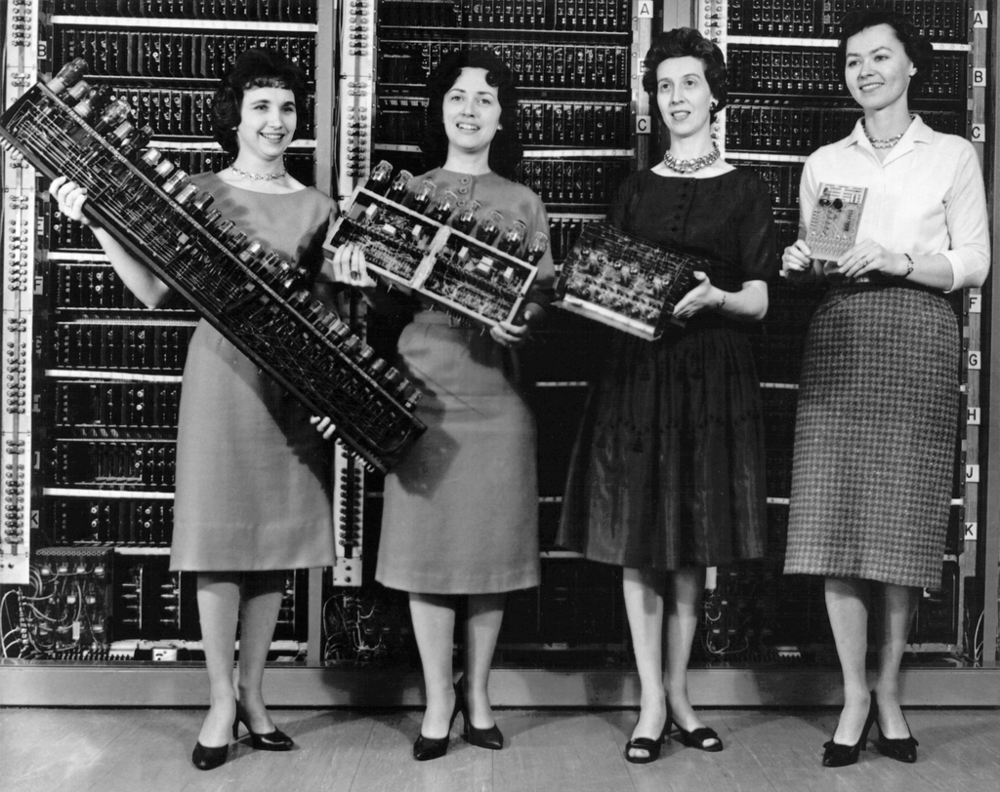
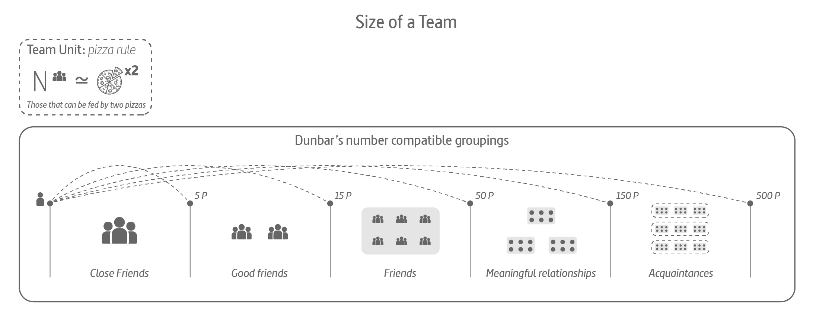
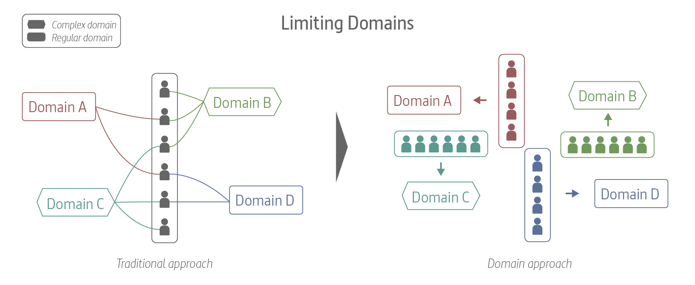
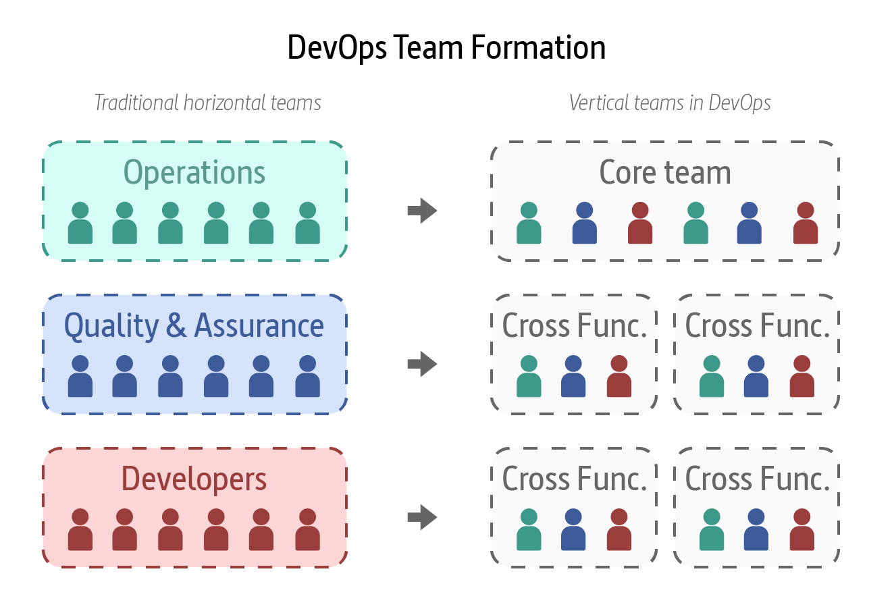

# Team topologies

{ .image-caption}

I recently joined a new project to design an Internal Developer Platform (IDP) from the scratch. I was so interested in analyzing the organization of the teams, its typologies and its interactions. I started looking for references and found the book The [*Team Topologies: Organizing Business and Technology Teams for Fast Flow*](https://teamtopologies.com/book) by Matthew Skelton and Manuel Pais.

I've long enjoyed learning from Matthew's and Manuel's work, and totally recommend their content. It's great to see that their vision for organizing teams has been collated into a single book.  For anyone in the tech/organization design field, *Team Topologies* is well worth reading. I share in this post my notes on reading this great book.

## 1 Team concepts

### 1.1 The Reverse Conway Maneuver

The reverse Conway maneuver gained traction in the technology world around 2015 and has been applied in many organizations since. Accelerate: The Science of Dev Ops by Nicole Forsgren, PhD, Jez Humble, and Gene Kim supports the importance of this strategy for high-performing organizations.

>**Conway law: Organizations wich design systems, are constrained to produce designs wich are copies of the communication structures of these organizations.**

Conway’s law tells us that an organization’s structure and the actual communication paths between teams persevere in the resulting architecture of the systems built. They void the attempts of designing software as a separate activity from the design of the teams themselves.

The effects of this simple law are far reaching. On one hand, the organization’s design limits the number of possible solutions for a given system’s architecture. On the other hand, the speed of software delivery is strongly affected by how many team dependencies the organization design instills.

Fast flow requires restricting communication between teams. Team collaboration is important for gray areas of development, where discovery and expertise is needed to make progress. But in areas where execution prevails—not discovery—communication becomes an unnecessary overhead.

In short, by considering the impact of Conway’s law when designing software architectures and/or reorganizing team structures, you will be able to takeadvantage of the isomorphic force at play, which converges the software architecture and the team design.

> **Organizations should evolve their team and organizational structure to achieve the desired architecture. The goal is for your architecture to support the ability of teams to get their work done—from design through to deployment—without requiring high-bandwidth communication between teams.**

### 1.2 Team First Approach

A research by Google on their own teams found that when it comes to measuring performance, teams matter more than individuals. It is a good approach to start with the team for effective software delivery. There are multiple aspects to consider like team size, team domains, team relationships, and team cognition.

#### 1.2.1 Limiting the Size of the teams

Amazon, for instance, is known for limiting the size of its software teams to those that can be fed by two pizzas. This limit, recommended by popular frameworks such as Scrum, derives from evolutionary limits on group recognition and trust known as **Dunbar’s number** (after anthropologist Robin Dunbar). Dunbar found fifteen to be the limit of the number of people one person can trust deeply. From those, only around five people can be known and trusted closely.

In the context of products and services enabled by software systems, the limits exposed by Dunbar’s number mean that the number of people in different business lines or streams of work should also explicitly be limited when the number of people in a department exceeds fifty (or 150, or 500), the internal and external dynamics with other groupings will change. This, in turn, means that the software architecture needs to be realigned with the new team groupings so that teams can continue to own the architecture effectively. This is an example of what we like to call “team-first architecture,” which requires a substantially new way of thinking for many organizations

- A single team: around five to eight people (based on industry experience)
- In high-trust organizations: no more than fifteen people
- Families (“tribes”): groupings of teams of no more than fifty people
- In high-trust organizations: groupings of no more than 150 people
- Divisions/streams/profit & loss (P&L) lines: groupings of no more than 150 or 500 people.

Organizations can be composed from Dunbar-compatible groupings of these sizes; when one of the limits is reached, the need to split off another unit as a semi-independent grouping arises. We can visualize this “scaling by Dunbar” as concentric circles of increasingly larger or smaller groups (see Figure)

#### 1.2.2 Limiting the number and type of domains per team

To get started, identify distinct domains that each team has to deal with, and classify these domains into simple (most of the work has a clear path of action), complicated (changes need to be analyzed and might require a few iterations on the solution to get it right), or complex (solutions require a lot of experimentation and discovery). You should finetune the resulting classification by comparing pairs of domains across teams.

- The first heuristic is to **assign each domain to a single team**. If a domain is too large for a team, instead of splitting responsibilities of a single domain to multiple teams, first split the domain into subdomains and then assign each new subdomain to a single team.
- The second heuristic is that **a single team should be able to accommodate two to three “simple” domains**. Because such domains are quite procedural, the cost of context switching between domains is more bearable, as responses are more mechanical.
- The third heuristic is that **a team responsible for a complex domain should not have any more domains assigned** to them—not even a simple one.
- The last heuristic is **to avoid a single team responsible for two complicated domains**. Instead, it’s best to split the team into two separate teams of five people (by recruiting one or two more team members), so they can each be more focused and autonomous.

#### 1.2.3 Limiting the team cognitive load

With a team-first approach, the team's responsibilities are matched to the cognitive load that the team can handle. For software-delivery teams a team-first approach to cognitive load means limiting the size of the software system that a team is expected to work with; that is, organizations should not allow a software subsystem to grow beyond the cognitive load of a team responsible for the software.

**Cognitive load** was characterized in 1988 by psychologist Jhon Sweller as **"the total amount of mental effort being used in the working memory."** Sweller defines three different kinds of cognitive load:

- **Intrinsic cognitive load:** relates to aspect of the task fundamental to the problem space. (How do I create a new method?)
- **Extraneous cognitive load:** relates to the environment in which the task is being done (How do I deploy this component again?)
- **Germane cognitive load:** relates to aspects of the task that need special attention for learning or high performance. (How should a service interact with other service)

For example, the intrinsic cognitive load for a developer could be the knowledge of the computer language being used, the extraneous cognitive load might be details of the commands needed to instantiate a dynamic testing environment, and the germane cognitive load could be the specific aspects of the business domain that the developer is programming.

For effective delivery and operations of modern software systems, organizations should attempt to minimize intrinsic cognitive load (through training, good choice of technologies, hiring, pair programming, etc.) and eliminate extraneous cognitive load altogether (boring or superfluous tasks or commands that add little value to retain in the working memory and can often be automated away), leaving more space for germane cognitive load (which is where the “value add” thinking lies).

### 1.3 Organizational sensing

Organizational sensing uses teams and their internal and external communication as the “senses” of the organization (sight, sound, touch, smell, taste)—what Peter Drucker calls “synthetic sense organs for the outside.” To sense things (and make sense of things), organisms need defined, reliable communication pathways. Similarly, with well-defined and stable communication pathways between teams, organizations can detect signals from across the organization and outside it, becoming something like an organism.

> **Organizational sensing is the use of sociotechnical inputs (software, digital sensors, human groups, and “weak signals”) to provide rich awareness of the internal and external business environment.**

A key aspect of this sensory feedback is the use of IT operations teams as high-fidelity sensory input for development teams, requiring joined-up communications between teams running systems (Ops) and teams building systems (Dev). It is essential that organizations use signals from maintenance work as input to software-development activities. In the The DevOps Handbook, Gene Kim and colleagues define The Three Ways of DevOps for modern, high-performing organizations:

- **Systems thinking:** optimize for fast flow across the whole organization, not just in small parts.
- **Feedback loops:** Development informed and guided by Operations.
- **Culture of continual experimentation and learning:** sensing and feedback for every team interaction.

## 2 Team Topologies

By deploying the four fundamental team topologies with the three core team interaction modes, organizations gain crucial clarity of purpose for their teams on an ongoing basis. Teams understand how, when, and why they need to collaborate with other teams; how, when, and why they should be consuming or providing something “as a service”; and how, when, and why they should provide or seek facilitation with another team. Thus, an organization should expect to see different kinds of interactions between different kinds of teams at any given time as the organization responds to new challenges.

### 2.1 Teams

The four fundamental team topologies—stream aligned, enabling, complicated subsystem, and platform—should act as “magnets” for all team types. All teams should move toward one of these four magnetic poles; that is, we should prefer these types, and aim to adopt the purpose, role, responsibility, and interaction behavior of these fundamental types for every team in our organization. Simplifying the types of teams to just these four helps to reduce ambiguity within the organization.

#### 2.1.1 Stream-aligned teams

A “stream” is the continuous flow of work aligned to a business domain or organizational capability. Continuous flow requires clarity of purpose and responsibility so that multiple teams can coexist, each with their own flow of work.

> **Is a team aligned to a single, valuable stream of work; this might be a single product or service, a single set of features, a single user journey, or a single user persona.**

The stream-aligned team is the primary team type in an organization, and the purpose of the other fundamental team topologies is to reduce the burden on the stream-aligned teams.

Because a stream-aligned team works on the full spectrum of delivery, they are, by necessity, closer to the customer and able to quickly incorporate feedback from customers while monitoring their software in production. Such a team can react to system problems in near real-time, steering the work as needed. In the words of Don Reinertsen: “In product development, we can change direction more quickly when we have a small team of highly skilled people instead of a large team.

In most organizations, an effective team has a maximum size of around seven to nine people. Amazon, for instance, is known for limiting the size of its software teams to those that can be fed by two pizzas.

The Amazon two-pizza-team model is an example of stream-aligned teams: the teams are substantially independent, have ownership over their services, and have responsibility for the runtime success of the software they write. The fact that Amazon has been using this model for over seventeen years shows how effective it can be to align teams to independent streams of change.

#### 2.1.2 Platform teams

Jutta Eckstein has a suitable recommendation: “Technical-service teams should always regard themselves as pure service providers for the domain teams.”

>**The purpose of a platform team is to enable stream-aligned teams to deliver work with substantial autonomy. The platform team provides internal services to reduce the cognitive load that would be required from stream-aligned teams to develop these underlying services.**

In practice, platform teams are expected to focus on providing a smaller number of services of acceptable quality rather than a large number of services with many resilience and quality problems.

In large organizations, a platform will need more than one team to build and run it (and in some cases, separate streams may each have their own platform). In these situations, a platform is composed of groups of other fundamental team types: stream aligned, enabling, complicated subsystem, and platform. Yes: the platform is itself built on a platform (see more on this later in this chapter).

Traditionally, many infrastructure teams were responsible for all aspects of the live/production infrastructure, including any changes to applications deployed on that infrastructure. Converting an infrastructure team into a platform team enables rapid, safe flow of change both within the platform and—crucially—within stream-aligned teams.

#### 2.1.3 Enabling teams

How can a stream-aligned team with end-to-end ownership find the space for researching, reading about, learning, and practicing new skills? Stream-aligned teams are also under constant pressure to deliver and respond to change quickly.

>**An enabling team is composed of specialists in a given technical (or product) domain, cross-cut to the stream-aligned teams and have the required bandwidth to research, try out options, and make informed suggestions on adequate tooling, practices, frameworks, and any of the ecosystem choices around the application stack.**

Enabling teams have a strongly collaborative nature; they thrive to understand the problems and shortcomings of stream-aligned teams in order to provide effective guidance. Jutta Eckstein calls them “Technical Consulting Teams. The end goal of an enabling team is to increase the autonomy of stream-aligned teams by growing their capabilities with a focus on their problems first, not the solutions per se. 

#### 2.1.4 Complicated subsystem teams

We can’t expect to embed the necessary specialists in all the stream-aligned teams that make use of the subsystem; it would not be feasible, cost-effective, or in line with the stream-aligned team’s goals.

>**A complicated-subsystem team is responsible for building and maintaining a part of the system that depends heavily on specialist knowledge. The goal of this team is to reduce the cognitive load of stream-aligned teams working on systems that include or use the complicated subsystem.**

The critical difference between a traditional component team (created when a subsystem is identified as being or expected to be shared by multiple systems) and a complicated-subsystem team is that the complicated-subsystem team is created only when a subsystem needs mostly specialized knowledge. The decision is driven by team cognitive load, not by a perceived opportunity to share the component.

### 2.2. Teams Interactions

When considering the relationship between any teams, a key decision is whether to collaborate with another team to achieve an objective or to treat the other team as providing a service. This choice between collaboration or consuming a service can be made at many different levels within the organization: consuming infrastructure as a service (from AWS, Azure, or Google Cloud, for instance), collaborating on logging and metrics, relying on a complicated-subsystem team to build a complex audio-processing codec, or working together on application deployment.

To understand how and when to adapt the Team Topologies model for software systems, we need to define and understand three essential ways in which teams can and should interact, taking into account team-first dynamics and Conway’s law.

#### 2.2.1 Collaboration

During early phases of new systems development, and during periods where there is a need to quickly discover new information, technology limitations, and suitable practices, the collaboration mode is highly valuable. This is because team topologies that use collaboration can rapidly uncover new ways of working and unexpected behaviors of technologies.

The collaboration team mode is suitable where a high degree of adaptability or discovery is needed, particularly when exploring new technologies or techniques.

>**Two teams work closely together for a defined period to discover new patterns, approaches, and limitations. Responsibility is shared and boundaries blurred, but problems are solved rapidly and the organization learns quickly.**

The collaboration interaction mode is good for rapid discovery of new things, because it avoids costly hand-offs between teams.

#### 2.2.2 X as a Service

The X-as-a-Service team interaction mode is suited to situations where there is a need for one or more teams to use a code library, component, API, or platform that “just works” without much effort, where a component or aspect of the system can be effectively provided “as a service” by a distinct team or group of teams. The goal is to consume or provide something with minimal collaboration.

>**One team consumes something (such as a service or an API) provided “as a service” from another team. Responsibilities are clearly delineated and—if the boundary is effective—the consuming team can deliver rapidly. The team providing the service seeks to make their service as easy to consume as possible.**

During later phases of systems development and periods where predictable delivery is needed (rather than discovery of new approaches), the X-as-a-Service model works best. In this model, teams can rely on certain aspects of their technology landscape being provided as a service by other teams (internal or external), allowing the team to focus on delivering their work.

#### 2.2.3 Facilitating

The facilitating team interaction mode is suited to situations where one or more teams would benefit from the active help of another team facilitating (or coaching) some aspect of their work. The facilitating interaction mode is the main operating mode of an enabling team and provides support and capabilities to many other teams, helping to enhance the productivity and effectiveness of these teams. 

>**One team helps another team to learn or adopt new approaches for a defined period of time. The team providing the facilitation aims to make the other team self-sufficient as soon as possible, while the team receiving the facilitation has an open-minded attitude to learning.**

Teams that interact using the facilitating mode typically work across many other teams, detecting and reducing cross-team problems and helping to inform the direction and capabilities of things like code libraries, APIs, and platforms provided as a service by other teams or organizations.

## 3. Team topologies vocabulary

| Term | Definition |
| --------------------------- | ------------------------------------------------------------ |
| **Team Topologies:** | a model for organizational design that provides a key technology-agnostic mechanism for modern software-intensive enterprises to sense when a change in strategy is required (either from a business or technology point of view). |
| **Digital Platform:** | a digital platform is a foundation of self-service APIs, tools, services, knowledge and support which are arranged as a compelling internal product. Autonomous delivery teams can make use of the platform to deliver product features at a higher pace, with reduced coordination. Evan Bottcher’s. |
| **Team:** | a stable grouping of five to nine people who work toward a shared goal as a unit as the smallest entity of delivery within the organization. |
| **Platform team:** | enables stream-aligned teams to deliver work with substantial autonomy. |
| **Enabling team:** | team(s) composed of specialists in a given technical (or product) domain; they help bridge the capability gap. |
| **stream-aligned team:** | a team aligned to a single, valuable stream of work. |
| **Dunbar’s number:** | is a suggested cognitive limit to the number of people with whom one can maintain stable social relationships—relationships in which an individual knows who each person is and how each person relates to every other person. This number was first proposed in the 1990s by British anthropologist Robin Dunbar, who found a correlation between primate brain size and average social group size. By using the average human brain size and extrapolating from the results of primates, he proposed that humans can comfortably maintain 150 stable relationships. |
| **Brooks’s law:** | is an observation about software project management according to which "adding manpower to a late software project makes it later". It was coined by Fred Brooks in his 1975 book The Mythical Man-Month. According to Brooks, under certain conditions, an incremental person when added to a project makes it take more, not less time. |
| **Conway’s law:** | law coined by Mel Conway that states that organizations, who design systems, are constrained to produce designs which are copies of the communication structures of these organizations. |
| **Cognitive load:** | the amount of working memory being used. |
|**Collaboration mode:** | team(s) working closely together with another team. |
| **Facilitating mode:** | team(s) helping (or being helped by) another team to clear impediments. |
| **X-as-a-Service mode:** | consuming or providing something with minimal collaboration. |
| **Domain complexity:** | how complex the problem is that is being solved via software. |
| **Fracture plane:** | a natural “seam” in the software system that allows it to be easily split into two or more parts. |
| **Organizational sensing:** | teams and their internal and external communication are the “senses” of the organization (sight, sound, touch, smell, taste). |

---

## References and links

- [Building Stronger, Happier Engineering Teams with Team Topologies](https://www.docker.com/blog/building-stronger-happier-engineering-teams-with-team-topologies/)
- [Team Topologies official website](https://teamtopologies.com/)
- [Team Topologies book](https://teamtopologies.com/book)
- [Organizational evolution for accelerating delivery of comparison services at Uswitch](https://teamtopologies.com/industry-examples/organizational-evolution-accelerating-delivery-of-comparison-services-uswitch)
- [Using Team Topologies to discover and improve reliability qualities](https://xebia.com/blog/using-team-topologies-to-discover-and-improve-reliability-qualities/)
- [Organizing Data Teams — Where to Make The Cut](https://towardsdatascience.com/organizing-data-teams-where-to-make-the-cut-49969c5ec093)
- [Data Team Organization](https://about.gitlab.com/handbook/business-technology/data-team/organization/)
- [How should our company structure our data team?](https://medium.com/snaptravel/how-should-our-company-structure-our-data-team-e71f6846024d)
- [More Notebooks like this here](https://carlosgrande.me/category/
myworks/notebooks/)