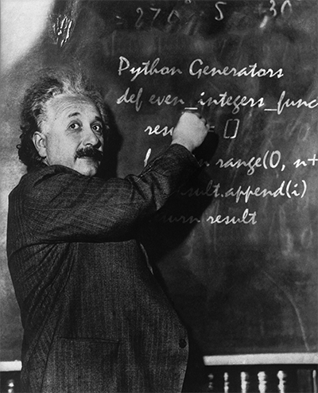

# Python generators

{ .image-caption }

Python generators overview

I wanted to share a post with some notes from the **Josh McQuiston** Python Generators course. It is a great course with basic content to learn how to code and use generators and coroutines in python.

## 1. Generator Functions and Expressions

Python provides a generator to create your own iterator function. A generator is a special type of function which does not return a single value, instead, it returns an iterator object with a sequence of values.
In a generator function, a yield statement is used rather than a return statement. The following is a simple generator function.

### Iterators

- Maintain state
- Use "lazy evaluation"
- Doesn't store sequence in memory

### Generator function

```python
# Function solution
def even_integers_function(n):
    result = []
    for i in range(0, n+1, 2):
        result.append(i)
    return result

# Generator function
def even_integers_generator(n):
    for i in range(0, n+1, 2):
        yield i

# CODE
number = 10
function = even_integers_function(number)
generator = list(even_integers_generator(number))

print(function)
print(generator)
```

```output
[0, 2, 4, 6, 8, 10]
[0, 2, 4, 6, 8, 10]
```

### Generator expression

```python
# Create the collection
names_list = ['Adam','Anne','Barry','Brianne',
              'Charlie','Cassandra','David','Dana']

# List comprenhension
list_comprenhension = [item.upper() for item in names_list]

# Generator expression
generator_expression = (item.upper() for item in names_list)

# Print the list comprenhension output
print(list_comprenhension) # return a list

# Print the generator expression output
print(list(generator_expression)) # return a generator object
```

```output
['ADAM', 'ANNE', 'BARRY', 'BRIANNE', 'CHARLIE', 'CASSANDRA', 'DAVID', 'DANA']
['ADAM', 'ANNE', 'BARRY', 'BRIANNE', 'CHARLIE', 'CASSANDRA', 'DAVID', 'DANA']
```

### Generator object

```python
# Generator function
def even_integers_generator(n):
    for i in range(0, n+1, 2):
        yield i
        
integers = even_integers_generator(10)
print(next(integers))
print(next(integers))
print(next(integers))
print(next(integers))
print(next(integers))
print(next(integers))
try:
    print(next(integers))
except ValueError:
    raise 'Generator is exahusted!'
```

```output
0
2
4
6
8
10
StopIteration
Traceback (most recent call last)
<ipython-input-101-99aabfd78e63> in <module>
     12 print(next(integers))
     13 try:
--&gt; 14     print(next(integers))
     15 except ValueError:
     16     raise 'Generator is exahusted!'
```

#### Avoiding exahusted generator

```python
generator_3 = even_integers_generator(3)

# Generator in a loop
print("Running generator 3 as a variable")
for i in generator_3:
    print(i)

# Try to print exahusted generator
try:
    next(generator_3)
except StopIteration as e:
    print('Error: Generator is exahusted!')
    
# Avoid the exahusted generator
print('Avoiding exahusted generator')
for i in even_integers_generator(3):
    print(i)
```

```output
Running generator 3 as a variable
0
2
Error: Generator is exahusted!
Avoiding exahusted generator
0
2
```

### Generator pipeline

- Several pipes can be linked together.
- Items flow one by one through the entire pipeline.
- Pipeline funtionality can be packaged into callable functions.

```python
import re

names = """Rhoda Hajduk
Armanda Pilling
Lahoma Mondragon
Angle Rase
Dave Cudd
Dawna Estey
Jone Jiron
Karina Vandyne
Calista Overbay
Cherise Retana
Pearly Breece
Lashanda Demoura
Jannie Hickey"""

# Names generator
names_generator = (name for name in re.split(' |\n', names))

# Lengths and name generator
lengths_generator = ((name, len(name)) for name in names_generator)

# Find the longest name in the tuples generator
max(lengths_generator, key=lambda x: x[1])
```

```output
('Mondragon', 9)
```

### Fibonacci example

```python
def fibbonacci_sequence(n):
    """
    Generates the Fibonacci sequence
    :param n: number of items calculated from the Fibonacci sequence
    :yield: the fibonacci number
    """
    first, second = 0, 1
    for i in range(0, n):
        if i == 0:
            yield 1
        else:
            yield first + second
            first, second = second, first + second

# CODE
print(list(fibbonacci_sequence(10)))
print(max(fibbonacci_sequence(10)))
```

```output
[1, 1, 2, 3, 5, 8, 13, 21, 34, 55]
55
```

## 2. Using Generators as Context Managers

Python object able to act as a control structure when used after "with" statement.

### Context manager using yield and @contextmanager decorator
```python
from contextlib import contextmanager

@contextmanager
def simple_context_manager(obj):
    try:
        obj.some_property += 1 # do something
        yield
    finally:
        obj.some_property -= 1 # Wrap up
        
class SomeObj(object):
    def __init__(self, arg):
        self.some_property = arg

# Create the object
obj = SomeObj(5)

# Print some property
print(f"some_property = {obj.some_property}")

# Print yield property with the context manager
with simple_context_manager(obj):
    print(f"some_property = {obj.some_property}")
    
# Print some property again to check
print(f"some_property = {obj.some_property}")
```

```output
some_property = 5
some_property = 6
some_property = 5
```

### Example in use

```python
from contextlib import contextmanager

HEADER = "this is the header \n\n"
FOOTER = "\n\nthis is the footer \n"

@contextmanager
def new_log_file(name):    
    try:
        logname = name
        f = open(logname, 'w')
        f.write(HEADER)
        yield f
    finally:
        f.write(FOOTER)
        f.close()

        
# TEST CODE
# Test new_log_file context manager
file_name = "Test Name.txt"
with new_log_file(file_name) as f:
    f.write('this is a test')
    
# Print file generated
with open(file_name) as f:
    print(f.read())
```

```output
this is the header
this is a test
this is the footer
```

## 3. Coroutines

Coroutines are build from a generator, but is conceptually different.
Element you give constantly things and may no return anything, instead it takes what is passed and do something with it. The main different with the generators is that the coroutines are not made for iteration.

- Repeatedly receives input.
- Processes input.
- Stops at yield statement.

Yield in corutines pauses flow and captures sent values.

```python
def counter(string):
    """Coroutine that sents one item at a time, and determine
    whether or not input is a string"""
    count = 0
    try:
        while True:
            item = yield
            # Check if the item is a string
            if isinstance(item, str):
                # Check if item is inside string variable
                if item in string:
                    count += 1
                    print(item)
                else:
                    print('No Match')
            else:
                print('Not a string')
    except GeneratorExit:
        print(count)
        
        
# TEST CODE
# Initializates the corutine function
c = counter('California')

# Prime the corutine and starting iteration at yield point
next(c)

# Sending some strings
c.send('Cali') # Getting a match
c.send('nia') # Getting a match
c.send('Hawaii') # Getting a no match
c.send(123)  # Getting a not a string

# Ending the corutine function and stoping iteration
c.close() # Outputs the counter variable
```

```output
Cali
nia
No Match
Not a string
2
```

### Coroutine Decorator

```python
def coroutine_decorator(func):
    def wrap(*args, **kwargs):
        cr = func(*args, **kwargs)
        next(cr)
        return cr
    return wrap


@coroutine_decorator
def coroutine_example():
    while True:
        x = yield
        #do something with x
        print(x)
        
c = coroutine_example()
c.send('Test the coroutine')
```

```output
Test the coroutine
```

#### Example

The concept of coroutines allow to keep the logic of opening and reading files, completely separate from filtering and counting it.

For this example we are using a list instead of a file to separate the "reading" from the processing.

```python
# Starting variable
names_str = """Rhoda Hajdukjo Armanda Pilling joLahoma Mondragon
Angle Rase Dave Cudd Dawna Estey Jone Jiron Karina Vandyne
Calista Overbay Cherise Retana Pearly Breece Lashanda Demoura
Jannie Hickey Tommie Leung Bong Humbertson Clifton Nees Maxwell Coupe
Maryam Lyons Vasiliki Stonge Danita Vallance Trisha Belin Salena Dulmage"""

# Sender function
def sender(string, target):
    """Is going to read the file and send it to a coroutine"""
    var_ready = string.split(' ')
    for i in var_ready:
        target.send(i.lower())
    target.close()
    

@coroutine_decorator
def match_counter(string):
    """Count the number of elements containing the string passed
    :string: string passed to check if is in the passed elements
    """
    count = 0
    try:
        while True:
            word = yield
            if string in word:
                count += 1
    except GeneratorExit:
        print(f'{count} results founded for string "{string}"')
        
@coroutine_decorator
def longer_than(n):
    """Check the number of elements longer than n
    :n: number of letters to check as a limit
    """
    count = 0
    try:
        while True:
            word = yield
            if len(word) > n:
                count += 1
    except GeneratorExit:
        print(f'There are {count} words longer than "{n}"')

# Test match_counter coroutine
c_match_counter = match_counter('da')
sender(names_str, c_match_counter)

# Test longer_than coroutine
c_longer_than = longer_than(6)
sender(names_str, c_longer_than)
```

```output
6 results founded for string "da"
There are 17 words longer than "6"
```

### Coroutine Pipelines

```python
# Creating the variable
names = ['Rhoda Hajdukjo', 'Armanda Pilling', 'joLahoma Mondragon',
         'Angle Rase', 'Dave Cudd', 'Dawna Estey', 'Jone Jiron',
         'Karina Vandyne', 'Calista Overbay', 'Cherise Retana',
         'Pearly Breece', 'Lashanda Demoura', 'Jannie Hickey',
         'Tommie Leung', 'Bong Humbertson', 'Clifton Nees']

# Creating router coroutine
@coroutine_decorator
def router():
    """It both receives data and sends data.
    Can branch in more than one direction and send to multiple targets"""
    try:
        while True: 
            name = yield
            (first, last) = name.split(' ')
            fnames.send(first)
            lnames.send(last.strip())
    except GeneratorExit:
        fnames.close()
        lnames.close()
        

# Creating file_write coroutine
@coroutine_decorator
def file_write(filename: str):
    """Get the words from the list split it into first and last names"""
    try:
        with open(filename, 'a') as file:
            while True:
                line = yield
                file.write(line+'\n')
    except GeneratorExit:
        file.close()

# CODE
if __name__=="__main__":
    fnames = file_write('first_names.txt')
    lnames = file_write('last_names.txt')
    router = router()
    
    # Loop to iterate through the names
    for name in names:
        router.send(name)
    router.close()
```

- - - - - -

## References and links

- Download the Jupyter notebook from: [github.com/charlstown/PythonGenerators](https://github.com/charlstown/PythonGenerators)
- [Python Generators course from Josh McQuiston](https://www.linkedin.com/learning/learning-python-generators)
- [Josh McQuiston LinkedIn profile](https://www.linkedin.com/in/joshmcquiston/)
- [More Notebooks like this here](https://carlosgrande.me/category/myworks/notebooks/)
