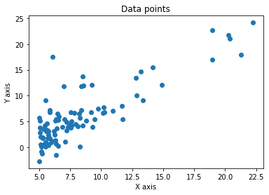
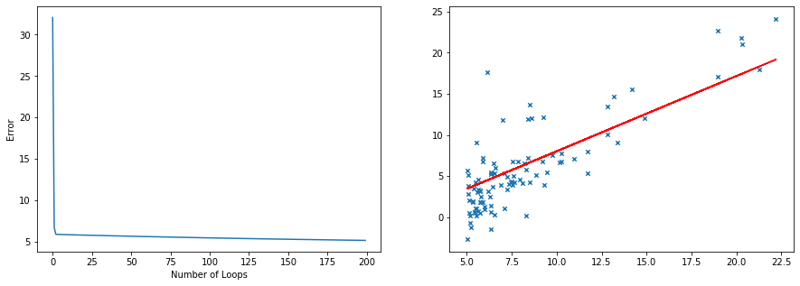
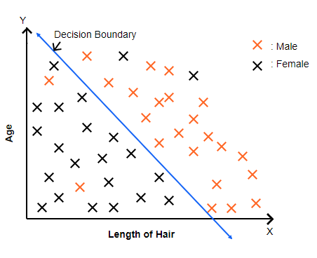
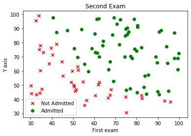
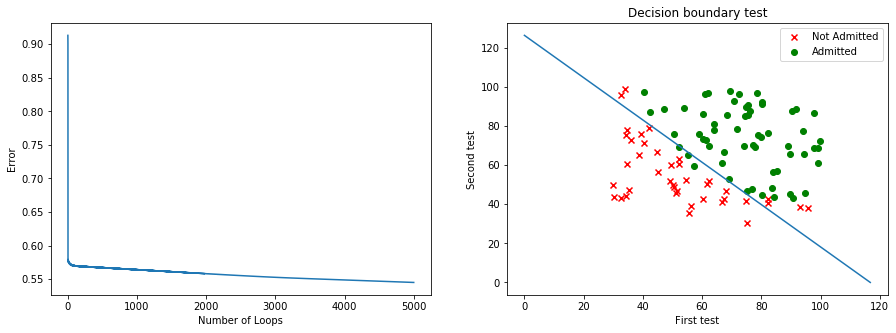

# Machine learning basics


## 1. Linear Regression with Multiple Variables

### Table data example

A multifeature variable is a variable that stores several related characteristics about one item or subject, instead of just a single value. Like the example in this table:

| Size(feet<sup>2</sup>) | N bedrooms | N floors | Age | Price (1K) |
|-|-|-|-|-|
| __x<sub>1</sub>__ | __X<sub>2</sub>__ | __X<sub>3</sub>__ | __X<sub>4</sub>__ | __y__ |
| 2104 | 5 | 1 | 45 | 460 |
| 1416 | 3 | 2 | 40 | 232 |
| 1534 | 3 | 2 | 30 | 315 |
|  852 | 2 | 1 | 36 | 178 |
|  ... |...|...|... | ... |


!!! note "Naming Convention"

    When defining your feature matrix **X**:

    - Always include a **bias term**:  
      `X₀ = 1` for all rows.
    - **X₁ … Xₙ** → feature columns (n variables)
    - **m** → number of training examples (rows)
    - **X<sub>1</sub><sup>1</sup> … X<sub>1</sub><sup>m</sup>** → feature values per example


### Equations

- Linear hypothesis

  $$
  h_\theta(x) = \theta^T x = \theta_0 x_0 + \theta_1 x_1 + \theta_2 x_2 + \cdots + \theta_n x_n
  $$

- Quadratic hypothesis (example of adding polynomial terms)

  $$
  h_\theta(x) = \theta_0 + \theta_1 x_1 + \theta_2 x_2 + \theta_3 x_1^2 + \theta_4 x_2^2 + \theta_5 x_1 x_2 + \cdots
  $$

- Cost function (least squares)

  $$
  J(\theta) = \frac{1}{2m} \sum_{i=1}^{m} \bigl(h_\theta(x^{(i)}) - y^{(i)}\bigr)^2
  $$

- Gradient descent update

  $$
  \theta_j := \theta_j - \alpha\, \frac{1}{m} \sum_{i=1}^{m} \bigl(h_\theta(x^{(i)}) - y^{(i)}\bigr)\, x^{(i)}_j \quad \text{for } j=0,\dots,n
  $$

### Example

1. __Graphing the data__

    ```py
    import pandas as pd
    import numpy as np
    import seaborn as sns
    import matplotlib.pyplot as plt
    pd.options.display.max_columns = 500
    pd.options.display.max_rows = 500
    # =============================================================================

    #Load data
    data = pd.read_csv(r'_data/ex1data1.txt', header=None, names=['x', 'y'])

    #Plot data
    plt.plot(data.x, data.y, 'o')
    plt.title('Data points')
    plt.xlabel('X axis')
    plt.ylabel('Y axis')
    plt.show()

    #variables calculation
    m = len(data.x)
    theta = np.array([0, 0])
    vector_x = np.array([[1]*len(data.x), data.x]).transpose()
    vector_y = np.array(data.y)
    ```

    

2. __Initial cost function calculation__

    ```py
    #Cost function calculation
    def costfunc(vec_x, vec_y, theta, m):
        hypothesis = vec_x.dot(theta.transpose())
        error = (hypothesis-vec_y)
        cost = 1/(2*m) * np.sum(error**2)
        return cost, error

    #output
    cost = costfunc(vector_x,vector_y , theta, m)
    print('The initial cost for theta {} is J = {}'.format(theta,cost[0]))
    ```

    ```output
    The initial cost for theta [0 0] is J = 32.072733877455676
    ```

    The cost value of 32.07 shows that the model’s predictions are still quite far from the actual data points.

    This high error indicates that the initial parameters (θ = [0, 0]) need to be adjusted through training to better fit the data.

3. __Gradient descent calculation__

    ```py
    #Number of iterations
    cycles = 200
    alpha = 0.01

    #Gradient descent
    cost_h = []
    for i in range(cycles):
        costf = costfunc(vector_x, vector_y, theta, m)
        cost = costf[0]
        cost_h.append(cost)
        error = costf[1]
        theta_0 = theta[0] - alpha*(1/m)*np.sum(error)
        theta_1 = theta[1] - alpha*(1/m)*np.sum(error*vector_x[:, 1])
        theta = np.array([theta_0, theta_1])

    y_sol = [theta[0] + theta[1]*x for x in data.x]

    #Plot cost function
    print('Cost Function graph with Alpha = {} doing {} loops'.format(alpha, cycles))
    f, axs = plt.subplots(1,2,figsize=(15,5))
    plt.subplot(1, 2, 1)
    plt.plot(list(range(cycles)), cost_h)
    plt.xlabel('Number of Loops')
    plt.ylabel('Error')

    #Plot Line
    plt.subplot(1, 2, 2)
    plt.plot(data.x, y_sol, color = 'red')
    plt.scatter(data.x, data.y,marker='x', s=20)


    plt.show()
    print()
    print('The final error is {}'.format(cost))
    print()
    print('THE FINAL THETA IS {}'.format(theta))
    ```

    ```output
    Cost Function graph with Alpha = 0.01 doing 200 loops
    ```

    

    ```output
    The final error is 5.1786804785845755

    THE FINAL THETA IS [-1.12450181  0.9146286 ]
    ```

## 02. Logistic Regression Classification

Logistic Regression Classification is a method used to predict whether something belongs to one of two categories (like yes/no or 0/1).

It works by finding a relationship between the input features and the probability of an outcome using a special “S-shaped” curve called the sigmoid function.

### Table data example

| Data   | y | x1 | x2 | x3 | ... | x29 | x30 |
|--------|---|----|----|----|-----|------|------|
| Nº 1   | 0 | 1  | 0  | 1  | ... | 1    | 1    |
| Nº 2   | 1 | 0  | 0  | 0  | ... | 1    | 1    |
| Nº 3   | 0 | 0  | 0  | 1  | ... | 0    | 1    |
| ...    |...|... |... |... | ... | ...  | ...  |
| Nº 599 | 1 | 0  | 1  | 0  | ... | 0    | 1    |
| Nº 600 | 1 | 1  | 0  | 1  | ... | 0    | 0    |


### Equations

- Sigmoid hypothesis

    $$
    h_\theta(x) = g(\theta^T x) = \frac{1}{1 + e^{-\theta^T x}} \\
    h_\theta(x) = P(y = 1 \mid x; \theta)
    $$
    
    

    $$
    g(z) \ge 0.5 \quad \text{when} \quad z(x) \ge 0
    $$

- Non-linear decision boundaries

    $$
    h_\theta(x) = g(\theta_0 + \theta_1 x_1 + \theta_2 x_2 + \theta_3 x_1^2 + \theta_4 x_2^2)
    $$

- Cost function

    $$
    \text{cost}(h_\theta(x), y) =
    \begin{cases}
    -\log(h_\theta(x)), & \text{if } y = 1 \\
    -\log(1 - h_\theta(x)), & \text{if } y = 0
    \end{cases}
    $$

    $$
    \text{cost}(h_\theta(x), y) = -y \log(h_\theta(x)) - (1 - y) \log(1 - h_\theta(x))
    $$

    $$
    J(\theta) = \frac{1}{m} \sum_{i=1}^{m} \text{Cost}(h_\theta(x^{(i)}), y^{(i)})
    $$

    $$
    J(\theta) = -\frac{1}{m} \left[ \sum_{i=1}^{m} y^{(i)} \log(h_\theta(x^{(i)})) + (1 - y^{(i)}) \log(1 - h_\theta(x^{(i)})) \right]
    $$

- Gradient descent

    Gradient formula:

    $$
    \frac{\delta J(\theta)}{\delta \theta_j} = \frac{1}{m} \sum_{i=1}^{m} \left( h_\theta(x^{(i)}) - y^{(i)} \right) x_j^{(i)}
    $$

    Gradient descent:

    $$
    \min_{\theta} J(\theta)
    $$

    $$
    \text{Repeat} \left\{ \theta_j := \theta_j - \alpha \frac{1}{m} \sum_{i=1}^{m} \left( h_\theta(x^{(i)}) - y^{(i)} \right) x_j^{(i)} \right\}
    $$

### Decision boundary

This image shows how logistic regression divides data into two groups (Male and Female) using a decision boundary — the blue line.

Points on one side of the line are predicted as one class, and those on the other side as the opposite class; the line itself represents where the model is 50% unsure between the two.

$$
\text{when: } 
\begin{cases}
h(x) = 0 \\
g(z) = 0.5 \\
h(x) = \theta_0 + \theta_1 x_1 + \theta_2 x_2 = 0
\end{cases}
$$



### Example

1. Graphing data

    ```py
    import pandas as pd
    import numpy as np
    import seaborn as sns
    import matplotlib.pyplot as plt
    pd.options.display.max_columns = 500
    pd.options.display.max_rows = 500
    # =============================================================================
    # =========================== INSERT YOUR CODE BELOW ===========================
    # =============================================================================

    #Load data
    data = pd.read_csv(r'_data\ex2data1.txt', header=None, names=['x', 'x1', 'y'])
    datay0 = data.where(data.y == 0).dropna()
    datay1 = data.where(data.y == 1).dropna()

    #Printed data
    print(data.head())

    #Plot data
    plt.scatter(datay0.x, datay0.x1, marker = 'x', color='red', label ='Not Admitted')
    plt.scatter(datay1.x, datay1.x1, marker = 'o', color='green', label='Admitted')
    plt.title('Second Exam')
    plt.xlabel('First exam')
    plt.ylabel('Y axis')
    plt.legend()
    plt.show()
    ```

    ```output
            x         x1  y
    0  34.623660  78.024693  0
    1  30.286711  43.894998  0
    2  35.847409  72.902198  0
    3  60.182599  86.308552  1
    4  79.032736  75.344376  1
    ```

    

2. Initial cost function calculation

    ```py
    import math as mt

    #variables calculation
    m = len(data.x)
    theta = np.zeros((3,1))
    vector_x = np.array([[1]*len(data.x), data.x, data.x1]).transpose()
    vector_y = np.array(data.y)[np.newaxis].T

    #Cost function calculation
    def sigmoid(lst):
        sigmoid = lambda x: 1/(1+mt.e**(-x))
        output = np.array([sigmoid(i) for i in lst])
        return output

    def costfunc(vec_x, vec_y, theta, m):
        hx = vec_x.dot(theta)
        gx = sigmoid(hx)
        cost = vec_y * np.log(gx) + (1-vec_y) * np.log(1-gx)
        fcost = - (1/m) * np.sum(cost)
        return fcost, gx

    #output
    cost = costfunc(vector_x,vector_y , theta, m)
    print('The initial cost for theta {} is J = {}'.format(theta.T,cost[0]))
    ```

    ```output
    The initial cost for theta [[0. 0. 0.]] is J = 0.6931471805599453
    ```

3. Gradient Descent

    ```py
    #Number of iterations
    cycles = 5000
    alpha = 0.001068
    theta = np.array([-1, 0, 0])[np.newaxis].T

    #Variables
    cost_h = []
    theta_0 = theta[0]
    theta_1 = theta[1]
    theta_2 = theta[2]

    #Gradient descent
    for i in range(cycles):
        cost = costfunc(vector_x, vector_y, theta, m)
        cost_h.append(cost[0])
        gx = cost[1]
        theta_0 = theta_0 - alpha * 1/m * np.sum((gx-vector_y)*vector_x[:, 0][np.newaxis].T)
        theta_1 = theta_1 - alpha * 1/m * np.sum((gx-vector_y)*vector_x[:, 1][np.newaxis].T)
        theta_2 = theta_2 - alpha * 1/m * np.sum((gx-vector_y)*vector_x[:, 2][np.newaxis].T)
        theta = np.array([theta_0, theta_1, theta_2])

    #Otuput
    print('The final error is {}'.format(cost_h[-3:]))
    print()
    print('THE FINAL THETA IS {}'.format(theta.T))
    print()
    print('The minimum error found with 300k cycles and alpha = 0.001068 is J = 0.27582976320910635')
    print('And the final theta is: ')
    theta = np.array([-9.78506335, 0.08377175, 0.0775022])[np.newaxis].T
    print(theta.T)
    ```

    ```output
    The final error is [0.5451423473696985, 0.5451386883489806, 0.5451350293938765]

    THE FINAL THETA IS [[-1.31988582  0.0196853   0.01075302]]

    The minimum error found with 300k cycles and alpha = 0.001068 is J = 0.27582976320910635
    And the final theta is: 
    [[-9.78506335  0.08377175  0.0775022 ]]
    ```

4. Algorithm trial

    ```py
    #Original hypothesis
    eq = lambda x, y: sigmoid(theta[0] + x*theta[1] + y*theta[2])

    #Select a point by index to know the y
    index = 4
    y = eq(vector_x[index, 1], vector_x[index, 2])

    #Outputs
    print('hypothesis theta = {}, {}, {}'.format(theta[0], theta[1], theta[2]))
    print()
    print('With this hypothesis the point P(x1, x2) = ({}, {}) would have a y = {}'.format(vector_x[index, 1], vector_x[index, 2], y))
    ```
    ```output
    hypothesis theta = [-9.78506335], [0.08377175], [0.0775022]

    With this hypothesis the point P(x1, x2) = (79.0327360507101, 75.3443764369103) would have a y = [0.93553537]
    ```

    ```py
    #Resolving equation for two points
    theta.flatten()
    x_pts = []
    y_pts = []
    ##If x2 = 0
    y_pts.append(0)
    x1 = -theta[0]/theta[1]
    x_pts.append(x1)
    ##If x1 = 0
    x_pts.append(0)
    y2 = -theta[0]/theta[2]
    y_pts.append(y2)

    #Plot cost function
    print('Cost Function graph with Alpha = {} doing {} loops'.format(alpha, cycles))
    f, axs = plt.subplots(1,2,figsize=(15,5))
    plt.subplot(1, 2, 1)
    plt.plot(list(range(cycles)), cost_h)
    plt.xlabel('Number of Loops')
    plt.ylabel('Error')

    #Plot Line
    plt.subplot(1, 2, 2)
    plt.scatter(datay0.x, datay0.x1, marker = 'x', color='red', label ='Not Admitted')
    plt.scatter(datay1.x, datay1.x1, marker = 'o', color='green', label='Admitted')
    plt.plot(x_pts, y_pts)
    plt.title('Decision boundary test')
    plt.xlabel('First test')
    plt.ylabel('Second test')
    plt.legend()

    plt.show()
    ```

    ```output
    Cost Function graph with Alpha = 0.001068 doing 5000 loops
    ```

    


## 03. Neural Networks

### Equations

---

#### Forward propagation

Hidden layer:

$$
a_1^{(2)} = g(z_1^{(2)}) = g(\theta_{10}^{(1)} \cdot x_0 + \theta_{11}^{(1)} \cdot x_1 + \theta_{12}^{(1)} \cdot x_2 + \theta_{13}^{(1)} \cdot x_3)
$$

$$
a_2^{(2)} = g(z_2^{(2)}) = g(\theta_{20}^{(1)} \cdot x_0 + \theta_{21}^{(1)} \cdot x_1 + \theta_{22}^{(1)} \cdot x_2 + \theta_{23}^{(1)} \cdot x_3)
$$

$$
a_3^{(2)} = g(z_3^{(2)}) = g(\theta_{30}^{(1)} \cdot x_0 + \theta_{31}^{(1)} \cdot x_1 + \theta_{32}^{(1)} \cdot x_2 + \theta_{33}^{(1)} \cdot x_3)
$$

Output layer:

$$
h_\theta(x) = g(z_1^{(3)}) = g(\theta_{10}^{(2)} \cdot a_0^{(2)} + \theta_{11}^{(2)} \cdot a_1^{(2)} + \theta_{12}^{(2)} \cdot a_2^{(2)} + \theta_{13}^{(2)} \cdot a_3^{(2)})
$$

#### Cost function

**Logistic regression regularization**

$$
J(\theta) = -\frac{1}{m} \left[ \sum_{i=1}^{m} y^{(i)} \log h_\theta(x^{(i)}) + (1 - y^{(i)}) \log(1 - h_\theta(x^{(i)})) \right] + \frac{\lambda}{2m} \sum_{j=1}^{n} \theta_j^2
$$

**Neural network regularization**

$$
J(\theta) = -\frac{1}{m} \left[ \sum_{i=1}^{m} \sum_{k=1}^{K} y_k^{(i)} \log h_\theta(x^{(i)})_k + (1 - y_k^{(i)}) \log(1 - h_\theta(x^{(i)})_k) \right]
+ \frac{\lambda}{2m} \sum_{l=1}^{L-1} \sum_{i=1}^{s_l} \sum_{j=1}^{s_{l+1}} (\theta_{ji}^{(l)})^2
$$
