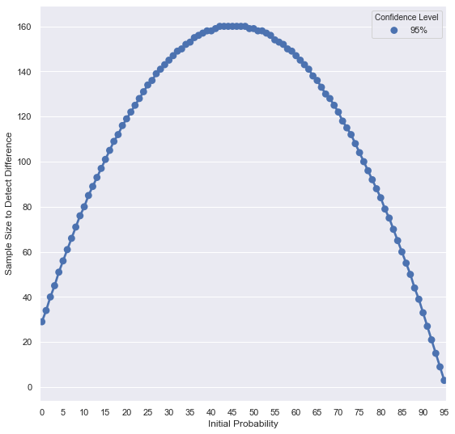
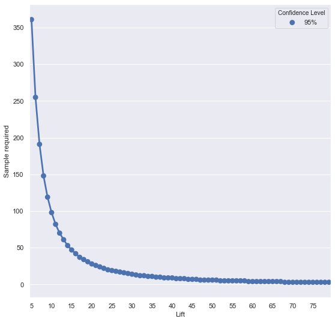

# Sample size determination

The goal is to estimate how many people must see the new assets to detect a meaningful improvement with confidence.

Nosh Mish Mosh plans an A/B test to see if an artisanal-looking vegetable selection increases purchases. Before we show anything to customers, we should estimate a minimum sample size so we avoid running an underpowered or wasteful test.

!!! note "What you need before sizing"
    - Baseline conversion (current rate)
    - Minimum Detectable Effect (MDE, uplift you care about)
    - Confidence level (typically 95%) and Significance (alpha = 1 - confidence)
    - Two-sided vs one-sided test (default to two-sided)

## Test Sizing Basics

Core inputs for sizing A/B tests.

| Concept | Description |
|-|-|
| Baseline conversion rate | Current conversion (control), as a proportion. |
| Minimum Detectable Effect (MDE) | Smallest uplift you care to detect (absolute or relative). |
| Significance (alpha) | False-positive tolerance; alpha = 0.05 for 95% confidence. |
| Confidence level | 1 - alpha (often 95%). |

!!! tip
    Use a recent baseline, pick a business‑relevant MDE, and default to a two‑sided, 95% confidence test.

Import libraries and define a small helper.

```py
# Libraries
import noshmishmosh
import pandas as pd
import numpy as np
from scipy import stats
import math
import seaborn as sns
from matplotlib import pyplot

# Functions
def tolist(tag):
    out = [i[tag] for i in visits]
    return out
```

## Build DataFrame

Create visits table; preview rows.

```py
visits = noshmishmosh.customer_visits

df_visits = pd.DataFrame({'ids': tolist('id'),
              'name': tolist('name'),
              'clickedthrough': tolist('clickedthrough'),
              'purchased': tolist('purchased'),
              'moneyspent': tolist('moneyspent')
             })


print(df_visits.head())
```

```output
     ids            name  clickedthrough  purchased  moneyspent
0  83421    Michael Todd            True      False         0.0
1  46042  Brianna Harmon            True      False         0.0
2  23766    Mario Arnold           False      False         0.0
3  20859      Paul Quinn           False      False         0.0
4  57771    Jerome Moore            True      False         0.0
```

## Baseline Conversion

Compute current conversion rate (payers / visitors).

```py
paying_visitors = df_visits[df_visits.purchased == True].ids.count()
print('Number of visitors that purchased: {}'.format(paying_visitors))

total_visitors = df_visits.ids.count()
print('Number of total visitors: {}'.format(total_visitors))

baseline = paying_visitors/total_visitors
print('The baseline is: {} %'.format(baseline*100))
```

```output
Number of visitors that purchased: 93
Number of total visitors: 500
The baseline is: 18.6 %
```

## Min Detectable Effect

Turn a weekly revenue goal ($1240) into conversion uplift via AOV and extra purchases.

```py
revenue = 1240

payments = noshmishmosh.money_spent
print('These are the first 5 payments sample: {}'.format(payments[:5]))

mean_payments = round(np.mean(payments))
print('The average payment is: {} $'.format(mean_payments))

n_payments = np.ceil(revenue/mean_payments)
print('We need {} payments to pull in the revenue'.format(int(n_payments)))
```

```output
These are the first 5 payments sample: [39.01, 10.16, 36.88, 23.41, 33.49]
The average payment is: 27.0 $
We need 46 payments to pull in the revenue
```

## Required Lift

Compute absolute conversion increase (extra purchases / visitors).

```py
lift = n_payments/total_visitors
print('The lift required is: {}%'.format(lift*100))
```

```output
The lift required is: 9.2%
```

Express MDE as a relative uplift over baseline: `MDE = lift / baseline`.

```py
minimum_detectable_effect = np.ceil(lift/baseline)
print('The minimum detectable effect is: {}'.format(minimum_detectable_effect))
```

```output
The minimum detectable effect is: 1.0
```

## Two-Prop Z Test

Define the Z‑statistic to compare two conversion rates.

The two-sample Z test for proportions determines whether a population proportion p1 is equal to another population proportion p2. In our example, p1 and p2 are the proportion of visitors before and after the marketing change, and we want to see whether there was a statistically significant increase in p2 over p1.

$$
Z = \frac{P_2 - P_1}{\sqrt{p^* (1 - p^*) \left( \frac{1}{n_1} + \frac{1}{n_2} \right)}}
$$

$$
p^* = \frac{n_1 p_1 + n_2 p_2}{n_1 + n_2}
$$

Where p* is the proportion of 'successes'. In this example the number of paying visitors.

Ultimately, we want to make sure we’re able to calculate a difference between p1 and p2 when it exists. So, let’s assume you know that the “true” difference that exists between p1 and p2. Then, we can look at sample size requirements for various confidence levels and absolute levels of p1.

We need a way of figuring out Z, so we can determine whether a given sample size provides statistically significant results, so let’s define a function that returns the Z value given p1, p2, n1, and n2.

```py
# Test that both populations have the same proportion (Z statistic).
def z_calc(p1, p2, n1, n2):
    p_star = (p1*n1 + p2*n2) / (n1 + n2)
    return (p2 - p1) / math.sqrt(p_star*(1 - p_star)*((1.0 / n1) + (1.0 / n2)))
```

Then, we can define a function that returns the sample required, given p1 (the before probability), p_diff (i.e. p2-p1), and alpha (which represents the p-value, or 1 minus the confidence level). For simplicity, we’ll just assume that n1 = n2. If you know in advance that n1 will have about a quarter of the size of n2, then it’s trivial to incorporate this into the function. However, you typically don’t know this in advance and in our scenario an equal sample assumption seems reasonable.

The function is fairly simplistic: it counts up from n starting from 1, until n gets large enough where the probability of that statistic being that large (i.e. the p-value) is less than alpha (in this case, we would reject the null hypothesis that p1 = p2). The function uses the normal distribution available from the scipy library to calculate the p-value and compare it to alpha.

```py
# Sample calculator
def sample_required(p1, p_diff, alpha):
    n = 1
    while True:
        z = z_calc(p1, p1+p_diff, n1=n, n2=n)
        p = 1 - stats.norm.cdf(z)
        if p < alpha:
            break
        n += 1
    return n
```

## Required Sample Size

Find the smallest n meeting 95% confidence for a 9.2% lift over an 18.6% baseline.

Compute required n with the helper; then visualize vs baseline and lift.


```py
sample_size = sample_required(baseline, lift, .05)
print('The final sample size is calculated with a baseline of {}% and a lift of {}%.'.format(baseline*100, lift*100), '\n')
print('For this example Nosh Mish Mosh needs to show the new pictures to {} people to make sure there is any improvement'.format(sample_size))
```

```output
The final sample size is calculated with a baseline of 18.6% and a lift of 9.2%. 

For this example Nosh Mish Mosh needs to show the new pictures to 114 people to make sure there is any improvement
```

## Size vs Baseline

Simulate required n across baselines (fixed lift, 95% confidence).

Build a DataFrame of required sizes by baseline.

```py

baseline_range = [i*.01 for i in range(96)]
data = []
for bsl in baseline_range:
    record = {}
    record['Probability Difference'] = lift
    record['Sample Size to Detect Difference'] = sample_required(p1=bsl,
                                                                p_diff=lift,
                                                                alpha=.05)
    record['Confidence Level'] = '95%'
    record['Initial Probability'] = bsl * 100
    data.append(record)

df = pd.DataFrame(data)
print(df.head())
```

```output
   Probability Difference  Sample Size to Detect Difference Confidence Level  \
0                   0.092                                29              95%   
1                   0.092                                34              95%   
2                   0.092                                40              95%   
3                   0.092                                45              95%   
4                   0.092                                51              95%   

   Initial Probability  
0                  0.0  
1                  1.0  
2                  2.0  
3                  3.0  
4                  4.0  
```

```py
Plot sample size versus baseline.
fig, ax = pyplot.subplots(figsize=(9, 9))
sns.set(style='darkgrid')

plot = sns.pointplot(x='Initial Probability',
            y='Sample Size to Detect Difference',
            hue='Confidence Level', ax = ax,
            data=df)

labels = []
for i in range(0, 101):
    if i % 5 == 0:
        labels.append(str(i))
    else:
        labels.append('')
plot.set_xticklabels(labels=labels);
```



As the figure shows, required sample size is highest when baseline is near 50% of the population. Differences are hardest to detect around mid-probabilities.

## Size vs Lift

Simulate required n across lifts (fixed baseline, 95% confidence).

```py
print(baseline*100)
Compute a DataFrame of required sizes by lift.
lift_range = range(5, 80)


samples_lift = [sample_required(baseline, lift/100, .05) for lift in lift_range]
dic = {'Lift': lift_range, 'Sample required': samples_lift, 'Confidence Level': '95%'} 
    
df = pd.DataFrame(dic)
print(df)
```

```output
18.6
    Lift  Sample required Confidence Level
0      5              361              95%
1      6              255              95%
2      7              191              95%
3      8              148              95%
4      9              119              95%
..   ...              ...              ...
70    75                3              95%
71    76                3              95%
72    77                3              95%
73    78                3              95%
74    79                3              95%

[75 rows x 3 columns]
```

```py
fig, ax = pyplot.subplots(figsize=(9, 9))
sns.set(style='darkgrid')

Plot sample size versus lift.
plot = sns.pointplot(x='Lift',
            y='Sample required',
            hue='Confidence Level', ax = ax,
            data=df)

labels = []
for i in range(5, 101):
    if i % 5 == 0:
        labels.append(str(i))
    else:
        labels.append('')
plot.set_xticklabels(labels=labels);
```



## Summary & Tips

This notebook shows how to translate business targets into MDE, then compute the required sample size and visualize how it varies with baseline and lift.

!!! summary "Key takeaways"
    - Size tests using baseline, MDE, and confidence level.
    - Derive MDE from revenue targets via average order value.
    - Sample size is largest near 50% baseline and for small lifts.


