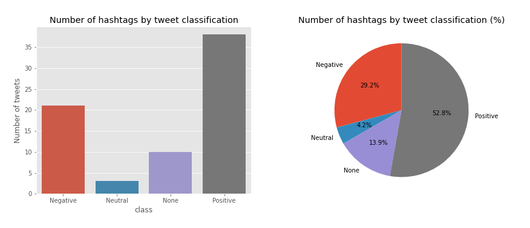

# Text mining sentiment analysis

In this section I wanted to post a Text Mining example about Sentimental Analysis on Twitter using Natural Language Processing tools. In this case we are going to test this tools with 1008 tweets in Spanish from twitter and train two different models using words frequencies as vectores (bag of words), a Naive-Bayes model and a SVM model.

## 1. Loading Data

```py
# Loading Data
corpus_path = r"CorpusTrainTASS"
tweets_data = load_files(corpus_path, encoding='utf-8')
X, y = tweets_data.data, tweets_data.target
sys.stdout.flush()
sys.stderr.flush()
# print('Files Loaded', '\n')
print(X[0])
```

```output
'@sosagraphs Pues tan sencillo porque en su día me puse a hacerlo y es de lo que mas encargos me hacen, aparte tengo mas estilos crack '
```

### 1.1 Loading Tweets in English

```py
df_tweets_en = pd.read_csv('helpers/tweets_en.csv')
list_tweets_en = list(df_tweets_en.tweets_en)

print(list_tweets_en[:2])
```

```output
['For @sosagraphs so simple because at the time I started to do and what makes me more commissions, other styles have more crack', '1477. No but because there just confi']
```

## 2. Naive-Bayes classification model

### 2.1 Naive-Bayes script function

```py
from sklearn.feature_extraction.text import CountVectorizer
from sklearn.feature_extraction.text import TfidfTransformer
from sklearn.model_selection import train_test_split
from sklearn.naive_bayes import MultinomialNB
from sklearn.metrics import classification_report, confusion_matrix, accuracy_score
from sklearn.metrics import plot_confusion_matrix

def nbayes(X, Y):
    plt.style.use('default')
    labels = ['Negative', 'Neutral', 'None', 'Positive']
    def basic_processing(X):
        documents = []
        for sen in range(0, len(X)):
            document = str(X[sen])
            documents.append(document)
        return documents

    documents = basic_processing(X)
    print('Documents processed', '\n')
    vectorizer = CountVectorizer()
    X = vectorizer.fit_transform(documents).toarray()

    # print(X)
    print('Vectorizer Done', '\n')
    tfidfconverter = TfidfTransformer()
    X = tfidfconverter.fit_transform(X).toarray()

    print('Starting trainning', '\n')

    # The data is divided into 20% test set and 80% training set.
    X_train, X_test, y_train, y_test = train_test_split(X, y, test_size=0.2, random_state=0)

    # Training the model
    clf = MultinomialNB().fit(X_train, y_train)
    y_pred = clf.predict(X_test)
    
    # Printing results
    print("------------------------------------------")
    print(classification_report(y_test,y_pred))
    print("------------------------------------------")
    print("accuracy",accuracy_score(y_test, y_pred))
    
    # Plot non-normalized confusion matrix
    titles_options = [("Confusion matrix, without normalization", None),
                      ("Normalized confusion matrix", 'true')]
    for title, normalize in titles_options:
        disp = plot_confusion_matrix(clf, X_test, y_test,
                                     display_labels=labels,
                                     cmap=plt.cm.Blues,
                                     normalize=normalize)
        disp.ax_.set_title(title)
    plt.show()
    return accuracy_score(y_test, y_pred)
```

### 2.2 Training the clasificator in Spanish

Training the Naive-Bayes clasificator with no preprocessing in Spanish

```py
tweets_es = X
target = y
# acc = nbayes(tweets_es, target)
```

```output
Documents processed 

Vectorizer Done 

Starting trainning 

------------------------------------------
              precision    recall  f1-score   support

           0       0.38      1.00      0.55        72
           1       0.00      0.00      0.00        31
           2       0.00      0.00      0.00        31
           3       0.82      0.13      0.23        68

    accuracy                           0.40       202
   macro avg       0.30      0.28      0.19       202
weighted avg       0.41      0.40      0.27       202

------------------------------------------
accuracy 0.400990099009901

/home/carlos/.local/lib/python3.6/site-packages/sklearn/metrics/_classification.py:1272: UndefinedMetricWarning: Precision and F-score are ill-defined and being set to 0.0 in labels with no predicted samples. Use `zero_division` parameter to control this behavior.
  _warn_prf(average, modifier, msg_start, len(result))
```


```py
df_results_bayes = pd.DataFrame({'model': ['n.bayes'], 'improve': ['default tweets_es'], 'accuracy': [acc]})
```

### 2.3 Training the clasificator in English

```py
acc = nbayes(list_tweets_en, target)
```

```output
Documents processed 

Vectorizer Done 

Starting trainning 

------------------------------------------
              precision    recall  f1-score   support

           0       0.38      0.99      0.55        72
           1       0.00      0.00      0.00        31
           2       0.00      0.00      0.00        31
           3       0.71      0.15      0.24        68

    accuracy                           0.40       202
   macro avg       0.27      0.28      0.20       202
weighted avg       0.38      0.40      0.28       202

------------------------------------------
accuracy 0.400990099009901

/home/carlos/.local/lib/python3.6/site-packages/sklearn/metrics/_classification.py:1272: UndefinedMetricWarning: Precision and F-score are ill-defined and being set to 0.0 in labels with no predicted samples. Use `zero_division` parameter to control this behavior.
  _warn_prf(average, modifier, msg_start, len(result))
```


```py
df_results_bayes = pd.DataFrame({'model': ['n.bayes'], 'improve': ['default tweets_en'], 'accuracy': [acc]})
```

## 3. Declaring useful functions

### 3.1 Declaring NLP functions

```py
def get_tags(text, nlp):
    nlp.max_length = 5000000
    # tokens generator
    doc = nlp(text, disable=['parser', 'ner'])
    tags = [t.pos__ for t in doc if
              (t.is_stop is False and t.is_punct is False and not t.text.isspace())]
    tags = list(set(tokens))
    return tags

def get_stops(text, nlp):
    nlp.max_length = 5000000
    text = text.lower()
    # stops generator
    doc = nlp(text)
    stops = [t.text for t in doc if t.is_stop]
    return stops

def get_tokens(text, nlp):
    nlp.max_length = 5000000
#     stops = nlp.Defaults.stop_words
    text = text.lower()
    # tokens generator
    doc = nlp(text, disable=['parser', 'ner'])
    tokens = [t.text for t in doc if
              (t.is_stop is False and t.is_punct is False and not t.text.isspace())]
    tokens = list(set(tokens))
    return tokens

def get_lemas(text, nlp):
    nlp.max_length = 5000000
    text = text.lower()
    # tokens generator
    doc = nlp(text, disable=['parser', 'ner'])
    tokens = [t.lemma_ for t in doc if
              (t.is_stop is False and t.is_punct is False and not t.text.isspace())]
    tokens = list(set(tokens))
    return tokens

def get_chunks(text, nlp):
    text = text.lower()
    # tokens generator
    doc = nlp(text)
    chunks = [chunk for chunk in doc.noun_chunks]
    if len(chunks) == 0:
        chunks = ''
    return chunks
```

### 3.2 Declaring other functions

```py
def counter(lst):
    output = {}
    for value in lst:
        count = len([i for i in lst if i == value])
        output[value] = count
    return output

def translate(string):
    translator = Translator()
    translated = translator.translate(string, src = 'en', dest='es').text
    time.sleep(2)
    return translated

def cleaner(lst, pattern):
    pattern = re.compile(pattern)
    clean = []
    for item in lst:
        if pattern.match(item):
            clean.append('')
        else:
            clean.append(item)
    return clean
```

## 4. Loading Spacy models and filtering stopwords

```py
# loading spacy module
nlp_es_spacy = spacy.load('es_core_news_md')
nlp_en_spacy = spacy.load('en_core_web_lg')
nlp_es = spacy.load('es_core_news_md')
nlp_en = spacy.load('en_core_web_lg')

# Loading selected stopwords in Spanish
with open('helpers/false_stops_es.json', 'r') as myfile:
    data=myfile.read()
false_stops_es = json.loads(data)

# Loading selected stopwords in English
with open('helpers/false_stops_en.json', 'r') as myfile:
    data=myfile.read()
false_stops_en = json.loads(data)

# Excluding selected stopwords in Spanish
for fstop in false_stops_es:
    nlp_es.vocab[fstop].is_stop = False

# Excluding selected stopwords in English
for fstop in false_stops_en:
    nlp_en.vocab[fstop].is_stop = False
```

## 5. Generating EDA Data Frame

```py
tweets_es = X
tweets_en = list_tweets_en
lemas_es = []
lemas_en = []
chunks_es = []
chunks_en = []
target = y

# Processing tokens with default stops
tokens_es = [get_tokens(tweet, nlp_es_spacy) for tweet in tweets_es]
tokens_en = [get_tokens(tweet, nlp_en_spacy) for tweet in tweets_en]

# Processing tokens with selected stops
tokens_es_selected = [get_tokens(tweet, nlp_es) for tweet in tweets_es]
tokens_en_selected = [get_tokens(tweet, nlp_en) for tweet in tweets_en]


# Processing lemas
lemas_es = [get_lemas(tweet, nlp_es) for tweet in tweets_es]
lemas_en = [get_lemas(tweet, nlp_en) for tweet in tweets_en]

# Procesing stops
stops_es = [get_stops(tweet, nlp_es_spacy) for tweet in tweets_es]
stops_en = [get_stops(tweet, nlp_en_spacy) for tweet in tweets_en]

# Data frame creation
df = pd.DataFrame({'tweets_es': tweets_es,
                   'tweets_en': tweets_en,
                   'tokens_es': tokens_es,
                   'tokens_es*': tokens_es_selected,
                   'tokens_en': tokens_en,
                   'tokens_en*': tokens_en_selected,
                   'lemas_es': lemas_es,
                   'lemas_en': lemas_en,
                   'stops_es': stops_es,
                   'stops_en': stops_en,
                   'target': target})
```

```r
library(kableExtra)

df_eda <- read.csv('df_eda_01.csv')
head(df_eda, 3) %>% kable() %>% kable_styling() %>% scroll_box(width = '100%')
```

| X | tweets_es | tweets_en | tokens_es | tokens_es. | tokens_en | tokens_en. | lemas_es | lemas_en | stops_es | stops_en | target |
|---|------------|------------|------------|-------------|------------|-------------|------------|------------|------------|------------|---------|
| 0 | @sosagraphs Pues tan sencillo porque en su día me puse a hacerlo y es de lo que mas encargos me hacen, aparte tengo mas estilos crack | For @sosagraphs so simple because at the time I started to do and what makes me more commissions, other styles have more crack | ['aparte', 'puse', 'encargos', 'y', 'a', 'sencillo', 'crack', '@sosagraphs', 'estilos'] | ['aparte', 'puse', 'hacerlo', 'encargos', 'y', 'a', 'sencillo', 'crack', 'porque', '@sosagraphs', 'estilos'] | ['makes', 'commissions', 'started', 'styles', 'time', 'simple', '@sosagraphs', 'crack'] | ['makes', 'because', 'commissions', 'started', 'styles', 'time', 'simple', '@sosagraphs', 'crack'] | ['hacerlo', 'encargo', 'y', 'a', 'sencillo', 'poner', 'porque', 'apartar', 'estilo', '@sosagraphs', 'crack'] | ['because', 'make', 'commission', '@sosagraph', 'time', 'style', 'start', 'simple', 'crack'] | ['pues', 'tan', 'porque', 'en', 'su', 'día', 'me', 'hacerlo', 'es', 'de', 'lo', 'que', 'mas', 'me', 'hacen', 'tengo', 'mas'] | ['for', 'so', 'because', 'at', 'the', 'i', 'to', 'do', 'and', 'what', 'me', 'more', 'other', 'have', 'more'] | 3 |
| 1 | 1477. No pero porque apenas hay confi | 1477. No but because there just confi | ['1477', 'confi'] | ['1477', 'no', 'confi', 'porque'] | ['1477', 'confi'] | ['1477', 'confi', 'because'] | ['1477', 'no', 'confi', 'porque'] | ['1477', 'confi', 'because'] | ['no', 'pero', 'porque', 'apenas', 'hay'] | ['no', 'but', 'because', 'there', 'just'] | 0 |
| 2 | Vale he visto la tia bebiendose su regla y me hs dado muchs grima | It've seen the aunt drinking his rule and hs given me muchs Grima | ['regla', 'tia', 'y', 'bebiendose', 'vale', 'hs', 'muchs', 'grima', 'visto'] | ['regla', 'tia', 'dado', 'y', 'bebiendose', 'vale', 'hs', 'muchs', 'grima', 'visto'] | ['aunt', 'rule', 'seen', 'given', "it've", 'hs', 'muchs', 'grima', 'drinking'] | ['aunt', 'rule', 'seen', 'his', "it've", 'given', 'hs', 'muchs', 'grima', 'drinking'] | ['tia', 'y', 'bebiendose', 'valer', 'hs', 'reglar', 'muchs', 'grima', 'vestir', 'dar'] | ['aunt', 'see', 'rule', '-PRON-', "it've", 'hs', 'muchs', 'grima', 'drink', 'give'] | ['he', 'la', 'su', 'me', 'dado'] | ['the', 'his', 'and', 'me'] | 0 |


## 6. Exploration Data Analysis

### 6.1 Visualization functions

```py
import seaborn as sns

def countplot(data, column = 'target', title = 'Countplot', xlab = 'class', ylab = 'Number of tweets'):
    labels = ['Negative', 'Neutral', 'None', 'Positive']
    plt.style.use('ggplot')
    plt.figure(figsize=(14, 11))

    # Bars plot
    plt.subplot(2, 2, 1)
    ax1 = sns.countplot(x=column, data=data)
    ax1.set_ylabel(ylab)
    ax1.set_xlabel(xlab)
    ax1.set_xticklabels(labels)
    ax1.title.set_text(title)
    
    # Pie plot
    total = len(data)
    data = list(data.groupby(column)[column].count()/total)
    ax2 = plt.subplot(2, 2, 2)
    ax2.pie(data, labels=labels, autopct='%1.1f%%', startangle=90)
    ax2.title.set_text(title + ' (%)')  
    plt.show()
    
def comparison_plot(df, colname, title = ''):
    if title == '':
        title = 'Number of tweets VS ' + colname
    filtered = df[df[colname] != ''].groupby('target').target.count()
    total_tweets = df.groupby('target').target.count()
    
    # Plotting data
    labels = ['Negative', 'Neutral', 'None', 'Positive']
    plt.style.use('ggplot')
    plt.figure(figsize=(14, 11))
    fig, ax = plt.subplots()
    x = np.arange(4)
    width = 0.3
    rects1 = ax.bar(x - width/2, total_tweets, width, label='tweets')
    rects2 = ax.bar(x + width/2, filtered, width, label= 'tweets with ' + colname)
    
    # Setting labels
    ax.set_ylabel('Frequency')
    ax.set_title(title)
    ax.set_xticks(x)
    ax.set_xticklabels(labels)
    ax.legend()
    plt.show()

def only_mentions(lst):
    pattern = re.compile('\.?@\w+')
    mentions = [mention for mention in lst if pattern.match(mention)]
    if len(mentions) == 0:
        mentions = ''         
    return mentions

def only_hash(string):
    pattern = re.compile('#\w+')
    hashtags = pattern.findall(string)
    hashtags = [i[1:] for i in hashtags]
    if len(hashtags) == 0:
        hashtags == ''
    return hashtags

def hash2word(hashtag):
    words = []
    b = False
    word = ''
    if hashtag == '':
        words = ''
    else:
        for i in range(len(hashtag)):
            letter = hashtag[i]
            if letter.isupper() and i != 0 and b == False:
                b = True
                word = word.lower()
                words.append(word)
                word = ''
                word += letter
            else:
                b = False
                word += letter
        word.lower()
        words.append(word)
        words = ' '.join(words)
    return words
    
def no_mentions(lst, lang = 'es'):
    if lang == 'es':
        rep = 'usuario'
    else:
        rep = 'user'
    pattern = re.compile('@\w+')
    clean = [lema for lema in lst]
    for lema in lst:
        if pattern.match(lema):
            clean.append(lema)
        else:
            clean.append(lema)
    return clean

def freq_table(df, col_name = 'items'):
    items = []
    targets = []
    column = df.iloc[:, 0]
    target = df.iloc[:, 1]
    for clm, tg in zip(column, target):
        for item in clm:
            items.append(item)
            targets.append(tg)
    df_freq = pd.DataFrame({col_name: items, 'target': targets})
    return df_freq
```

### 6.2 Number of tweets

```py
countplot(df, title = 'Number of tweets by category')
```


### 6.3 Stopwords analysis

```py
df_stops_freq_es = freq_table(df[['stops_es', 'target']], 'stopwords')
df_stops_freq_en = freq_table(df[['stops_en', 'target']], 'stopwords')
# df_stops_freq_es.head()

countplot(df_stops_freq_es, title = 'Number of stopwords by category')
```


#### 6.3.1 Clasifiying stopwords

```py
negative_stops_es = df_stops_freq_es[df_stops_freq_es.target == 0]\
    .groupby('stopwords').target.count().reset_index().sort_values(by=['target'], ascending = False)\
    .reset_index(drop=True).rename(columns={'target': 'freq'})
negative_stops_es.head(5)
```

```output
  stopwords  freq
0       que   250
1        de   226
2        no   207
3        me   154
4        la   134
```

```py
negative_stops_en = df_stops_freq_en[df_stops_freq_en.target == 0]\
    .groupby('stopwords').target.count().reset_index().sort_values(by=['target'], ascending = False)\
    .reset_index(drop=True).rename(columns={'target': 'freq'})
```

```py
positive_stops_es = df_stops_freq_es[df_stops_freq_es.target == 3]\
    .groupby('stopwords').target.count().reset_index().sort_values(by=['target'], ascending = False)\
    .reset_index(drop=True).rename(columns={'target': 'freq'})
# positive_stops_es.head(5)
```

```output
  stopwords  freq
0        de   152
1       que   138
2        la    94
3        el    84
4        en    78
```

```py
positive_stops_en = df_stops_freq_en[df_stops_freq_en.target == 3]\
    .groupby('stopwords').target.count().reset_index().sort_values(by=['target'], ascending = False)\
    .reset_index(drop=True).rename(columns={'target': 'freq'})
```

#### 6.3.2 Filtering important stopwords

```py
threshold = 0.3
df_merged_es = pd.merge(negative_stops_es, positive_stops_es, on='stopwords', how = 'outer')
df_merged_es = df_merged_es[(df_merged_es.freq_x.isna()) | (df_merged_es.freq_y.isna()) | (df_merged_es.freq_x/df_merged_es.freq_y <= threshold) | (df_merged_es.freq_y/df_merged_es.freq_x <= threshold)]

df_merged_es.head()
```

```output
   stopwords  freq_x  freq_y
2         no   207.0    60.0
16    porque    43.0    10.0
39        ni    16.0     1.0
40        le    16.0     3.0
45     están    15.0     3.0
```

```py
threshold = 0.3
df_merged_en = pd.merge(negative_stops_en, positive_stops_en, on='stopwords', how = 'outer')
df_merged_en = df_merged_en[(df_merged_en.freq_x.isna()) | (df_merged_en.freq_y.isna()) | (df_merged_en.freq_x/df_merged_en.freq_y <= threshold) | (df_merged_en.freq_y/df_merged_en.freq_x <= threshold)]
```

```py
merge_negative_stops_en = df_merged_en.sort_values(by='freq_x', ascending=False)
merge_negative_stops_es = df_merged_es.sort_values(by='freq_x', ascending=False)
# merge_negative_stops_es.head()
```

```output
   stopwords  freq_x  freq_y
2         no   207.0    60.0
16    porque    43.0    10.0
39        ni    16.0     1.0
40        le    16.0     3.0
45     están    15.0     3.0
```

```py
false_stops_es = list(df_merged_es[(df_merged_es.freq_x > 1) | (df_merged_es.freq_y >1)].stopwords)
false_stops_en = list(df_merged_en[(df_merged_en.freq_x > 1) | (df_merged_en.freq_y >1)].stopwords)

# Saving false stopwords
# with open('helpers/false_stops_en.json', 'w', encoding='utf-8') as f:
#     json.dump(false_stops_en, f, ensure_ascii=False, indent=4)
# with open('helpers/false_stops_es.json', 'w', encoding='utf-8') as f:
#     json.dump(false_stops_es, f, ensure_ascii=False, indent=4)
# false_stops_es[:5]
```

```output
['no', 'porque', 'ni', 'le', 'están']
```

### 6.4 Normalizing laughing ‘jaja’

```py
jaja_checker = []
tweets_jaja_es = []
tweets_jaja_en = []
pattern_es = re.compile('j\w*j\w*j\w*|a*ja+j[ja]*|lo+l')
pattern_en = re.compile('a*ha+h[ha]*|lo+l')

for index, row in df.iterrows():
    tweet_es = row.tweets_es
    tweet_en = row.tweets_en
    
#     find_en = re.findall('a*ha+h[ha]* | lo+l', tweet_en)
    finded = re.findall('j\w*j\w*j\w*|a*ja+j[ja]*|lo+l', tweet_es)
    if finded != []:
        new_tweet_es = pattern_es.sub(' risa ', tweet_es)
        new_tweet_en = pattern_en.sub(' laugh ', tweet_en)
        tweets_jaja_es.append(new_tweet_es)
        tweets_jaja_en.append(new_tweet_en)
        jaja_checker.append(True)
    else:
        tweets_jaja_es.append(tweet_es)
        tweets_jaja_en.append(tweet_en)
        jaja_checker.append('')

df['tweets_es'] = tweets_jaja_es
df['tweets_en'] = tweets_jaja_en
df['jaja_checker'] = jaja_checker
# print(tweets_jaja_es[22:24])
# print(tweets_jaja_en[22:24])
```

```output
["@ElSpeaker Life takes us through inextricable ways  laugh  I'm glad you have molado today's program", '@ Mamiauryner1 especially hope to have it with my  laugh  child. thanks beautiful ♥']
```

```py
tokens_jaja_es = [get_tokens(tweet, nlp_es) for tweet in tweets_jaja_es]
tokens_jaja_en = [get_tokens(tweet, nlp_en) for tweet in tweets_jaja_en]

df['tokens_jaja_es'] = tokens_jaja_es
df['tokens_jaja_en'] = tokens_jaja_en
```

```py
lemas_jaja_es = [get_lemas(tweet, nlp_es) for tweet in tweets_jaja_es]
lemas_jaja_en = [get_lemas(tweet, nlp_en) for tweet in tweets_jaja_en]

df['lemas_jaja_es'] = lemas_jaja_es
df['lemas_jaja_en'] = lemas_jaja_en

df_eda <- read.csv('df_eda_02.csv')
head(df_eda) %>% kable() %>% scroll_box(width = '100%')
```

| X | tweets_es (resumen) | tweets_en (resumen) | tokens_es | tokens_en | lemas_es | lemas_en | stops_es | stops_en | target | jaja_checker | tokens_jaja_es | tokens_jaja_en | lemas_jaja_es | lemas_jaja_en |
|---|----------------------|----------------------|------------|------------|------------|------------|------------|------------|---------|---------------|----------------|----------------|----------------|----------------|
| 0 | @sosagraphs Pues tan sencillo porque en su día me puse a hacerlo... | For @sosagraphs so simple because at the time I started to do... | ['estilos', 'y', 'encargos', ...] | ['commissions', 'crack', 'time', ...] | ['hacerlo', 'porque', 'encargo', ...] | ['style', 'crack', 'time', ...] | ['pues', 'tan', 'porque', ...] | ['for', 'so', 'because', ...] | 3 | — | ['hacerlo', 'porque', 'estilos', ...] | ['commissions', 'crack', 'time', ...] | ['hacerlo', 'porque', 'encargo', ...] | ['style', 'crack', 'time', ...] |
| 1 | 1477. No pero porque apenas hay confi | 1477. No but because there just confi | ['confi', '1477'] | ['confi', '1477'] | ['confi', 'porque', '1477', ...] | ['because', 'confi', '1477'] | ['no', 'pero', 'porque', ...] | ['no', 'but', 'because', ...] | 0 | — | ['confi', 'porque', '1477', ...] | ['because', 'confi', '1477'] | ['confi', 'porque', '1477', ...] | ['because', 'confi', '1477'] |
| 2 | Vale he visto la tia bebiendose su regla y me hs dado muchs grima | It’ve seen the aunt drinking his rule and hs given me muchs grima | ['bebiendose', 'hs', 'grima', ...] | ['aunt', 'rule', 'hs', ...] | ['bebiendose', 'hs', 'grima', ...] | ['aunt', 'rule', 'hs', ...] | ['he', 'la', 'su', ...] | ['the', 'his', 'and', ...] | 0 | — | ['bebiendose', 'hs', 'grima', ...] | ['aunt', 'rule', 'hs', ...] | ['bebiendose', 'hs', 'grima', ...] | ['aunt', 'rule', 'hs', ...] |
| 3 | @Baronachor El concepto es de lo más bonico, pero de eso a serlo hay un trecho | @Baronachor The concept is most bonico, but that there is a stretch to be | ['bonico', 'concepto', 'serlo', ...] | ['bonico', 'concept', 'stretch', ...] | ['bonico', 'concepto', 'serlo', ...] | ['bonico', 'stretch', 'concept', ...] | ['el', 'es', 'de', 'lo', ...] | ['the', 'is', 'most', 'but', ...] | 1 | — | ['bonico', 'concepto', 'serlo', ...] | ['bonico', 'stretch', 'concept', ...] | ['bonico', 'concepto', 'serlo', ...] | ['bonico', 'stretch', 'concept', ...] |

### 6.5 Lemas Analysis

#### 6.5.1 Lemas by frequency

```py
df_lemas_freq = freq_table(df[['lemas_es', 'target']], 'lemas')
df_lemas_freq.head()
```

```output
         lemas  target
0            a       3
1       porque       3
2  @sosagraphs       3
3     sencillo       3
4        crack       3
```

#### 6.5.2 Most repeated lemas

```py
all_lemas = df_lemas_freq.groupby('lemas').target.count().reset_index().sort_values(by=['target'], ascending = False)\
    .reset_index(drop=True).rename(columns={'target': 'freq'})

all_lemas.head()
```

```output
    lemas  freq
0       y   317
1      no   284
2       a   274
3  porque    62
4  gracia    54
```

##### Most repeated negative lemas

```py
negative_lemas = df_lemas_freq[df_lemas_freq.target == 0]\
    .groupby('lemas').target.count().reset_index().sort_values(by=['target'], ascending = False)\
    .reset_index(drop=True).rename(columns={'target': 'freq'})

negative_lemas.head()
```

```output
    lemas  freq
0      no   176
1       y   150
2       a   118
3  porque    41
4     ser    27
```

##### Most repeated positive lemas

```py
positive_lemas = df_lemas_freq[df_lemas_freq.target == 3]\
    .groupby('lemas').target.count().reset_index().sort_values(by=['target'], ascending = False)\
    .reset_index(drop=True).rename(columns={'target': 'freq'})

positive_lemas.head(5)
```

```output
    lemas  freq
0       y   100
1       a    77
2      no    50
3  gracia    37
4   bueno    34
```
### 6.6 User mentions analysis (@user)

```py
# Saving mentions by tweet in the data frame
mentions = [only_mentions(lema) for lema in df.lemas_es]
df['mentions'] = mentions
# df.iloc[0:4, [0, 1, -1]]
```

```py
df_eda_3 <- read.csv('df_eda_03.csv')
df_eda_3 %>% kable()
```

| X | tweets_es (resumen) | tweets_en (resumen) | mentions |
|---|----------------------|----------------------|-----------|
| 0 | @sosagraphs Pues tan sencillo porque en su día me puse a hacerlo y es de lo que más encargos me hacen... | For @sosagraphs so simple because at the time I started to do and what makes me more commissions... | ['@sosagraphs'] |
| 1 | No pero porque apenas hay confi | No but because there just confi | — |
| 2 | Vale he visto la tía bebiéndose su regla y me hs dado muchs grima | It’ve seen the aunt drinking his rule and hs given me muchs Grima | — |
| 3 | @Baronachor El concepto es de lo más bonico, pero de eso a serlo hay un trecho | @Baronachor The concept is most bonico, but that there is a stretch to be | ['@baronachor'] |


```py
df_mentions = df[df.mentions != ''].reset_index(drop=True)
countplot(df_mentions, title = 'Number of mentions by tweet classification')
```


```py
comparison_plot(df, 'mentions')
```


### 6.7 Hashtags analysis

```py
hashtags = [only_hash(tweet) if len(only_hash(tweet)) != 0 else '' for tweet in df.tweets_es]
df['hashtags'] = hashtags
# df.iloc[[7, 15, 26], [0, 2, -1]]
```

```r
df_eda_4 <- read.csv('df_eda_04.csv')
df_eda_4 %>% kable()
```

| X  | tweets_es (resumen) | tokens_es | hashtags |
|----|----------------------|------------|-----------|
| 7  | @Diego_FDM @el_pais La noticia perfecta para #NotasDelMisterio | ['notasdelmisterio', 'noticia', '@diego_fdm', 'perfecta', '@el_pais'] | ['NotasDelMisterio'] |
| 15 | Hoy microaventura en #kayak con dos expertos kayakistas Ría de Villaviciosa. @ El Puntal… https://t.co/y7j88bRmYK | ['microaventura', 'expertos', 'kayak', 'villaviciosa', 'puntal', 'https://t.co/y7j88brmyk', 'kayakistas', 'ría'] | ['kayak'] |
| 26 | 6 momentos en los que usar lentes de contacto es simplemente mejor ¡Feliz lunes! https://t.co/x06G1nkaH1 #optometria #lentesdecontacto | ['feliz', 'contacto', 'https://t.co/x06g1nkah1', 'lentesdecontacto', '6', 'simplemente', 'optometria', 'momentos', 'lunes', 'lentes'] | ['optometria', 'lentesdecontacto'] |

#### 6.7.1 Hashtags distribution analysis

```py
# Hashtags by frecuency and tweet
df_hashtags = df[df.hashtags != '']
countplot(df_hashtags, title = 'Number of hashtags by tweet classification')
```



```py
comparison_plot(df, 'hashtags')
```


#### 6.7.2 Hashtags frequency analysis

```py
df_hashtags_freq = freq_table(df[['hashtags', 'target']], 'hashtags')

df_hashtags_freq.head()
```

```output
           hashtags  target
0             playa       3
1  NotasDelMisterio       3
2             kayak       3
3        optometria       2
4  lentesdecontacto       2
```

```py
negative_hashtags = df_hashtags_freq[df_hashtags_freq.target == 0].reset_index(drop=True)\
    .groupby('hashtags').target.count().reset_index().sort_values(by=['target'], ascending = False)\
    .reset_index(drop=True).rename(columns={'target': 'freq'})

negative_hashtags.head(10)
```

```output
           hashtags  freq
0    askalvarogango     2
1         Algeciras     1
2          Sangüesa     1
3              rcde     1
4   justice4hombres     1
5  investiduraRajoy     1
6     emprendedores     1
7             dgtes     1
8            crisis     1
9      corrupciónPP     1
```

```py
positive_hashtags = df_hashtags_freq[df_hashtags_freq.target == 3]\
    .groupby('hashtags').target.count().reset_index().sort_values(by=['target'], ascending = False)\
    .reset_index(drop=True).rename(columns={'target': 'freq'})
```

```output
              hashtags  freq
0        HableConEllas     3
1       AcapulcoShore3     1
2         enlacabezaNo     1
3  TonyYSorayaEnMalaga     1
4      TrendingEstreno     1
5          WillyToledo     1
6            ahílodejo     1
7       altafitdonosti     1
8               askLFI     1
9       askalvarogango     1
```

#### 6.7.3 Hashtags to words

```py
# Extracting words from hashtags in a dictionary
all_hashtags = [hash for list in df.hashtags for hash in list]
h2word = [hash2word(hash) for hash in all_hashtags]
hash_dic = {h:w for h, w in zip(all_hashtags, h2word)}
```

```output
'hable con Ellas'
```

```py
# Processing hastags throught the hash_dic
words = []
for lst in df.hashtags:
    tags =[]
    if lst != '' and len(lst) != 1:
        for hs in lst:
            tag = hash_dic[hs]
            tags.append(tag)
    elif lst != '' and len(lst) == 1:
        tag = hash_dic[lst[0]]
        tags.append(tag)
    else:
        tags = ''
    tags = ' '.join(tags)
    words.append(tags)
    tags = []

# Saving the words in a new feature
df['hash2words'] = words
# df.iloc[[5, 7, 26], [0, 1, -1]]
```

```r
read.csv('df_eda_05.csv') %>% kable()
```

| X  | tweets_es (resumen) | tweets_en (resumen) | hash2words |
|----|----------------------|----------------------|-------------|
| 5  | Como siempre mi tortilla triunfa más que otros platos #playa… https://t.co/C60TC2teqV | As always my omelet triumphs over other dishes #beach… https://t.co/C60TC2teqV | playa |
| 7  | @Diego_FDM @el_pais La noticia perfecta para #NotasDelMisterio | @Diego_FDM @el_pais The perfect news for #NotasDelMisterio | notas del Misterio |
| 26 | 6 momentos en los que usar lentes de contacto es simplemente mejor ¡Feliz lunes! https://t.co/x06G1nkaH1 #optometria #lentesdecontacto | 6 times when contact lenses used is simply better Happy Monday! https://t.co/x06G1nkaH1 #optometria #lentesdecontacto | optometria lentesdecontacto |

### 6.8 Emojis analysis

```py
from spacymoji import Emoji

emoji = Emoji(nlp_en)
nlp_en.add_pipe(emoji, first=True)

emojis_en = []
for tweet in df.tweets_es:
    doc = nlp_en(tweet)
    if doc._.has_emoji:
        emojis = doc._.emoji
        emojis = [emoji[2] for emoji in emojis]
        emojis_en.append(emojis)
    else:
        emojis_en.append('')
        
df['emojis_en'] = emojis_en
df_emojis = df[df.emojis_en != '']

emojis_es = [[translate(emj) for emj in lst] if len(lst) > 0 else '' for lst in emojis_en]
# print(emojis_en[67])
# print(emojis_es[67])

df['emojis_es'] = emojis_es
df_emojis = df[df.emojis_es != '']
```

```output
['cara con lágrimas de alegría', 'cara con lágrimas de alegría']
```

```r
read.csv('df_eda_07.csv') %>% kable()
```

| X  | tweets_es (resumen) | emojis_en | emojis_es |
|----|----------------------|------------|------------|
| 23 | @mamiauryner1 espero sobretodo tenerla con mi niño risa. gracias guapa ♥ | ['heart suit'] | ['palo de corazón'] |
| 67 | @aaron_np @OjeraFarlopera_ @Nerea_RMCF93 somos antifas y bebemos agua de pantanos que hizo Franco… que pena. Mira, me meo 😂😂 | ['face with tears of joy', 'face with tears of joy'] | ['cara con lágrimas de alegría', 'cara con lágrimas de alegría'] |

```output
                emojis_en  target
0              heart suit       3
1               red heart       3
2               red heart       3
3  face with tears of joy       0
4  face with tears of joy       0
```

```py
# Number of emojis by category bar plot and pie plot
countplot(emojis_en_freq, title = 'Number of emojis by category')
```


### 6.9 Unknown words analysis

Let’s detect all lemas that aren’t in the vocabulary

```py
def ukn_cleaner(txt):
#     print(txt)
    pattern = re.compile('.*@\w+|http\w*|jaja*|.*\d|ha*ha*')
    if bool(pattern.match(txt)) == False:
        return txt
    else:
        return ''

# Words unknown
all_tokens = [' '.join(token) for token in df.tokens_jaja_es]
tokens_es = nlp_es(' '.join(all_tokens))
tokens_unknown = [ukn_cleaner(token.text) for token in tokens_es if token.is_oov and len(token.text) > 2]

# Words unknown by frequency
tokens_freq = counter(tokens_unknown)
tokens_unknown = list(set(tokens_unknown))
freq_tokens_unknown = [tokens_freq[token] for token in tokens_unknown]
df_unknown = pd.DataFrame({'tokens': tokens_unknown, 'freq': freq_tokens_unknown})
df_unknown = df_unknown[df_unknown.tokens != ''].sort_values(by = 'freq', ascending = False)

# print('There are {} tokens unknown'.format(len(tokens_unknown)))
df_unknown.head(10)
```

```output
                  tokens  freq
168       askalvarogango     3
194        hableconellas     3
104            gemeliers     2
66           felizmartes     2
90                  vmas     2
42                niñuca     2
1                unicovy     1
145                  mgw     1
137  sesiondeinvestidura     1
138                  dep     1
```

## 7 Training the Naive-Bayes Model

### 7.1 Training with tokens in Spanish (Spacy stopwords)

```py
X_tokens = [' '.join(tokens) for tokens in list(df.tokens_es)]
# print(X_tokens[0])
# acc = nbayes(X_tokens, target)
```

```output
a @sosagraphs sencillo estilos crack puse aparte encargos y
```

```output
Documents processed 

Vectorizer Done 

Starting trainning 

------------------------------------------
              precision    recall  f1-score   support

           0       0.40      0.99      0.57        72
           1       0.00      0.00      0.00        31
           2       0.00      0.00      0.00        31
           3       0.68      0.25      0.37        68

    accuracy                           0.44       202
   macro avg       0.27      0.31      0.23       202
weighted avg       0.37      0.44      0.33       202

------------------------------------------
accuracy 0.43564356435643564

/home/carlos/.local/lib/python3.6/site-packages/sklearn/metrics/_classification.py:1272: UndefinedMetricWarning: Precision and F-score are ill-defined and being set to 0.0 in labels with no predicted samples. Use `zero_division` parameter to control this behavior.
  _warn_prf(average, modifier, msg_start, len(result))
```


### 7.2 Training with tokens in English (Spacy stopwords)

```py
X_tokenized_en = [' '.join(token) for token in list(df.tokens_en)]
print(X_tokenized_en[:2])
# acc = nbayes(X_tokenized_en, target)
```

```output
['@sosagraphs commissions crack simple started styles time makes', 'confi 1477']
```

```output
Documents processed 

Vectorizer Done 

Starting trainning 

------------------------------------------
              precision    recall  f1-score   support

           0       0.40      0.89      0.55        72
           1       0.00      0.00      0.00        31
           2       0.00      0.00      0.00        31
           3       0.57      0.35      0.44        68

    accuracy                           0.44       202
   macro avg       0.24      0.31      0.25       202
weighted avg       0.33      0.44      0.34       202

------------------------------------------
accuracy 0.43564356435643564

/home/carlos/.local/lib/python3.6/site-packages/sklearn/metrics/_classification.py:1272: UndefinedMetricWarning: Precision and F-score are ill-defined and being set to 0.0 in labels with no predicted samples. Use `zero_division` parameter to control this behavior.
  _warn_prf(average, modifier, msg_start, len(result))
```


### 7.3 Training with tokens in English (selected stopwords)

```py
X_tokenized_en_2 = [' '.join(lema) for lema in list(df['tokens_en*'])]
# print(X_tokenized_en_2[:2])
# acc = nbayes(X_tokenized_en_2, target)
```

```output
['@sosagraphs commissions crack simple started styles because time makes', 'confi 1477 because']
```

```output
Documents processed 

Vectorizer Done 

Starting trainning 

------------------------------------------
              precision    recall  f1-score   support

           0       0.40      0.92      0.56        72
           1       0.00      0.00      0.00        31
           2       0.00      0.00      0.00        31
           3       0.65      0.35      0.46        68

    accuracy                           0.45       202
   macro avg       0.26      0.32      0.25       202
weighted avg       0.36      0.45      0.35       202

------------------------------------------
accuracy 0.44554455445544555

/home/carlos/.local/lib/python3.6/site-packages/sklearn/metrics/_classification.py:1272: UndefinedMetricWarning: Precision and F-score are ill-defined and being set to 0.0 in labels with no predicted samples. Use `zero_division` parameter to control this behavior.
  _warn_prf(average, modifier, msg_start, len(result))
```


### 7.4 Training with tokens in Spanish (selected stopwords)

```py
X_tokenized_es_2 = [' '.join(lema) for lema in list(df['tokens_es*'])]
# print(X_tokenized_es_2[:2])
# acc = nbayes(X_tokenized_es_2, target)
```

```output
['a porque @sosagraphs sencillo estilos crack puse aparte hacerlo encargos y', 'no confi 1477 porque']
```

```output
Documents processed 

Vectorizer Done 

Starting trainning 

------------------------------------------
              precision    recall  f1-score   support

           0       0.42      0.97      0.59        72
           1       0.00      0.00      0.00        31
           2       0.00      0.00      0.00        31
           3       0.76      0.41      0.53        68

    accuracy                           0.49       202
   macro avg       0.30      0.35      0.28       202
weighted avg       0.41      0.49      0.39       202

------------------------------------------
accuracy 0.48514851485148514

/home/carlos/.local/lib/python3.6/site-packages/sklearn/metrics/_classification.py:1272: UndefinedMetricWarning: Precision and F-score are ill-defined and being set to 0.0 in labels with no predicted samples. Use `zero_division` parameter to control this behavior.
  _warn_prf(average, modifier, msg_start, len(result))
```


### 7.5 Training with lemas in Spanish (selected stopwords)

```py
X_lematized_es = [' '.join(lema) for lema in list(df.lemas_es)]
# print(X_lematized_es[:2])
# acc = nbayes(X_lematized_es, target)
```

```output
['a porque @sosagraphs sencillo crack encargo estilo hacerlo apartar poner y', 'no confi 1477 porque']
```

```output
Documents processed 

Vectorizer Done 

Starting trainning 

------------------------------------------
              precision    recall  f1-score   support

           0       0.41      0.97      0.58        72
           1       0.00      0.00      0.00        31
           2       0.00      0.00      0.00        31
           3       0.84      0.40      0.54        68

    accuracy                           0.48       202
   macro avg       0.31      0.34      0.28       202
weighted avg       0.43      0.48      0.39       202

------------------------------------------
accuracy 0.4801980198019802

/home/carlos/.local/lib/python3.6/site-packages/sklearn/metrics/_classification.py:1272: UndefinedMetricWarning: Precision and F-score are ill-defined and being set to 0.0 in labels with no predicted samples. Use `zero_division` parameter to control this behavior.
  _warn_prf(average, modifier, msg_start, len(result))
```


### 7.6 Training with lemas in English (selected stopwords)

```py
X_lematized_en = [' '.join(lema) for lema in list(df.lemas_en)]
# print(X_lematized_en[:2])
# acc = nbayes(X_lematized_en, target)
```

```output
['crack @sosagraph simple make start commission style because time', 'confi 1477 because']
```

```output
Documents processed 

Vectorizer Done 

Starting trainning 

------------------------------------------
              precision    recall  f1-score   support

           0       0.39      0.89      0.54        72
           1       0.00      0.00      0.00        31
           2       0.00      0.00      0.00        31
           3       0.65      0.35      0.46        68

    accuracy                           0.44       202
   macro avg       0.26      0.31      0.25       202
weighted avg       0.36      0.44      0.35       202

------------------------------------------
accuracy 0.43564356435643564

/home/carlos/.local/lib/python3.6/site-packages/sklearn/metrics/_classification.py:1272: UndefinedMetricWarning: Precision and F-score are ill-defined and being set to 0.0 in labels with no predicted samples. Use `zero_division` parameter to control this behavior.
  _warn_prf(average, modifier, msg_start, len(result))
```


### 7.7 Training with the emojis description

```py
X_tokens_emojis_es = [' '.join(token) + ' ' + ' '.join(emoji) for token, emoji in zip(df['tokens_es*'], df.emojis_es)]
# print(X_tokens_emojis_es[67])
# acc = nbayes(X_tokens_emojis_es, target)
```

```output
pena meo bebemos antifas franco 😂 somos pantanos @ojerafarlopera hizo mira @aaron_np agua @nerea_rmcf93 y cara con lágrimas de alegría cara con lágrimas de alegría
```

```output
Documents processed 

Vectorizer Done 

Starting trainning 

------------------------------------------
              precision    recall  f1-score   support

           0       0.42      0.97      0.59        72
           1       0.00      0.00      0.00        31
           2       0.00      0.00      0.00        31
           3       0.78      0.41      0.54        68

    accuracy                           0.49       202
   macro avg       0.30      0.35      0.28       202
weighted avg       0.41      0.49      0.39       202

------------------------------------------
accuracy 0.48514851485148514

/home/carlos/.local/lib/python3.6/site-packages/sklearn/metrics/_classification.py:1272: UndefinedMetricWarning: Precision and F-score are ill-defined and being set to 0.0 in labels with no predicted samples. Use `zero_division` parameter to control this behavior.
  _warn_prf(average, modifier, msg_start, len(result))
```


### 7.8 Training with tokens in Spanish with jaja normalized

```py
X_tokenized_jaja_es = [' '.join(token) for token in list(df.tokens_jaja_es)]
# print(X_tokenized_jaja_es[:2])
# acc = nbayes(X_tokenized_jaja_es, target)
```

```output
['a porque @sosagraphs sencillo estilos crack puse aparte hacerlo encargos y', 'no confi 1477 porque']
```

```output
Documents processed 

Vectorizer Done 

Starting trainning 

------------------------------------------
              precision    recall  f1-score   support

           0       0.43      0.97      0.59        72
           1       0.00      0.00      0.00        31
           2       0.00      0.00      0.00        31
           3       0.76      0.43      0.55        68

    accuracy                           0.49       202
   macro avg       0.30      0.35      0.29       202
weighted avg       0.41      0.49      0.40       202

------------------------------------------
accuracy 0.4900990099009901

/home/carlos/.local/lib/python3.6/site-packages/sklearn/metrics/_classification.py:1272: UndefinedMetricWarning: Precision and F-score are ill-defined and being set to 0.0 in labels with no predicted samples. Use `zero_division` parameter to control this behavior.
  _warn_prf(average, modifier, msg_start, len(result))
```


### 7.9 Training with tokens in English with jaja normalized

```py
X_tokenized_jaja_en = [' '.join(token) for token in list(df.tokens_jaja_en)]
# print(X_tokenized_jaja_en[:2])
```

```output
['@sosagraphs commissions crack simple started styles because time makes', 'confi 1477 because']
```

```output
Documents processed 

Vectorizer Done 

Starting trainning 

------------------------------------------
              precision    recall  f1-score   support

           0       0.40      0.92      0.56        72
           1       0.00      0.00      0.00        31
           2       0.00      0.00      0.00        31
           3       0.65      0.35      0.46        68

    accuracy                           0.45       202
   macro avg       0.26      0.32      0.25       202
weighted avg       0.36      0.45      0.35       202

------------------------------------------
accuracy 0.44554455445544555

/home/carlos/.local/lib/python3.6/site-packages/sklearn/metrics/_classification.py:1272: UndefinedMetricWarning: Precision and F-score are ill-defined and being set to 0.0 in labels with no predicted samples. Use `zero_division` parameter to control this behavior.
  _warn_prf(average, modifier, msg_start, len(result))
```


### 7.10 Training with tokens in Spanish with jaja normalized and Hashtags

```py
X_tokenized_jaja_hash_es = [' '.join(token) + ' ' + ' '.join(hash) for token, hash in zip(df.tokens_jaja_es, df.hash2tokens)]
# print(X_tokenized_jaja_hash_es[7])
# acc = nbayes(X_tokenized_jaja_hash_es, target)
```

```output
@el_pais noticia @diego_fdm notasdelmisterio perfecta notas misterio
```

```output
Documents processed 

Vectorizer Done 

Starting trainning 

------------------------------------------
              precision    recall  f1-score   support

           0       0.43      0.97      0.60        72
           1       0.00      0.00      0.00        31
           2       0.00      0.00      0.00        31
           3       0.77      0.44      0.56        68

    accuracy                           0.50       202
   macro avg       0.30      0.35      0.29       202
weighted avg       0.41      0.50      0.40       202

------------------------------------------
accuracy 0.49504950495049505

/home/carlos/.local/lib/python3.6/site-packages/sklearn/metrics/_classification.py:1272: UndefinedMetricWarning: Precision and F-score are ill-defined and being set to 0.0 in labels with no predicted samples. Use `zero_division` parameter to control this behavior.
  _warn_prf(average, modifier, msg_start, len(result))
```


### 7.11 Results Naive-Bayes Model

```py
df_results_bayes = df_results_bayes.sort_values(by='accuracy')
# df_results_bayes
```

```output
      model                                improve  accuracy
0   n.bayes                      default tweets_en  0.400990
1   n.bayes           tokens Spanish (Spacy stops)  0.435644
2   n.bayes           tokens English (Spacy stops)  0.435644
6   n.bayes         lemas in English (false stops)  0.435644
3   n.bayes           tokens English (false stops)  0.445545
9   n.bayes             tokens English (fs) & jaja  0.445545
5   n.bayes            lemas Spanish (false stops)  0.480198
4   n.bayes           tokens Spanish (false stops)  0.485149
7   n.bayes        tokens in Spanish (ss) & emojis  0.485149
8   n.bayes             tokens Spanish (fs) & jaja  0.490099
10  n.bayes  tokens Spanish (fs) & jaja & hashtags  0.495050
([0, 1, 2, 3, 4, 5, 6, 7, 8, 9, 10], <a list of 11 Text major ticklabel objects>)
```


## 8 Training the SVM Model

### 8.1 SVM model function

```py
from sklearn.svm import SVC
from sklearn.model_selection import GridSearchCV

def svm_model(X, Y):
    labels = ['Negative', 'Neutral', 'None', 'Positive']
    def basic_processing(X):
        documents = []
        for sen in range(0, len(X)):
            document = str(X[sen])
            documents.append(document)
        return documents

    documents = basic_processing(X)
    print('Documents processed', '\n')
    vectorizer = CountVectorizer()
    X = vectorizer.fit_transform(documents).toarray()
    
    # The data is divided into 20% test set and 80% training set.
    X_train, X_test, y_train, y_test = train_test_split(X, y, test_size=0.2, random_state=0)
    
    
    # Create the parameter grid based on the results of random search 
    params_grid = [{'kernel': ['rbf'], 'gamma': [1e-3, 1e-4],
                         'C': [1, 10, 100, 1000]},
                        {'kernel': ['linear'], 'C': [1, 10, 100, 1000]}]
    

    clf = GridSearchCV(SVC(decision_function_shape='ovr'), params_grid, cv=5)
    final_model = clf.fit(X_train, y_train)
    
#     y_pred = final_model.predict(X_test)
    
    # View the accuracy score
    print('Best score for training data:', final_model.best_score_,"\n")

    # View the best parameters for the model found using grid search
    print('Best C:',final_model.best_estimator_.C,"\n")
    c = final_model.best_estimator_.C
    kernel = final_model.best_estimator_.kernel
    gamma = final_model.best_estimator_.gamma
    print('Best Kernel:',final_model.best_estimator_.kernel,"\n")
    print('Best Gamma:',final_model.best_estimator_.gamma,"\n")

    final_model = final_model.best_estimator_
    y_pred = final_model.predict(X_test)

#     print(confusion_matrix(y_test,y_pred))
#     print("------------------------------------------")
#     print(classification_report(y_test,y_pred))
#     print("------------------------------------------")
#     print("accuracy",accuracy_score(y_test, y_pred))
    
    acc = accuracy_score(y_test, y_pred)
    
    return acc, kernel, c, gamma
```

### 8.2 Training SVM for all NLP

```py
nlps = [tweets_es, X_tokens, X_tokenized_en, X_tokenized_en_2, X_tokenized_es_2, X_lematized_es, X_lematized_en, X_tokens_emojis_es, X_tokenized_jaja_es, X_tokenized_jaja_es, X_tokenized_jaja_hash_es]
labels = ['default tweets_es', 'tokens Spanish (Spacy)', 'tokens English (Spacy)','tokens English (false stops)' ,'tokens Spanish (false stops)', 'lemas Spanish (false stops)', 'lemas English (false stops)', 'tokens Spanish (fs) & emojis', 'tokens Spanish (fs) & jaja', 'tokens English (fs) & jaja', 'tokens Spanish (fs) & jaja & hashtag']
df_results_svm = pd.DataFrame({'model': [], 'improve': [],'accuracy': [] ,'parameters': []})

for nlp, label in zip(nlps, labels):
    acc = svm_model(nlp, target)
    df_results_svm = df_results_svm.append({'model': 'SVM', 'improve': label, 'accuracy': acc[0], 'parameters': acc[1:]}
                  , ignore_index=True);
df_results_svm = df_results_svm.sort_values(by='accuracy')
# df_results_svm
```

```output
   model                               improve  accuracy           parameters
1    SVM                tokens Spanish (Spacy)  0.430693  (rbf, 1000, 0.0001)
0    SVM                     default tweets_es  0.445545  (rbf, 1000, 0.0001)
2    SVM                tokens English (Spacy)  0.450495  (rbf, 1000, 0.0001)
4    SVM          tokens Spanish (false stops)  0.514851    (rbf, 100, 0.001)
8    SVM            tokens Spanish (fs) & jaja  0.519802    (rbf, 100, 0.001)
9    SVM            tokens English (fs) & jaja  0.519802    (rbf, 100, 0.001)
10   SVM  tokens Spanish (fs) & jaja & hashtag  0.519802    (rbf, 100, 0.001)
6    SVM           lemas English (false stops)  0.524752  (rbf, 1000, 0.0001)
7    SVM          tokens Spanish (fs) & emojis  0.524752    (rbf, 100, 0.001)
5    SVM           lemas Spanish (false stops)  0.529703    (rbf, 100, 0.001)
3    SVM          tokens English (false stops)  0.539604    (rbf, 100, 0.001)
```

### 8.3 Results SVM Model

```output
([0, 1, 2, 3, 4, 5, 6, 7, 8, 9, 10], <a list of 11 Text major ticklabel objects>)
```


### 8.4 Performance comparison Naive-Bayes VS SVM

```py
import math

# Plotting data
labels = ['tokens Spanish (Spacy)', 'default tweets_es', 'tokens English (Spacy)','tokens Spanish (false stops)' ,'tokens Spanish (fs) & jaja', 'tokens English (fs) & jaja', 'tokens Spanish (fs) & jaja & hashtag', 'lemas English (false stops)', 'tokens Spanish (fs) & emojis', 'lemas Spanish (false stops)', 'tokens English (false stops)']

svm = [0.430693, 0.445545, 0.450495, 0.514851, 0.519802, 0.519802, 0.519802, 0.524752, 0.524752, 0.529703, 0.539604] 
bayes = [0.435644, 0.400990, 0.435644, 0.485149, 0.490099, 0.445545, 0.495050, 0.435644, 0.485149, 0.480198, 0.445545]
```

```output
(array([ 0,  1,  2,  3,  4,  5,  6,  7,  8,  9, 10]), <a list of 11 Text major ticklabel objects>)
```


## References & other links

- You can check the repository [here](https://github.com/charlstown/SentimentalAnalysisTwitter)
