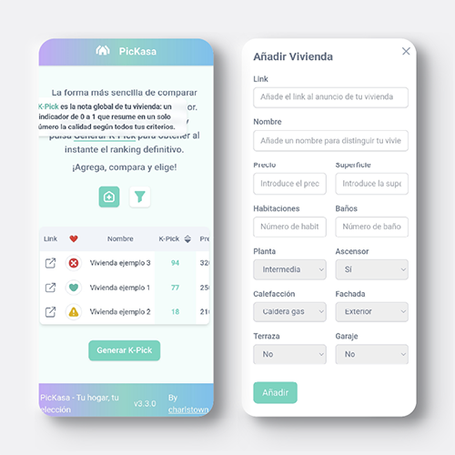

# PicKasa App

PicKasa started as an Excel sheet my partner and I used while searching for a new home.
We kept adding flats we liked and tried to sort them by what mattered most — but it quickly became messy.

[Open PicKasa](https://www.pickasa.app/){ .md-button .text-center }

So I turned that spreadsheet into something simpler and more visual: a small web app that lets you add your favorite listings and rank them based on your own priorities.
You decide what matters more — price, floor, sunlight, terrace — and PicKasa builds a ranking that reflects your way of choosing.

It’s basically our old house-hunting sheet, evolved into something cleaner, smarter, and a lot more fun to use.

---

## 1. Usage

### Adding new houses to the list

Easily add new homes to your list, each one adapts automatically to the active filters and parameters you’ve chosen.

### Selecting features and weigths

Select which parameters matter most and adjust their weights to shape how your K-Pick score is calculated.

### Generating de K-Pick

Once you’ve added your homes and set the filters and weights, click Generate K-Pick, each row gets its score instantly, and the list auto-sorts from best to worst match.

### Other features

PicKasa also includes a few handy extra columns that don’t affect the K-Pick score. One lets you tag each home with quick icons — favorites, visited, pending, or discarded — so you can track your progress visually. Another column provides a direct link to the original listing, letting you jump back to the ad in one click.

## 2. How it works

### What is the K-pick

The K-Pick is a custom score (from 0 to 100) that reflects how well each home fits your personal priorities.

It’s built from a simple but consistent logic: you decide what matters most, and PicKasa translates that into numbers.

### The Logic behind

PicKasa doesn’t use artificial intelligence or machine learning.
The logic behind the K-Pick score is pure, simple mathematics, a weighted average.

Each home is described by several features (price, size, floor, terrace, etc.), and each feature is given a weight depending on how important it is to you. Those values are first normalized between 0 and 1, so that everything can be compared on the same scale.

Then, the final K-Pick score is calculated using this formula:

$$
K_{Pick} = 
\frac{
\sum_{i=1}^{n} 
\left[
\left(
\frac{x_i - \min(x_i)}{\max(x_i) - \min(x_i)}
\right)
\times w_i
\right]
}{
\sum_{i=1}^{n} w_i
}
$$

| Symbol | Meaning |
|:-------:|----------|
| \( x_i \) | Raw value of feature *i* (e.g., price, size, floor) |
| \( \min(x_i), \max(x_i) \) | Minimum and maximum values of that feature |
| \( w_i \) | Importance weight assigned by the user |
| \( K_{Pick} \) | Final score between 0 and 1 (later scaled to 0–100) |
| \( n \) | Total number of features considered in the ranking |

#### 1. Selecting the features

Each column (price, floor, heating, etc.) has two key properties:

| Property    | Meaning                                               |
| ----------- | ----------------------------------------------------- |
| **isKpick** | Whether that field should influence the ranking.      |
| **weight**  | How important it is to you (higher = more influence). |

Only the fields marked as active (isKpick = true) and with a positive weight participate in the calculation.

#### 2. Normalization

Since every field has different scales (e.g., “price” can go from 100 000 to 500 000, while “floor” is 1 to 5), all values are normalized between 0 and 1 so they can be compared fairly.

Two types of normalization are applied:

| Type                   | Example                       | Formula (conceptually)                                     |
| ---------------------- | ----------------------------- | ---------------------------------------------------------- |
| **Numeric fields**     | Price, size, floor            | `(value - min) / (max - min)` → gives a number from 0 to 1 |
| **Categorical fields** | Heating: none / gas / central | Ordered and distributed evenly between 0 and 1             |

If a field is marked as descending (for example, you prefer lower price), the scale is inverted:
normalized = 1 - normalized.

#### 3. Applying weights

Each normalized value is multiplied by the weight you assigned to that field.
Then, the app calculates a weighted average:

$$
K_{Pick} = \frac{\sum (value_i \times weight_i)}{\sum weight_i}
$$

This gives a number between 0 and 1, which is then scaled to 0–100 for readability.

PicKasa just turns your subjective preferences into a clear, visual score so you can see which homes truly fit you.

## 3. Architecture

PicKasa runs on a simple, serverless setup. The frontend, built with React and hosted on [Vercel](https://vercel.com/), handles the entire user interface. When you click Generate K-Pick, the browser sends the list of homes and weights to an AWS Lambda exposed through API Gateway. The Lambda processes the data, calculates the scores, and returns them instantly. All user data stays local — stored in the browser’s cache or cookies — so there’s no database or login system involved.

### The Front

### The Back

