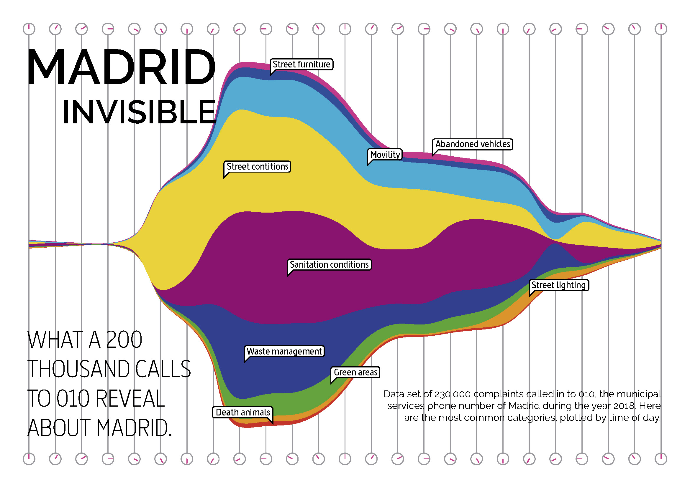

---
short_title: Madrid 010 calls
description: A visual analysis of 230,000 calls to Madrid's 010 municipal service, revealing complaint categories and their daily time patterns in 2018.
date: 2020-01-06
thumbnail: assets/images/thumbnails/madrid-invisible-portrait.png
---

# Madrid invisible

Madrid invisible, data analysis of 230.000 complaints called in to 010, the municipal services phone number of Madrid during the year 2018. Here are the most common categories, plotted by time of day.

---

##### REFERENCES & OTHE LINKS:

- More articles like this here: [https://carlosgrande.me/category/projects/](https://carlosgrande.me/category/projects/)
