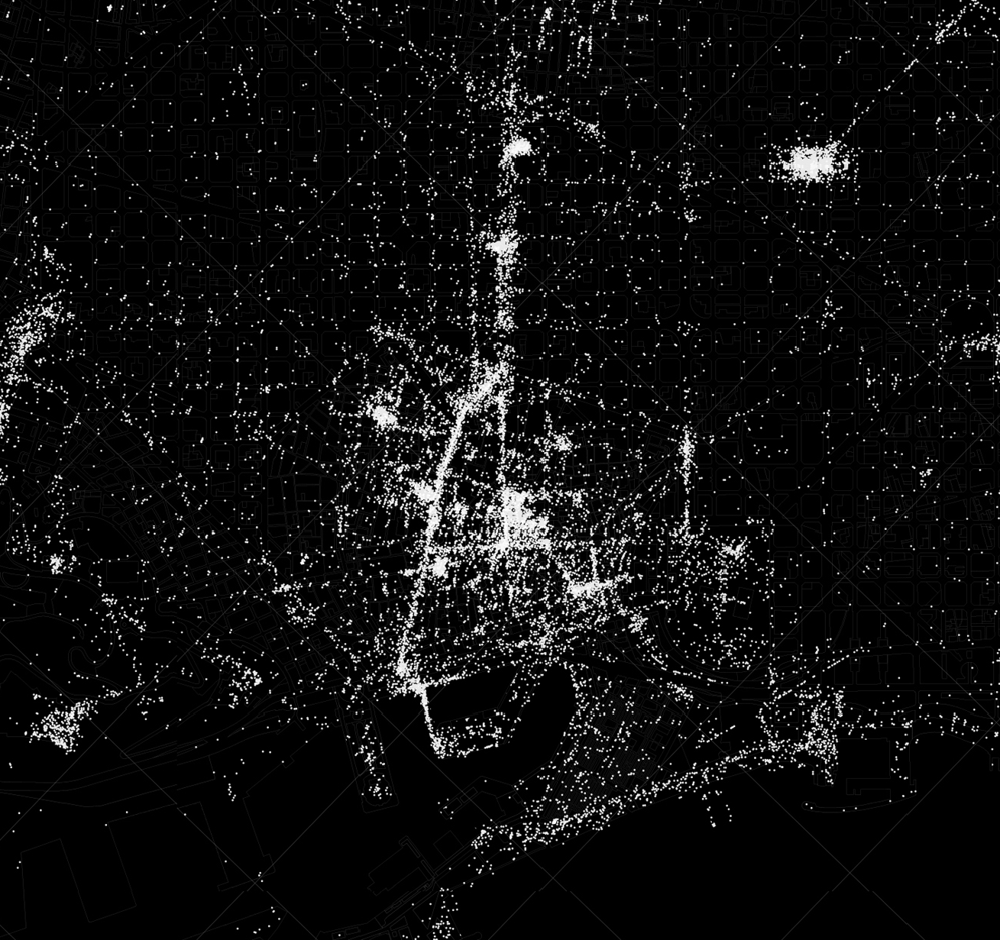
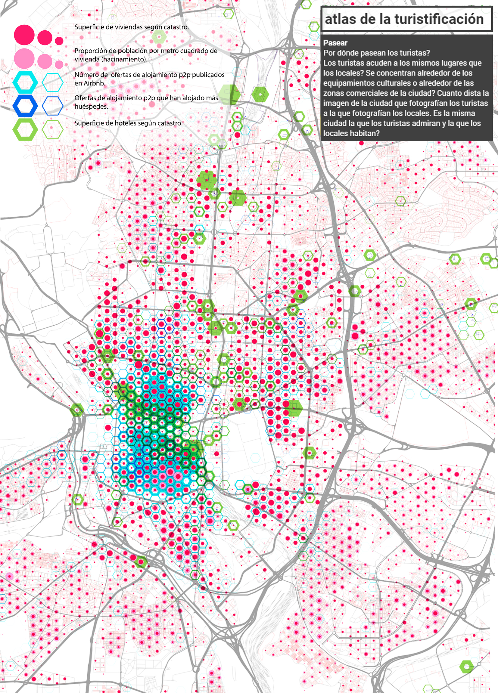

# 300.000 Km/s studio

{ .image-caption }

In this post, I wanted to introduce **300000 kms**. An urban planning agency founded in Barcelona aimed at making cities the most livable places on the planet. They are a team of architects, urban planners, data scientists and programmers who explore the potentials of big data and new computing paradigms to improve urban analysis, strategic planning and decision-making.

---

## AtNight project
The project addresses the mapping of intangible aspects for a better understanding of the city's visible surface and internal flows organization beyond traditional mobility and usage as the guideline topics that allow us to verify earlier hypotheses on nightscapes configuration.

We classified the data into three main categories according to the source. First, we used information from Open Data and public geographic services regarding cartographic features and general statistics (demography, land use, street layout, etc). Second, we obtained mobility trends and energy consumption averages through agreements with public and private local agencies. Finally, we collected geo-social data sets by a systematic crawl of several location-based social networks API.

The basic technological idea behind the project was to set up a platform that harvests data from geo-social streams and local Open Data providers apply mining functionalities, extracts key elements, and plots them on a series of maps. The research followed several phases, from the design of capture engines to the management of data via a geographic information system, allowing parameters to be set and tuned in accordance with specific data sets

We employed intuitive strategies to represent and communicate information from the simple existence of data and non-data, each value has been related to a geometrical feature to the superimposition of several data sets. On the one hand, we assigned color scales to easily distinguish dissimilar situations, mainly day and night perception. We established a hierarchy for certain values within the network by applying thickness and size to geometrical entities. On the other hand, new information can be seen by modifying the opacity of data groups or adopting multiplication or subtraction criteria of RGB values.
*Santamaría, and Martínez (2015, as cited in Binhanic, 2015).*

## Conclusion
Over the next few years, we will reconfigure our cities. We should adapt urban contexts to new scenarios resulting from urban and technical advancements. The ability to transform society will be key to ensuring a prosperous future and sustainable development. Recent technological breakthroughs have derived in the consolidation of a distinct urban model, the *Smart City*, which places sensors of all kinds to monitor life in real-time (weather, traffic, the flow of people, contamination, etc.). What if these same digital achievements could work in reverse and could interact with urban data to raise a common imagination from the collective and collaborative contribution? In accordance with cities rearrangement, we should foster urban planning from another perspective-taking advantage of novel representation tools to interpret, intervene, and rebuild.

It is crucial to delve into this line of research. Today, urban planning still relies upon traditional cartographic information (topography, plot division, usage) and neighborhood-level statistics, these long-established practices are inadequate in comprehending the interaction of citizenship on the urban skin and the territory. The new and accessible cartographic information will provide an inestimable tool for citizen empowerment, enabling individuals to tale collective decisions about the intangible city we actually inhabit.
*Santamaría, and Martínez (2015, as cited in Binhanic, 2015).*

## Gallery

{ .image-caption }

{ .image-caption }

{ .image-caption }

{ .image-caption }

---

**REFERENCES:**

- Binhanic, D. (2015). New challenges for Data Design. Springer. [Link to the book](https://link.springer.com/book/10.1007/978-1-4471-6596-5)
- Figures retrieved from [http://www.atnight.ws](http://www.atnight.ws)

**FURTHER READING:**

- 300000 Kms personal site: [300000kms.net/](https://300000kms.net/)
- LinkedIn: [@300-000km-s](https://www.linkedin.com/company/300-000km-s/)
- AtNight project: [http://www.atnight.ws/](http://www.atnight.ws/)
- More articles like this here: [https://carlosgrande.me/category/case-studies/](https://carlosgrande.me/category/case-studies/)