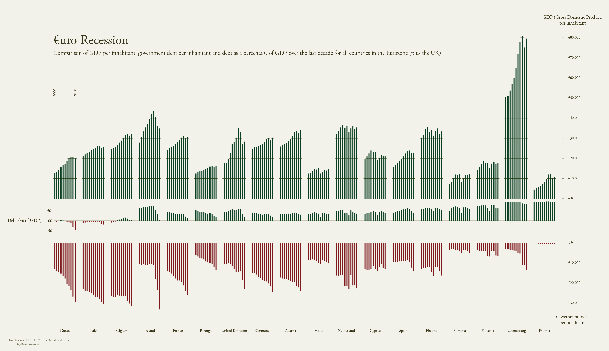
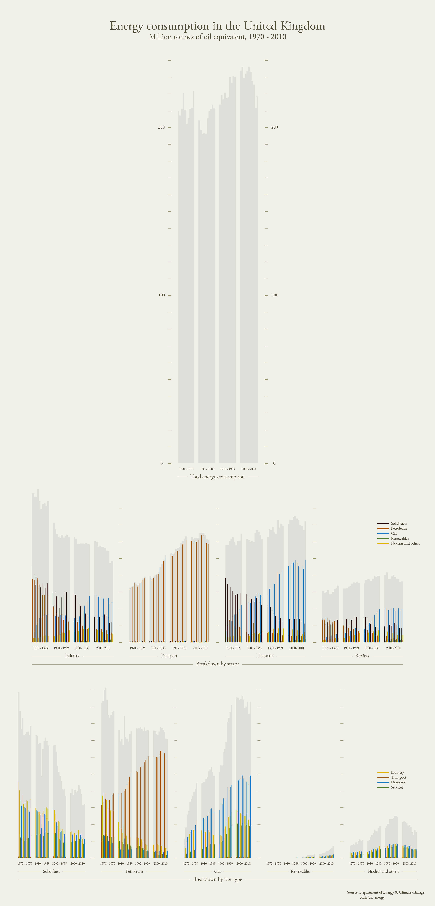
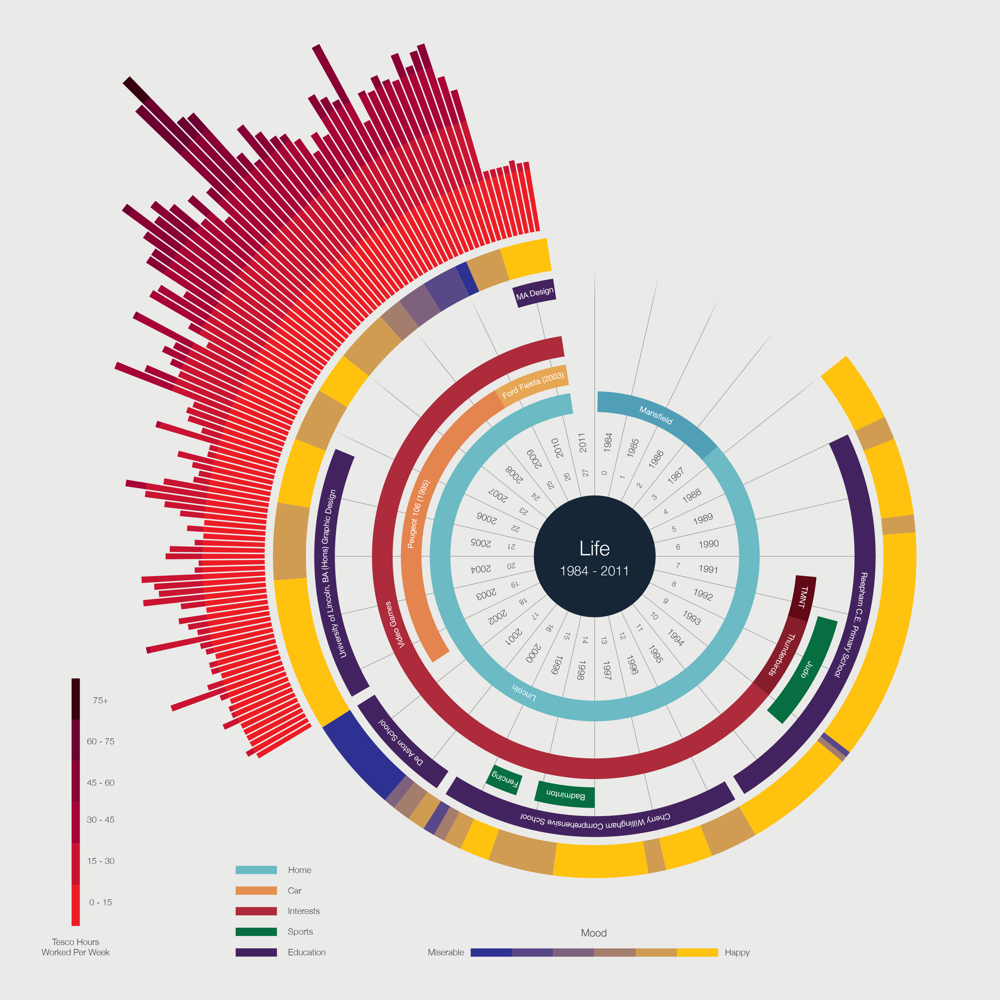

# Ben Willers

In this post, I wanted to introduce **Ben Willers**, a freelance graphic and data designer in the UK, who enjoys exploring and creating data-rich visualizations. He has published amazing big data design works full of inspiration capable of giving shape and meaning to Big Data. Ben Willers as a data designer believes stories in data should be built on a solid foundation of facts. As a result allows the audience to arrive at their own conclusions based on the evidence provided.

---

## Show, Don't Tell. By Ben Willers

Too often, I see visual representations of data used as a means to an end, reinforcing or adding creditability to an argument, or worse still an attempt to decorate or distract. Those experienced with handling large quantities of raw data will know of the pleasures that can be had from uncovering hidden truths buried within. These may be unusual and unexpected, sometimes even controversial. They provoke thought, spark conversations, and encourage further exploration. By carefully selecting data and display methods, we are able to communicate these discoveries without explicit exposition, allowing the reader to explore the rich data landscape that lies before us.

[...]

One of the greatest challenges I face in my work is finding a balance that does not undermine the richness of the data, yet is still accessible and engaging to the reader. Many of us have been conditioned to read in a particular way, along a linear path in a one-dimensional fashion. Un familiar territory is inevitably going to cause many readers, and perhaps some designers with a degree of anxiety, wich may explain why I see so many displays of data that simply mimic the traditional reading style. I always asume my reader is highly capable of judgment and reasoning, possessing a desire to learn but lacking knowledge within a particular area. My heart always sinks whenever a client asks me to simplify the scope of a design and turn up the visual 'cool factor' when a miltidimensional approach would be my preference. It is my hope that as audiences become more accustomed to these alternative methods of reading, designers will grow in confidence and deliver thought-provokin visualizations on a more regular basis.

(Willers, 2015, quoted in Bihanic, 2015.)

## Gallery

{ .image-caption }

{ .image-caption }

{ .image-caption }

{ .image-caption }

{ .image-caption }

{ .image-caption }

---

**REFERENCES & OTHE LINKS:**

- Bihanic, D. (2015). *New challenges for Data Design**.* London: Springer-Verlag.
- Figures retrieved from [http://www.benwillers.com/](http://www.benwillers.com/)
- You can by the book here: [https://www.springer.com/gp/book/9781447165958](https://www.springer.com/gp/book/9781447165958)
- More articles like this here: [https://carlosgrande.me/category/case-studies/](https://carlosgrande.me/category/case-studies/)