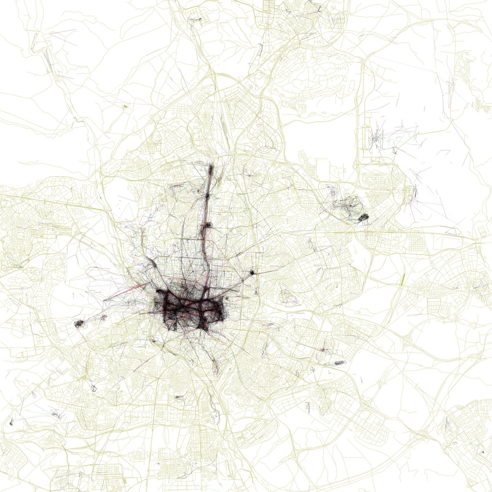
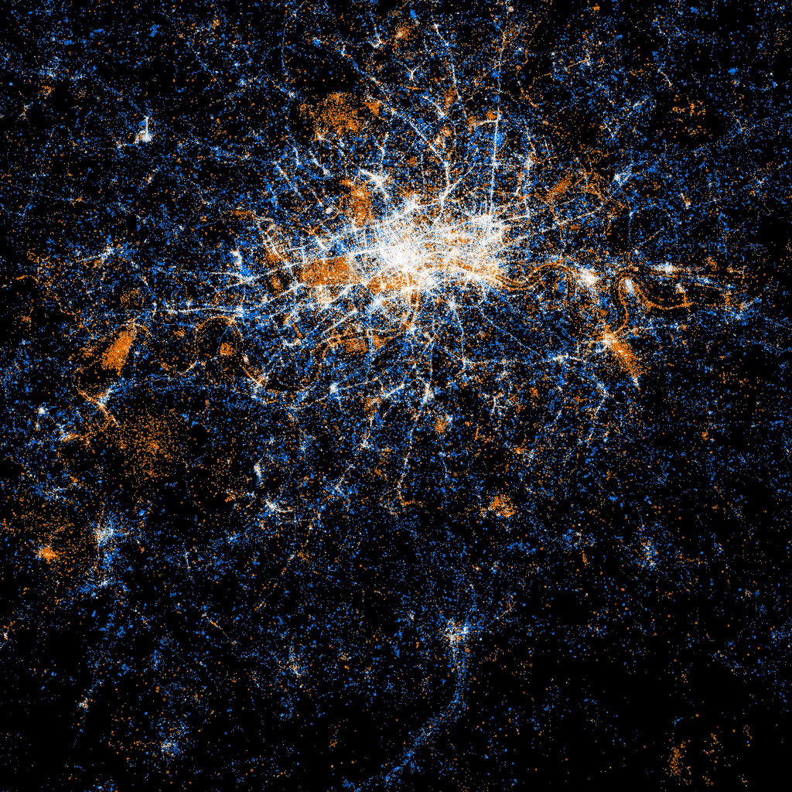
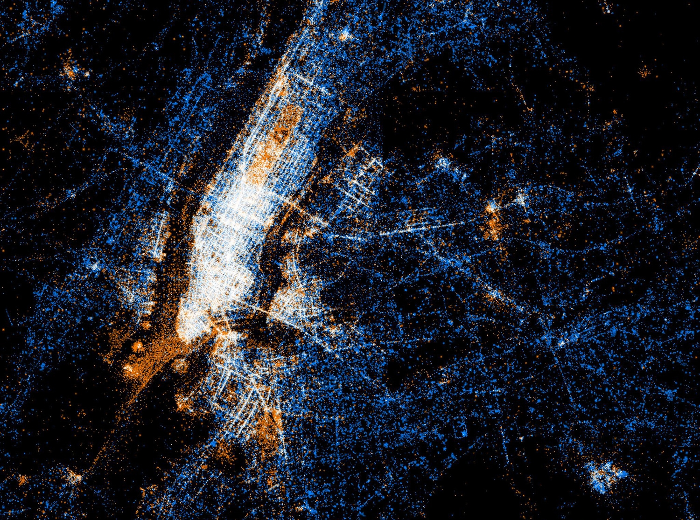
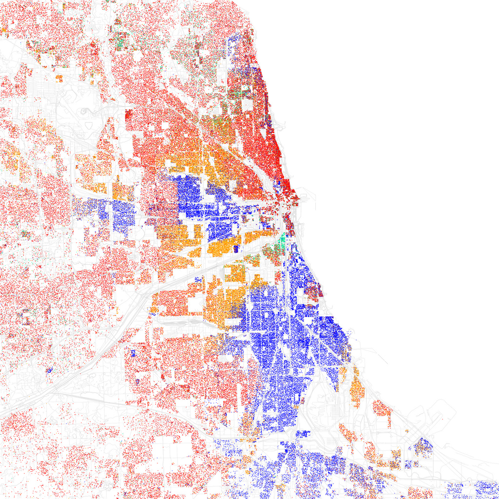

# Eric Fischer

In this post, I wanted to introduce **Eric Fischer**, a data designer and software developer at San Francisco. His works have been published in the Modern Art Museum, in Wired magazine, and other online magazine publications. Fischer is particularly interested in using geographic data to understand and improve pedestrian traffic and movements within the cities. Fischer never expected his private reflections to become in national art, but his data maps uploaded to your account Flickr, have been praised by art blogs, imitated by the New York Times, and exhibited at the Museum of Modern Art. Fisher creates maps by extracting resources such as the US data census UU., Flickr photographs, and tweets.

Fischer manages to perfectly represent all hidden information from the cities, he has published around 100 city maps in his investigations. He wrote a software that allowed him to represent all these maps and he developed it to such a level where It has become a payment tool known as MapBox. This tool provides an opportunity for data scientists and engineers leaving them a powerful tool capable of displaying dynamic maps in real-time. ---

## The Washington Post: Eric Fischer uses maps

Fischer represents data and geotags by colors and points using a code he wrote by himself. The result of the patterns produces visual galaxies of information. His work caught the attention in 2010 when he published some maps showing the list of photos taken by tourists and by locals around the city. (...) His next job focused him on racial divisions in 109 cities in the United States, showing the divisions still present in the population. Their recent works, called Look at something or say something, compare where people write about their social life and where people photograph. (...) “I want people to look at the different areas of the maps that they know well and to discover what some popular places do and other not-so-popular places, ”says Fischer. “If you live in a street that nobody goes to, what causes people to not want to go there? One of his observations is that people go on vacation to sites where they can walk to the sites, but on the contrary, they live in places where they cannot do so (Bell, 2011).

## Gallery

{ .image-caption }

{ .image-caption }

{ .image-caption }

{ .image-caption }

{ .image-caption }

{ .image-caption }

---

**REFERENCES & OTHE LINKS:**

- Bell, M. (2011) Eric Fischer uses maps, Twitter and Flickr to explore the contours of cities, Washington, USA, The Washington Post. Retrieved from [https://www.washingtonpost.com](https://www.washingtonpost.com/lifestyle/magazine/eric-fischer-uses-maps-twitter-and-flickr-to-explore-the-contours-of-cities/2011/08/10/gIQAISrMgJ_story.html?noredirect=on&utm_term=.957f82c00a5f.)
- Figures retrieved from [https://www.flickr.com/photos/walkingsf/albums](https://www.flickr.com/photos/walkingsf/albums)

**FURTHER READING:**

- Fischer Word Atlas article: [https://blog.mapbox.com/linking-the-most-interesting-places-in-the-world-b421f35b35a0](https://blog.mapbox.com/linking-the-most-interesting-places-in-the-world-b421f35b35a0)
- Word Atlas: [https://www.flickr.com/photos/walkingsf/sets/72157623971287575/](https://www.flickr.com/photos/walkingsf/sets/72157623971287575/)
- MapBox blog: [https://blog.mapbox.com/](https://blog.mapbox.com/)
- More articles like this here: [https://carlosgrande.me/category/case-studies/](https://carlosgrande.me/category/case-studies/)