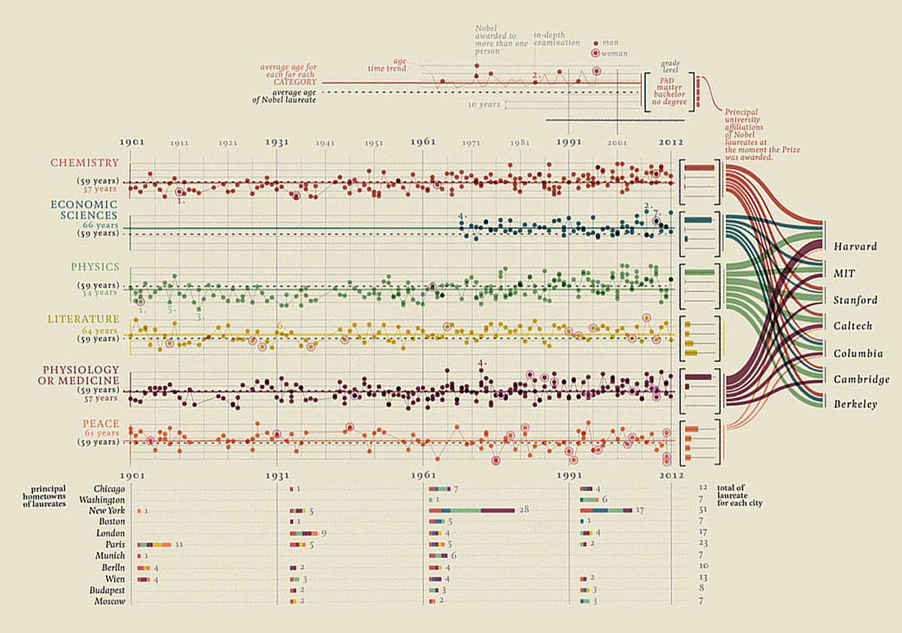
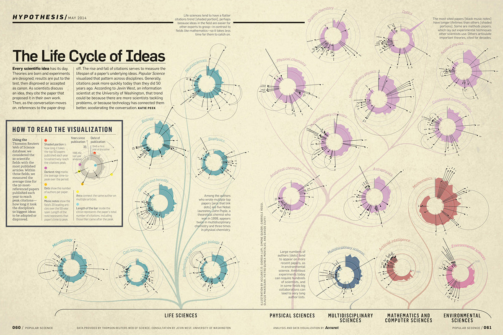

# Giorgia Lupi

In this post, I wanted to introduce **Giorgia Lupi**, Co-Founder and Design Director at Accurat, she is an information designer and researcher. Her work in information visualization frequently crosses the divide between digital and print, exploring visual models and metaphors to represent dense and rich data-driven stories.

---

## Visual Models and Metaphors. By Giorgia Lupi.

At Accurat, we publish compound and complex stories that each time are not told through an article, but through a data visualization. We here try to think like a journalist, rather than data analysts: Understanding in which contexts we should interpret the data we gather and analyze, and questioning ourselves about what is interesting in these numbers and what possible correlations with other information we might experiment to unveil hidden stories. We aim at delivering rich visual narratives able to maintain the complexity of the data but still making this complexity more accessible and understandable through the visualization.

[...]

Whenever the main purpose of visualizations is to open readers' eyes yo new knowledge and to reveal something new about the world or to engage and entertain the audience about a topic, it is impractical to avoid a certain level of visual and complexity indeed. The world is complex, compound, rich in information that can be combined in endless ways, therefore catching new points of view or discovering something that you did not know before often cannot happen at a glance: This process of "revelation" often needs and require an in-depth investigation of the context. Consequently, we like to think at these kinds of data visualizations we presented as visual ways to convey the richness, the involvement, and feelings that we experience in our everyday lives rather than a simplification of the world.

(Giorgia Lupi, 2015, quoted in Bihanic, 2015.)

## Gallery

{ .image-caption }

{ .image-caption }

{ .image-caption }

---

**REFERENCES:**

- Bihanic, D. (2015). *New challenges for Data Design**.* London: Springer-Verlag.
- Figures retrieved from [https://www.behance.net/accurat](https://www.behance.net/accurat "https://www.behance.net/accurat")
- You can buy the book here: [https://www.springer.com/gp/book/9781447165958](https://www.springer.com/gp/book/9781447165958 "https://www.springer.com/gp/book/9781447165958")

**FURTHER READING:**

- Giorgia Lupi personal site: [http://giorgialupi.com/](http://giorgialupi.com/)
- @giorgialupi: [https://twitter.com/giorgialupi](https://twitter.com/giorgialupi "https://twitter.com/giorgialupi")
- More articles like this here: [https://carlosgrande.me/category/case-studies/](https://carlosgrande.me/category/case-studies/)