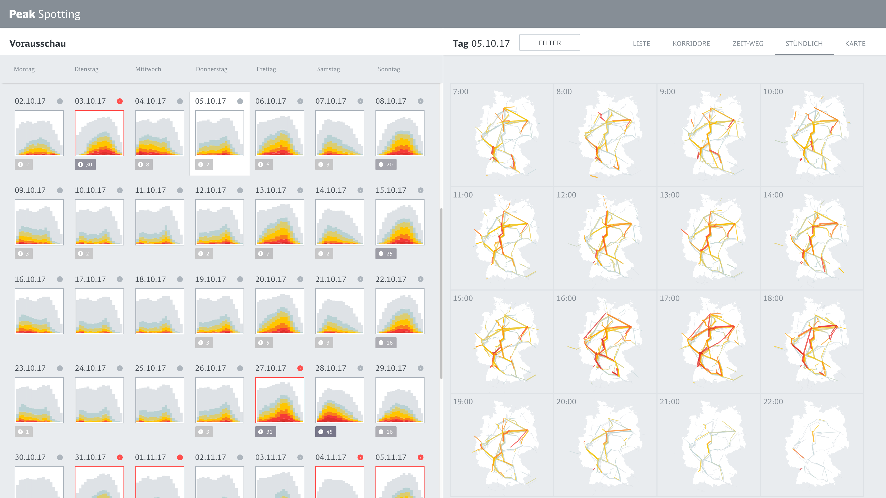
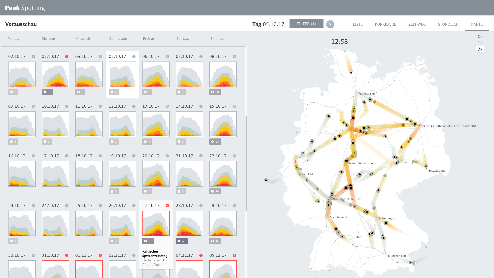

# Moritz Stefaner

In this post, I wanted to introduce **Moritz Stefaner**, a designer dedicated to data visualization and big data. He works as a designer, consultant, and researcher, collaborating and helping organizations and companies to find the real meaning of the data he works with.

Stefaner has a quite diverse background. After school, he applied for art schools, but he didn't get accepted. He finally proceeds to do a one-year 'multimedia producer' crash course, and worked with agencies for a few years, mostly doing flash websites. In the mid-twenties, he decided to go back to University to study Cognitive Science. After these years the went to Postdam to study Interface Design, working as a part-time researcher for a few years. In the last years, he has been working as an independent consultant and designer of data visualization.

---

## Truth and Beauty. (Moritz Stefaner)
 

To me, truth and beauty are equally important. In a visualization project, if you have only one without the other, you are not done yet.
Buckminister Fuller, the famous designer and systems theorist, said once, in essence, that he didn't think about beauty when he started a design, engineering, or architectural project. He was just concerned with its function. He wanted to find the right way to devise the product. But then, in the end, if the solution he came up with was not beautiful, he knew something was wrong. For Buckminister Fuller, in some sense, beauty was an indicator of functionality and truth.

Design is much more than mere decoration. Often, people think of design as is the wrong approach. Good design is tightly intertwined with the content it presents. It consists of thinking about what to show; what to leave out; what to highlight; how to structure information; what rhythm, visual flow, and pace, you want your story to have. That's what design is all about. (Stefaner, 2011)
(Stefaner, 2015, quoted in Bihanic, 2015.)

## Gallery

{ .image-caption }

{ .image-caption }

{ .image-caption }

{ .image-caption }

---

**REFERENCES & OTHE LINKS:**

- Bihanic, D. (2015). *New challenges for Data Design**.* London: Springer-Verlag.
- Figures retrieved from https://truth-and-beauty.net/](https://truth-and-beauty.net/)
- You can by the book here: [https://www.springer.com/gp/book/9781447165958](https://www.springer.com/gp/book/9781447165958)
- More articles like this here: [https://carlosgrande.me/category/case-studies/](https://carlosgrande.me/category/case-studies/)

**FURTHER READING:**

- Follow @Moritz_Stefaner: [https://twitter.com/moritz_stefaner?lang=es](https://twitter.com/moritz_stefaner?lang=es)
- About him: [https://en.wikipedia.org/wiki/Moritz_Stefaner](https://en.wikipedia.org/wiki/Moritz_Stefaner)
- More articles like this here: [https://carlosgrande.me/category/case-studies/](https://carlosgrande.me/category/case-studies/)