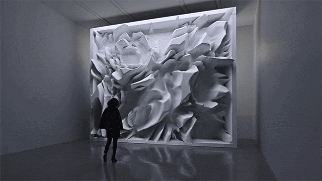
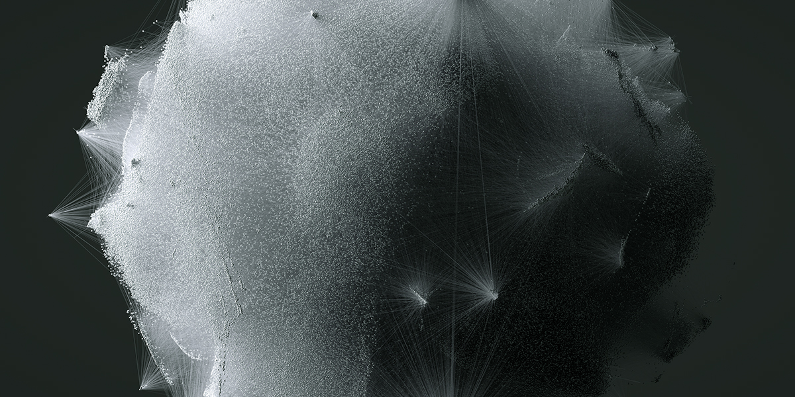
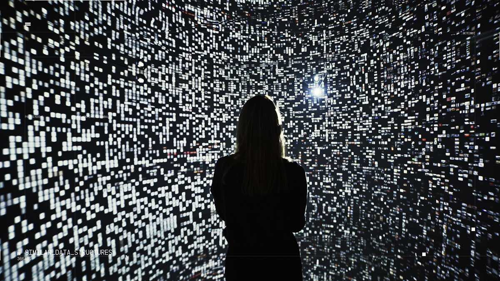
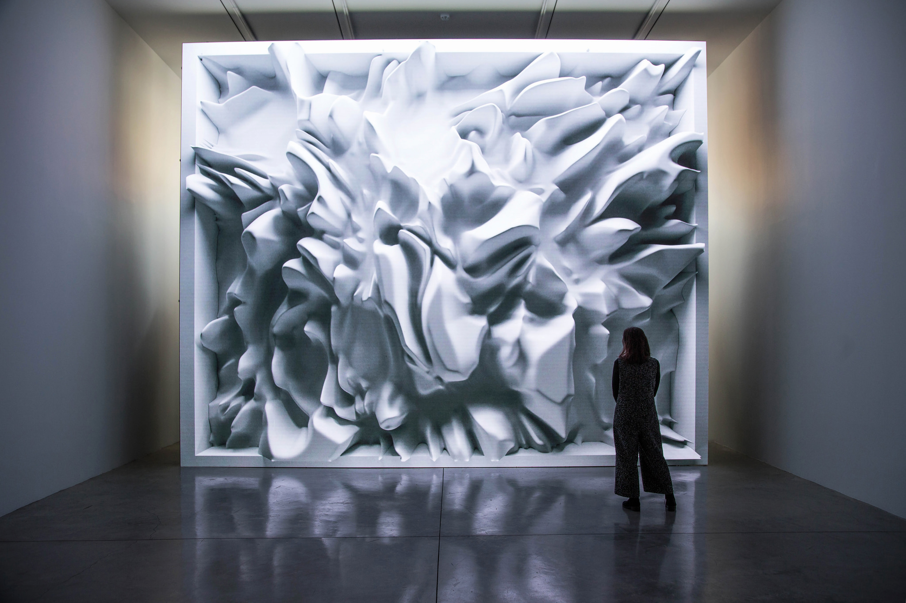
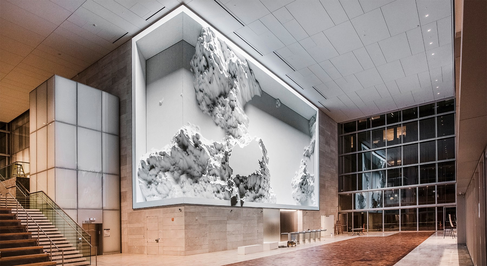

# Refik Anadol

In this post, I wanted to introduce **Refik Anadol**,  is a media artist, director, and pioneer in the aesthetics of machine intelligence. His main work locates creativity at the intersection of humans and machines. He takes the data that flows around us as his primary material and uses Neural Networks to design with a thinking brush. Refik offers us radical visualizations of our digitized memories and expanding the possibilities of architecture, narrative, and the body in motion.

---

## A data universe made of memories, AI and architecture. Interview with Refik anadol.

The idea of the project started in 2012 while having my second Master’s degree at UCLA. I was taking a highly inspiring class from a legendary professor Jennifer Steinkamp where she had brilliant questions. Brainstorming with her helped me a lot on finding ways to implement my dreams into projects and create perfect sequences. At the time I couldn’t make a project that big as a student. Even though Infinity Room is just a room, it’s still a place that needs construction, four projections, complex drawings and engineering. I was able to realize the project only in 2015. It was first launched in Istanbul. Later it travelled to 29 cities. It was transformed into a global project with almost two million viewers and has been to every single continent in the world. This is mind boggling. The beauty of the possibility that an idea can reach so many people with all kinds of backgrounds and ages. I don’t have any other projects that reached people in such extent.

[...]

Just like everyone else, I love to remember and talk about my memories. The concept of time is closely related to memory. We’re all aware that the concept of time has a strong correlation to memory. I’ve always had an obsession about memory, remembering and lifelogging. Data are also a form of memory. Our likes, posts, comments, the cars we use and GPS are also a memory. Interestingly, the concept of memory in the 21st century doesn’t boil down to the cognitive and neurological system of the humans. We’re in a position to interact with machines. I found this topic interesting and we began to work on it with the outstanding professor and a neuroscientist, Adam Gazzaley. Being a part the University of California as both an alumni and a researcher, I had the chance to access a large data set and work with a sample whilst doing the research. In these data sets, there were extended researches on brain and memory shared by groups which have accelerated the speed of my work. I can’t give many names working with John Does. Instead of concerning ourselves with what memory belonged to whom, we detached the ego from the data and delved into the energy signals that are the representation of the moment of reminiscence. As a result, I transformed these outputs into sculptures. In terms of exhibiting the project, I wasn’t sure sure if the public space was a fit for an intimate idea like this one. I thought it would be better understood and monitored if it was placed in a gallery space rather than a public space.

(Anadol, 2019)

## Gallery

{ .image-caption }

{ .image-caption }

{ .image-caption }

{ .image-caption }

{ .image-caption }

{ .image-caption }

---

**REFERENCES:**

- Anadol, R. (2019). Personal interview. Digicult. [Link to interview](http://digicult.it/articles/a-data-universe-made-of-memories-ai-and-architecture-interview-with-refik-anadol/)
- Figures retrieved from [https://www.behance.net/refikanadol](https://www.behance.net/refikanadol "https://www.behance.net/refikanadol")

**FURTHER READING:**

- Refik Anadol personal site: [refikanadol.com](https://refikanadol.com/)
- @refikanadol: [https://twitter.com/refikanadol](https://twitter.com/refikanadol "https://twitter.com/refikanadoli")
- More articles like this here: [https://carlosgrande.me/category/case-studies/](https://carlosgrande.me/category/case-studies/)

