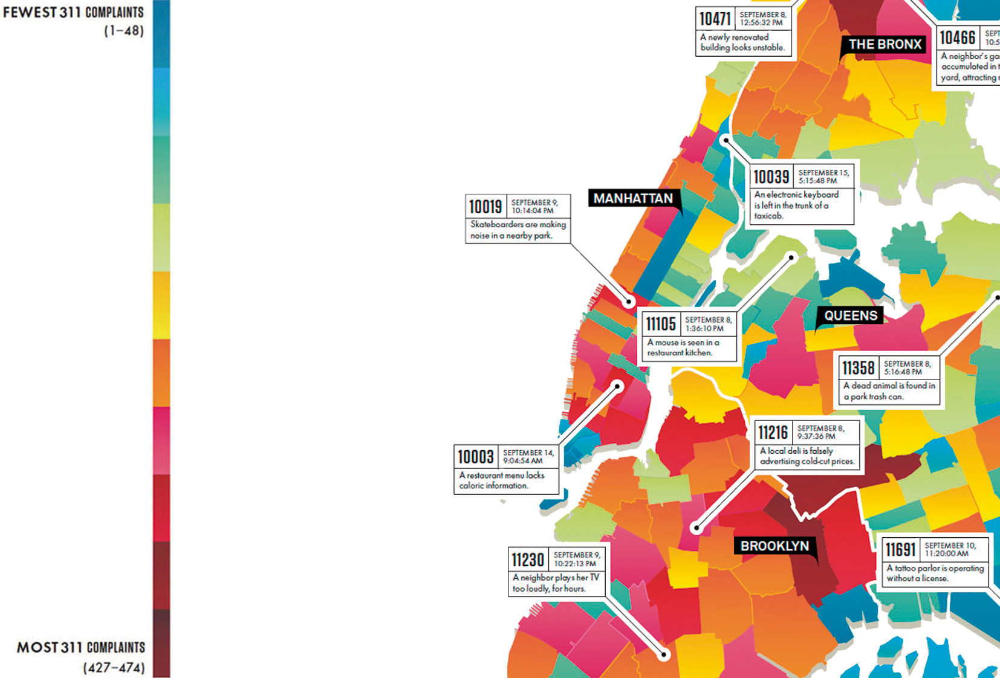

# Wesley Grubbs

In this post, I wanted to introduce **Wesley Grubbs**, is an artist, data visualizer and provocateur based in Berkeley. Grubbs founded in 2007 the data visualization studio Pitch Interactive, he is in charge of technical and creative direction and managing all crucial aspects that define the project scope, client expectations, deliverables and story telling.

Built upon his life experiences, education and his innate interest in the brain and cognition, Grubbs work focuses on revealing patterns about human behavior and how our actions impact our surroundings.

---

## A process Dedicated to Cognition and Memory. By Wesley Grubbs

The most effective form of communication is a visual one. Even when we speak we use visual metaphors to help our communication (i.e., to bark up the wrong tree or to push one's buttons). Focusing on a visual that helps bring attention to the story can also help establish a memory of the story, and this is the key aspect we take into consideration in every visualization we build.

[...]

It never ceases to amaze me how frequent the importance of good design and esthetics is disregarded as unnecessary fluff or a distraction from the actual data. Design is critical in the work we do, and we spend a significant amount of time during the production and postproduction focusing on colors, type, aligment, and other visuall elements because they are a crucial part to the communication aspect of the visualization. The human brain is wired to not only process but to attract to intrincate imagery, for example, looking at a mountain range or watching waves on a beach. These are inmense complex images of terrain and motion, yet we often find ourselves mesmerized and amazed by them even if we cannot appreciate fine art. When intrincate imagery has a story embedded within, it only simulates our interest more.

(Grubbs, 2015, quoted in Bihanic, 2015.)

## Gallery

{ .image-caption }

{ .image-caption }

---

**REFERENCES:**

- Bihanic, D. (2015). *New challenges for Data Design**.* London: Springer-Verlag.
- Figures retrieved from [https://pitchinteractive.com/work/Wired311/](https://pitchinteractive.com/work/Wired311/ "https://pitchinteractive.com/work/Wired311/")
- You can by the book here: [https://www.springer.com/gp/book/9781447165958](https://www.springer.com/gp/book/9781447165958 "https://www.springer.com/gp/book/9781447165958")

**FURTHER READING:**

- Pitch Interactive site: [https://pitchinteractive.com/](https://pitchinteractive.com/ "https://pitchinteractive.com/")
- @wesleygrubbs: [https://twitter.com/wesleygrubbs](https://twitter.com/wesleygrubbs "https://twitter.com/wesleygrubbs")
- Article in Substratum: [Substratum Article](http://substratumseries.com/issues/truth_and_beauty/wesley_grubbs/0 "Substratum")
- More articles like this here: [https://carlosgrande.me/category/case-studies/](https://carlosgrande.me/category/case-studies/)