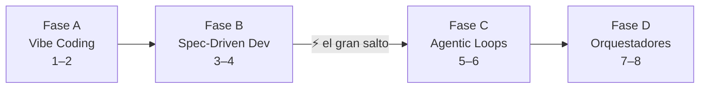
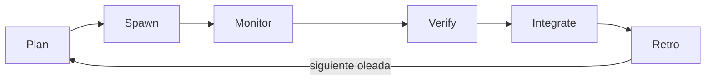
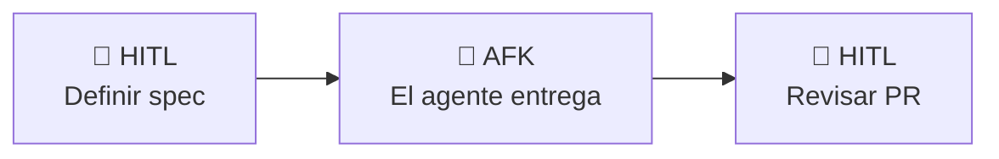

# Los 8 niveles de IA

Escribir este post ha sido una de las cosas que más he disfrutado últimamente — y eso lo dice todo. Llevo ya un tiempo en el nivel 6, multiplicando agentes en paralelo, y cada vez que alguien me pregunta "¿por dónde empiezo con todo esto?" me doy cuenta de que no hay ninguna guía honesta ahí fuera que trace el camino completo. Mi objetivo final es entender cada flujo que toca un producto y convertirlos en skills o comandos que me permitan dirigir sin tener que tocar el código línea por línea. Este marco es la hoja de ruta más honesta que he encontrado para llegar ahí. Espero que disfrutes leyéndolo tanto como yo disfruté escribiéndolo.

{ .image-width-24 }

---

## 1. De dónde viene este marco

El marco de los 8 niveles fue popularizado por **Steve Yegge** — veterano de Google y Amazon, actualmente en Kilo Code — a través de una entrevista en The Pragmatic Engineer (marzo de 2026) y desarrollado en detalle en Augment Code. Su versión original describe ocho etapas que van desde "sin IA" hasta "orquestador personalizado", midiendo cada nivel por cuánta confianza depositas en el agente y cuánto control le cedes.

Lo que ves en la miniatura de este post es una versión depurada. He reasignado los nombres para reflejar mejor lo que realmente ocurre en la práctica (los saltos de fase, los hitos reales, los techos), y he añadido el concepto de **Living Spec** para describir el nivel 8 — porque me parece más preciso que "Gas Town", el nombre interno que Yegge dio a su propio proyecto de orquestación. Describen lo mismo: un sistema donde el dev define la intención y la infraestructura de agentes se autogestiona.

!!! quote ""
    El marco de Yegge no es un ranking de seniority. Es una hoja de ruta: cada nivel te dice exactamente qué herramienta o flujo de trabajo adoptar para alcanzar el siguiente.

---

## 2. Las cuatro fases

Antes de ir nivel por nivel, ayuda ver la estructura de fases. Esto no es cosmético — las fases marcan cambios cualitativos en tu forma de trabajar:

| Fase | Niveles | Nombre | Qué cambia |
|-------|--------|------|--------------|
| **A** | 1 – 2 | :material-typewriter: Vibe Coding | La IA asiste, tú escribes cada línea |
| **B** | 3 – 4 | :material-file-document-edit: Spec-Driven Development | Delegas archivos enteros; la spec gobierna |
| **C** | 5 – 6 | :material-robot: Agentic Loops | Multiplexas agentes; los bucles se autoiteran |
| **D** | 7 – 8 | :material-factory: Agentic Orchestrators | Diriges la infraestructura, no el código |

El salto más disruptivo es el de la **Fase B a la Fase C** — de conductor a orquestador. Más sobre esto en la sección de conceptos clave.

---

## 3. Los 8 niveles

### 3.1 Nivel 1 — Copy-Paste AI

El IDE sugiere la siguiente línea. Pulsas Tab o Esc. Así de simple — y así de limitante.

El dev acepta o rechaza sugerencias una a una, sin salir del flujo de escritura. El verdadero hito de este nivel es dejar de ignorar las sugerencias y empezar a integrarlas de forma natural, sin romper tu hilo de pensamiento. El techo llega cuando se acumula la fatiga de decisión: aceptar o rechazar cien veces al día te desgasta.

:material-hammer-wrench: **Herramientas:** GitHub Copilot (autocompletado), Tabnine, cualquier IDE con sugerencias en línea.

### 3.2 Nivel 2 — Chat Assistant

El dev abre un panel lateral (ChatGPT, Claude.ai, Copilot Chat) y genera snippets a través de la conversación. El contexto no vive en el repositorio — solo existe en la ventana del chat.

El gran cambio aquí es de mentalidad: en lugar de buscar en Stack Overflow, preguntas directamente. El techo aparece cuando copiar y pegar entre el chat y el editor empieza a costar más de lo que aporta. Cada vez que cierras la conversación, el contexto desaparece.

:material-hammer-wrench: **Herramientas:** ChatGPT, Claude.ai, GitHub Copilot Chat.

### 3.3 Nivel 3 — Agent Mode

El agente ya no genera snippets para que los pegues — edita varios archivos directamente dentro de una conversación. Aquí emerge una habilidad crítica: **el agente pregunta antes de construir**.

En lugar de adivinar el alcance y generar código que tendrás que deshacer, un buen agente en este nivel hace preguntas estructuradas al inicio de cada tarea. Ese momento de "espera, cuéntame más antes de actuar" es el verdadero hito del nivel 3. El techo llega con los monorepos: sin una spec compartida, el agente se pierde entre dependencias.

!!! tip ""
    :material-chat-question: **`AskUserQuestion`** es la herramienta que hace esto real. En Claude Code, permite que el agente se detenga a mitad de una tarea y plantee preguntas estructuradas y específicas antes de actuar — cortando el bucle de adivinanzas antes de que empiece.

:material-hammer-wrench: **Herramientas:** Cursor Agent, Windsurf Cascade, GitHub Copilot Agent Mode.

### 3.4 Nivel 4 — CLI First

El dev deja atrás el IDE como entorno principal. El agente se ejecuta desde la terminal, abre ramas, hace commits y crea PRs. El dev ya no coordina diffs — coordina dirección.

El hito aquí es delegar una tarea completa desde la terminal y recibir al final un PR revisable. La habilidad que lo desbloquea es saber enmarcar las tareas con suficiente contexto para que el agente no necesite preguntar en cada paso. El techo: el historial de commits empieza a importar, y la higiene de Git se convierte en un problema real.

:material-hammer-wrench: **Herramientas:** Claude Code, Aider, GitHub Copilot CLI.

### 3.5 Nivel 5 — Subagents :material-lightning-bolt: El gran salto

Aquí es donde ocurre el salto. El dev deja de ser un **conductor** (un agente, una tarea, tú al volante) y se convierte en un **orquestador** (un agente líder que planifica y delega en subagentes especializados).

El patrón que emerge: Plan → Spawn → Monitor → Verify → Integrate → Retro. Un agente líder descompone el trabajo, lo asigna a subagentes que se ejecutan en oleadas, y cada oleada termina con una verificación. El hito es delegar el trabajo en oleadas verificables — es decir, que cada oleada produzca algo que puedas revisar antes de lanzar la siguiente.

Este nivel es el más disruptivo del marco porque cambia fundamentalmente tu rol. Ya no vigilas cada archivo. El techo aparece cuando tienes que coordinar y revisar lo que producen varios agentes y aún no tienes sistemas para hacerlo bien.

:material-hammer-wrench: **Herramientas:** Claude Code (patrón de subagentes), scripts de orquestación personalizados.

### 3.6 Nivel 6 — Multiagents

De 2 a 5 agentes especializados trabajando en paralelo: uno construye, otro revisa, otro testea. Cada uno tiene su propia rama. La verificabilidad — tests automatizados, CI — es lo que hace posible el paralelismo sin caos.

El hito es el **trabajo concurrente sin pisarse las ramas**. La habilidad que lo desbloquea no es técnica — es de diseño: descomponer una tarea para que los agentes no colisionen requiere pensar en interfaces y contratos antes de lanzar ningún agente. El techo: la coordinación sigue siendo manual y ad-hoc. Sigues siendo el cuello de botella.

:material-hammer-wrench: **Herramientas:** Claude Code con Git worktrees, sesiones de tmux, swarms.

### 3.7 Nivel 7 — Orchestrator

El dev ya no gestiona los agentes individualmente. Diseña la **fábrica**: una cola de tareas compartida que evita el trabajo duplicado, un coordinador que asigna el trabajo según disponibilidad, y checkpointing para reanudar, revertir y auditar cada agente.

El hito es tener funcionando estas tres primitivas: checkpointing, reanudación (resume) y rollback. Sin ellas, a escala de más de 10 agentes, los fallos se acumulan sin vía de recuperación. El techo: cuando la flota supera la capacidad de revisión humana.

:material-hammer-wrench: **Herramientas:** Gas Town (Yegge), orquestadores personalizados, plataformas como Kilo Code.

### 3.8 Nivel 8 — Living Spec

El orquestador llevado al extremo: 20-30 agentes en paralelo trabajando contra una **living spec** — una especificación viva que los agentes leen, actualizan y usan como memoria compartida. El dev solo define la intención. El sistema se autogestiona.

!!! note "Todavía en evolución"
    No voy a entrar en detalle aquí porque es terreno de investigación activa (Gas Town de Yegge es el ejemplo más público), los costes operativos son significativos, y los problemas de gobernanza, trazabilidad y auditoría aún no tienen respuestas claras. Es la visión del campo, no el destino para la mayoría.

---

## 4. Conceptos clave

### 4.1 Vibe Coding vs. Spec-Driven Development

El **vibe coding** (acuñado por Andrej Karpathy en febrero de 2025) describe el flujo de los niveles 1-2: describes lo que quieres, la IA genera el código, iteras. Rápido para prototipos. Frágil a escala.

El **Spec-Driven Development (SDD)** es el cambio de mentalidad que ocurre en los niveles 3-4. En lugar de iterar sobre la salida del agente, defines primero: objetivo, alcance, interfaces, tests de aceptación. La spec es el contrato. El agente ejecuta contra ese contrato.

La diferencia práctica: con vibe coding pasas el 80% de tu tiempo revisando y corrigiendo. Con SDD pasas el 80% de tu tiempo definiendo y verificando — que es exactamente donde debe estar el juicio humano.

### 4.2 El salto de conductor → orquestador

El salto del nivel 4 al nivel 5 es el más difícil conceptualmente porque no es una mejora incremental — es un cambio de rol.

**Como conductor** (niveles 1-4), tienes un agente, una tarea, tú al volante. Ves cada diff. El agente trabaja para ti de forma síncrona.

**Como orquestador** (niveles 5+), tienes un agente líder trabajando para ti mientras varios subagentes trabajan para él. Dejas de ver cada diff. Ves los resultados de las oleadas. Tu trabajo es definir el plan, establecer criterios de verificación y revisar los checkpoints.

El ciclo que emerge: **Plan → Spawn → Monitor → Verify → Integrate → Retro**. Cada oleada es una unidad de trabajo que termina con una verificación antes de que empiece la siguiente.

### 4.3 AFK vs. HITL

**HITL (Human In The Loop)** significa que el humano está en el bucle activo — revisando, corrigiendo, dando feedback en tiempo real.

**AFK (Away From Keyboard)** significa que el agente trabaja de forma autónoma mientras el dev hace otra cosa — o simplemente no está.

La síntesis más útil que he encontrado: **HITL en los extremos, AFK en el medio**. El dev define la spec al inicio (HITL) y revisa el PR al final (HITL). En medio, el agente entrega. Esto se vuelve viable a partir del nivel 5, cuando tienes verificación automatizada (tests, CI) actuando como red de seguridad durante el tiempo AFK.

En los niveles bajos, el AFK es arriesgado porque no hay red. En los niveles altos, el AFK es el objetivo.

### 4.4 Living Spec

Una **living spec** es una especificación que los agentes no solo leen — también actualizan. Actúa como memoria externa compartida entre agentes y sesiones.

En la práctica puede ser un archivo Markdown estructurado, un sistema como "Beads" (el issue tracker que Yegge integró en Gas Town), o cualquier almacén de estado accesible para todos los agentes del sistema.

El concepto resuelve uno de los techos más comunes del nivel 6: el spec drift — cuando distintos agentes que trabajan en paralelo se desalinean porque cada uno arrastra su propio modelo mental del estado del sistema.

---

## 5. ¿En qué nivel estoy?

Responde a estas preguntas. Cada "sí" suma un punto.

=== "Fase A — Vibe Coding"

    | # | Pregunta | Sí |
    |---|----------|-----|
    | 1 | ¿Usas el autocompletado (Tab/Esc) con regularidad? | ☐ |
    | 2 | ¿Generas snippets con un chat assistant sin salir de tu tarea principal? | ☐ |

=== "Fase B — Spec-Driven Dev"

    !!! tip ""
        :material-key: **Habilidad clave:** dominar la herramienta `AskUserQuestion`. Un buen agente deja de adivinar y hace preguntas estructuradas de aclaración antes de actuar — eso es lo que desbloquea las fases 3 y 4.

    | # | Pregunta | Sí |
    |---|----------|-----|
    | 3 | ¿El agente edita varios archivos en una sola conversación? | ☐ |
    | 4 | ¿Le das al agente contexto estructurado antes de pedirle que construya? | ☐ |
    | 5 | ¿Delegas tareas completas desde la terminal y recibes un PR al final? | ☐ |
    | 6 | ¿El agente abre ramas y hace commits por su cuenta? | ☐ |

=== "Fase C — Agentic Loops"

    !!! tip ""
        :material-key: **Habilidad clave:** definir roles especializados y diseñar para la paralelización. Los agentes necesitan responsabilidades claras y sin solapamientos, y ramas aisladas — sin eso, el trabajo concurrente genera conflictos en lugar de velocidad.

    | # | Pregunta | Sí |
    |---|----------|-----|
    | 7 | ¿Tienes un agente líder que planifica y delega en subagentes? | ☐ |
    | 8 | ¿Verificas cada oleada antes de lanzar la siguiente? | ☐ |
    | 9 | ¿Hay de 2 a 5 agentes especializados ejecutándose en paralelo en ramas separadas? | ☐ |
    | 10 | ¿Tienes CI automatizado actuando como red de seguridad para el trabajo AFK? | ☐ |

=== "Fase D — Agentic Orchestrators"

    | # | Pregunta | Sí |
    |---|----------|-----|
    | 11 | ¿Tienes una cola de tareas compartida que evita el trabajo duplicado entre agentes? | ☐ |
    | 12 | ¿Tienes checkpointing — puedes reanudar o revertir un agente que ha fallado? | ☐ |

??? note "Resultados"
    | Puntuación | Nivel estimado | Siguiente paso |
    |-------|----------------|-----------|
    | 0 – 2 | Niveles 1 – 2 | Integra un chat assistant en tu flujo diario; practica generar snippets sin cambiar de contexto |
    | 3 – 4 | Niveles 3 – 4 | Adopta un agente CLI; aprende a escribir specs antes de pedir código |
    | 5 – 6 | Nivel 5 | Prueba el patrón líder + subagentes en una tarea bien acotada |
    | 7 – 8 | Nivel 6 | Añade CI y tests como red de seguridad; diseña para que los agentes no colisionen |
    | 9 – 10 | Nivel 7 | Implementa cola de tareas y checkpointing |
    | 11 – 12 | Nivel 8 | La gobernanza, la trazabilidad y los costes son tu próximo problema |

---

## 6. Tabla resumen

| Nivel | Nombre | Qué delega el dev | Herramientas | Hito |
|-------|------|----------------------|-------|-----------|
| 1 | Copy-Paste AI | Sugerencias en línea | Copilot, Tabnine | Aceptar sin salir del flujo |
| 2 | Chat Assistant | Generación de snippets | ChatGPT, Claude.ai | Generar sin cambiar de tarea |
| 3 | Agent Mode | Edición multiarchivo | Cursor, Windsurf, Copilot Agent | El agente pregunta antes de construir |
| 4 | CLI First | Tareas completas (rama → PR) | Claude Code, Aider | Delegar tareas desde la terminal |
| 5 | Subagents | Oleadas de trabajo verificables | Patrón de subagentes de Claude Code | Líder + subagentes; Plan→Spawn→Verify |
| 6 | Multiagents | Trabajo concurrente multirrama | Claude Code + Git worktrees | Paralelo sin conflictos de ramas |
| 7 | Orchestrator | Gestión de la flota de agentes | Gas Town, Kilo Code | Checkpointing, reanudación, rollback |
| 8 | Living Spec | Intención | Orquestadores personalizados | Sistema autogestionado |

---

## Referencias

Augment Code. (2026). *Steve Yegge's 8 levels of AI development: Where's your team?* Augment Code. <https://www.augmentcode.com/guides/steve-yegge-8-levels-ai-assisted-development>

Huntley, G. (2025, July). *How to Ralph Wiggum* [GitHub repository]. <https://github.com/ghuntley/how-to-ralph-wiggum>

Karpathy, A. (2025, February 2). *Vibe coding* [Social media post]. X. <https://x.com/karpathy>

Nuri, M. (2026). *The missing levels of AI-assisted development: From agent chaos to orchestration*. Marc Nuri. <https://blog.marcnuri.com/missing-levels-ai-assisted-development>

Orosz, G. (2026, March 11). *From IDEs to AI agents with Steve Yegge*. The Pragmatic Engineer. <https://newsletter.pragmaticengineer.com/p/from-ides-to-ai-agents-with-steve>

Ralph Wiggum. (2026). *Ralph Wiggum: Viral agentic coding loop, simplified*. <https://ralph-wiggum.ai/>

Yegge, S. (2026, January). *The future of coding agents*. Medium. <https://steve-yegge.medium.com/the-future-of-coding-agents-e9451a84207c>

## Lecturas adicionales

- [Los 8 niveles de Steve Yegge — guía de Augment Code](https://www.augmentcode.com/guides/steve-yegge-8-levels-ai-assisted-development) — El marco completo con sistema de puntuación y guía de transición entre fases.
- [The Missing Levels — Marc Nuri](https://blog.marcnuri.com/missing-levels-ai-assisted-development) — Amplía el marco con 5 subniveles entre el 7 y el 8.
- [The Future of Coding Agents — Steve Yegge](https://steve-yegge.medium.com/the-future-of-coding-agents-e9451a84207c) — El propio Yegge sobre por qué ganan las colonias de agentes.
- [How to do AFK Coding — alexop.dev](https://alexop.dev/posts/how-to-do-afk-coding/) — Implementación práctica del patrón HITL en los extremos + AFK en el medio.
- [Awesome Claude — Ralph Wiggum loop](https://awesomeclaude.ai/ralph-wiggum) — La técnica de Geoffrey Huntley para bucles autónomos con Claude Code.
