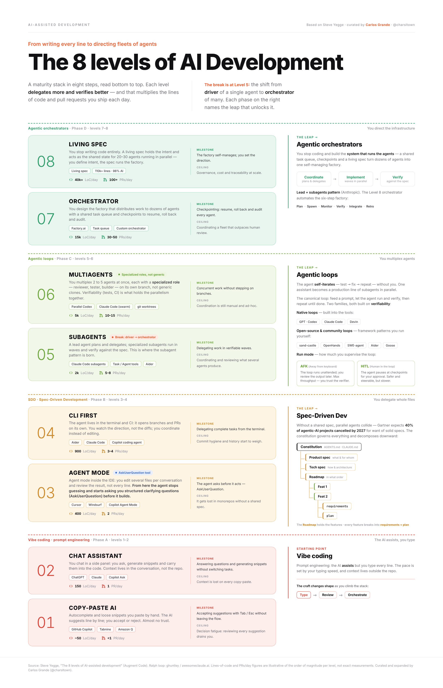
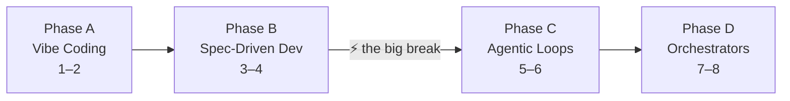
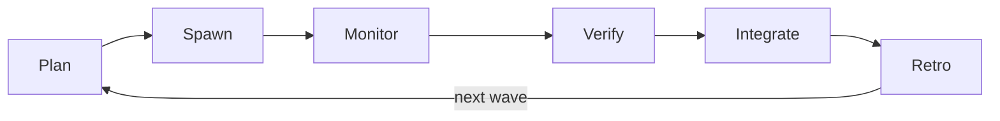
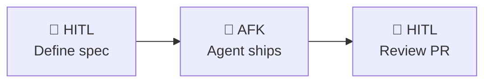

# The 8 levels of AI note

Writing this post has been one of the most enjoyable things I've done lately — and that says it all. I've been at level 6 for a while now, multiplying agents in parallel, and every time someone asks me "where do I even start with this?" I realize there's no honest guide out there that maps the full journey. My end goal is to understand every flow that touches a product and turn them into skills or commands that let me direct without having to touch code line by line. This framework is the most honest roadmap I've found to get there. I hope you enjoy reading it as much as I enjoyed writing it.

{ .image-width-24 }

---

## 1. Where this framework comes from

The 8-level framework was popularized by **Steve Yegge** — veteran of Google and Amazon, currently at Kilo Code — through an interview in The Pragmatic Engineer (March 2026) and expanded in detail at Augment Code. His original version describes eight stages ranging from "no AI" to "custom orchestrator", measuring each level by how much trust you place in the agent and how much control you hand over.

What you see in this post's thumbnail is a curated version. I've remapped the names to better reflect what actually happens in practice (the phase jumps, the real milestones, the ceilings), and added the concept of **Living Spec** to describe level 8 — because it feels more precise than "Gas Town", the internal name Yegge gave to his own orchestration project. They describe the same thing: a system where the dev defines intent and the agent infrastructure self-manages.

!!! quote ""
    Yegge's framework isn't a seniority ranking. It's a roadmap: each level tells you exactly which tool or workflow to adopt to reach the next one.

---

## 2. The four phases

Before going level by level, it helps to see the phase structure. This isn't cosmetic — phases mark qualitative shifts in how you work:

| Phase | Levels | Name | What changes |
|-------|--------|------|--------------|
| **A** | 1 – 2 | :material-typewriter: Vibe Coding | AI assists, you write every line |
| **B** | 3 – 4 | :material-file-document-edit: Spec-Driven Development | You delegate whole files; the spec governs |
| **C** | 5 – 6 | :material-robot: Agentic Loops | You multiplex agents; loops self-iterate |
| **D** | 7 – 8 | :material-factory: Agentic Orchestrators | You direct infrastructure, not code |

The most disruptive jump is **Phase B to Phase C** — from driver to orchestrator. More on this in the key concepts section.

---

## 3. The 8 levels

### 3.1 Level 1 — Copy-Paste AI

The IDE suggests the next line. You press Tab or Esc. That simple — and that limiting.

The dev accepts or rejects suggestions one by one, without leaving the writing flow. The real milestone at this level is stopping to ignore suggestions and starting to integrate them naturally, without breaking your train of thought. The ceiling comes when decision fatigue builds up: accepting or rejecting a hundred times a day wears you down.

:material-hammer-wrench: **Tools:** GitHub Copilot (autocomplete), Tabnine, any IDE with inline suggestions.

### 3.2 Level 2 — Chat Assistant

The dev opens a side panel (ChatGPT, Claude.ai, Copilot Chat) and generates snippets through conversation. Context doesn't live in the repository — it only exists in the chat window.

The big shift here is a mindset change: instead of searching Stack Overflow, you ask directly. The ceiling shows up when copy-pasting between the chat and the editor starts costing more than it's worth. Every time you close the conversation, context disappears.

:material-hammer-wrench: **Tools:** ChatGPT, Claude.ai, GitHub Copilot Chat.

### 3.3 Level 3 — Agent Mode

The agent no longer generates snippets for you to paste — it edits multiple files directly within a conversation. A critical skill emerges here: **the agent asks before it builds**.

Instead of guessing scope and generating code you'll have to undo, a good agent at this level asks structured questions at the start of each task. That moment of "wait, tell me more before I act" is the real milestone of level 3. The ceiling arrives with monorepos: without a shared spec, the agent gets lost in dependencies.

!!! tip ""
    :material-chat-question: **`AskUserQuestion`** is the tool that makes this real. In Claude Code, it lets the agent pause mid-task and surface structured, specific questions before acting — stopping the guessing loop before it starts.

:material-hammer-wrench: **Tools:** Cursor Agent, Windsurf Cascade, GitHub Copilot Agent Mode.

### 3.4 Level 4 — CLI First

The dev leaves the IDE behind as the primary environment. The agent runs from the terminal, opens branches, makes commits, and creates PRs. The dev no longer coordinates diffs — they coordinate direction.

The milestone here is delegating a complete task from the terminal and receiving a reviewable PR at the end. The skill that unlocks it is knowing how to frame tasks with enough context so the agent doesn't need to ask at every step. The ceiling: commit history starts to matter, and Git hygiene becomes a real problem.

:material-hammer-wrench: **Tools:** Claude Code, Aider, GitHub Copilot CLI.

### 3.5 Level 5 — Subagents :material-lightning-bolt: The big break

This is where the break happens. The dev stops being a **driver** (one agent, one task, you at the wheel) and becomes an **orchestrator** (a lead agent that plans and delegates to specialized subagents).

The pattern that emerges: Plan → Spawn → Monitor → Verify → Integrate → Retro. A lead agent breaks down the work, assigns it to subagents running in waves, and each wave ends with verification. The milestone is delegating work in verifiable waves — meaning each wave produces something you can review before launching the next.

This level is the most disruptive in the framework because it fundamentally changes your role. You're no longer watching every file. The ceiling shows up when you have to coordinate and review what several agents produce and you don't yet have systems to do it well.

:material-hammer-wrench: **Tools:** Claude Code (subagent pattern), custom orchestration scripts.

### 3.6 Level 6 — Multiagents

2 to 5 specialized agents working in parallel: one builds, one reviews, one tests. Each has its own branch. Verifiability — automated tests, CI — is what makes the parallelism possible without chaos.

The milestone is **concurrent work without stepping on branches**. The skill that unlocks it isn't technical — it's design: decomposing a task so agents don't collide requires thinking in interfaces and contracts before launching any agent. The ceiling: coordination is still manual and ad-hoc. You're still the bottleneck.

:material-hammer-wrench: **Tools:** Claude Code with Git worktrees, tmux sessions, swarms.

### 3.7 Level 7 — Orchestrator

The dev no longer manages agents individually. They design the **factory**: a shared task queue that prevents duplicate work, a coordinator that assigns work by availability, and checkpointing to resume, roll back, and audit each agent.

The milestone is having these three primitives working: checkpointing, resume, and rollback. Without them, at the scale of 10+ agents, failures pile up with no recovery path. The ceiling: when the fleet exceeds the capacity for human review.

:material-hammer-wrench: **Tools:** Gas Town (Yegge), custom orchestrators, platforms like Kilo Code.

### 3.8 Level 8 — Living Spec

The orchestrator taken to the extreme: 20-30 agents in parallel working against a **living spec** — a live specification that agents read, update, and use as shared memory. The dev only defines intent. The system self-manages.

!!! note "Still evolving"
    I won't go into detail here because it's active research territory (Yegge's Gas Town is the most public example), operational costs are significant, and the problems of governance, traceability, and auditing don't have clear answers yet. It's the field's vision, not the destination for most.

---

## 4. Key concepts

### 4.1 Vibe Coding vs. Spec-Driven Development

**Vibe coding** (coined by Andrej Karpathy in February 2025) describes the flow of levels 1-2: you describe what you want, the AI generates code, you iterate. Fast for prototypes. Brittle at scale.

**Spec-Driven Development (SDD)** is the mindset shift that happens at levels 3-4. Instead of iterating on the agent's output, you define first: goal, scope, interfaces, acceptance tests. The spec is the contract. The agent executes against that contract.

The practical difference: with vibe coding you spend 80% of your time reviewing and correcting. With SDD you spend 80% of your time defining and verifying — which is exactly where human judgment belongs.

### 4.2 The driver → orchestrator break

The jump from level 4 to level 5 is the hardest conceptually because it's not an incremental improvement — it's a role change.

**As a driver** (levels 1-4), you have one agent, one task, you at the wheel. You see every diff. The agent works for you synchronously.

**As an orchestrator** (levels 5+), you have a lead agent working for you while several subagents work for it. You stop seeing every diff. You see wave results. Your job is to define the plan, set verification criteria, and review checkpoints.

The cycle that emerges: **Plan → Spawn → Monitor → Verify → Integrate → Retro**. Each wave is a unit of work that ends with verification before the next one begins.

### 4.3 AFK vs. HITL

**HITL (Human In The Loop)** means the human is in the active loop — reviewing, correcting, giving feedback in real time.

**AFK (Away From Keyboard)** means the agent works autonomously while the dev does something else — or simply isn't there.

The most useful synthesis I've found: **HITL at the edges, AFK in the middle**. The dev defines the spec at the start (HITL) and reviews the PR at the end (HITL). In between, the agent ships. This becomes viable from level 5 onward, when you have automated verification (tests, CI) acting as a safety net during AFK time.

At lower levels, AFK is risky because there's no net. At higher levels, AFK is the point.

### 4.4 Living Spec

A **living spec** is a specification that agents don't just read — they also update. It acts as shared external memory across agents and sessions.

In practice it can be a structured Markdown file, a system like "Beads" (the issue tracker Yegge integrated into Gas Town), or any state store accessible to all agents in the system.

The concept solves one of the most common ceilings at level 6: spec drift — when different agents working in parallel fall out of alignment because each carries its own mental model of the system's state.

---

## 5. What level am I at?

Answer these questions. Each "yes" scores a point.

=== "Phase A — Vibe Coding"

    | # | Question | Yes |
    |---|----------|-----|
    | 1 | Do you use autocomplete (Tab/Esc) regularly? | ☐ |
    | 2 | Do you generate snippets with a chat assistant without leaving your main task? | ☐ |

=== "Phase B — Spec-Driven Dev"

    !!! tip ""
        :material-key: **Key skill:** mastering the `AskUserQuestion` tool. A good agent stops guessing and asks structured clarifying questions before acting — that's what unlocks phases 3 and 4.

    | # | Question | Yes |
    |---|----------|-----|
    | 3 | Does the agent edit multiple files in a single conversation? | ☐ |
    | 4 | Do you give the agent structured context before asking it to build? | ☐ |
    | 5 | Do you delegate complete tasks from the terminal and receive a PR at the end? | ☐ |
    | 6 | Does the agent open branches and make commits on its own? | ☐ |

=== "Phase C — Agentic Loops"

    !!! tip ""
        :material-key: **Key skill:** defining specialized roles and designing for parallelization. Agents need clear, non-overlapping responsibilities and isolated branches — without that, concurrent work creates conflicts instead of speed.

    | # | Question | Yes |
    |---|----------|-----|
    | 7 | Do you have a lead agent that plans and delegates to subagents? | ☐ |
    | 8 | Do you verify each wave before launching the next? | ☐ |
    | 9 | Are 2-5 specialized agents running in parallel on separate branches? | ☐ |
    | 10 | Do you have automated CI acting as a safety net for AFK work? | ☐ |

=== "Phase D — Agentic Orchestrators"

    | # | Question | Yes |
    |---|----------|-----|
    | 11 | Do you have a shared task queue that prevents duplicate work across agents? | ☐ |
    | 12 | Do you have checkpointing — can you resume or roll back a failed agent? | ☐ |

??? note "Results"
    | Score | Estimated level | Next step |
    |-------|----------------|-----------|
    | 0 – 2 | Levels 1 – 2 | Integrate a chat assistant into your daily flow; practice generating snippets without switching context |
    | 3 – 4 | Levels 3 – 4 | Adopt a CLI agent; learn to write specs before asking for code |
    | 5 – 6 | Level 5 | Try the lead + subagents pattern on a well-scoped task |
    | 7 – 8 | Level 6 | Add CI and tests as a safety net; design so agents don't collide |
    | 9 – 10 | Level 7 | Implement task queue and checkpointing |
    | 11 – 12 | Level 8 | Governance, traceability, and costs are your next problem |

---

## 6. Summary table

| Level | Name | What the dev delegates | Tools | Milestone |
|-------|------|----------------------|-------|-----------|
| 1 | Copy-Paste AI | Inline suggestions | Copilot, Tabnine | Accept without leaving the flow |
| 2 | Chat Assistant | Snippet generation | ChatGPT, Claude.ai | Generate without switching tasks |
| 3 | Agent Mode | Multi-file editing | Cursor, Windsurf, Copilot Agent | Agent asks before building |
| 4 | CLI First | Complete tasks (branch → PR) | Claude Code, Aider | Delegate tasks from terminal |
| 5 | Subagents | Verifiable waves of work | Claude Code subagent pattern | Lead + subagents; Plan→Spawn→Verify |
| 6 | Multiagents | Concurrent multi-branch work | Claude Code + Git worktrees | Parallel without branch conflicts |
| 7 | Orchestrator | Agent fleet management | Gas Town, Kilo Code | Checkpointing, resume, rollback |
| 8 | Living Spec | Intent | Custom orchestrators | Self-managed system |

---

## References

Augment Code. (2026). *Steve Yegge's 8 levels of AI development: Where's your team?* Augment Code. <https://www.augmentcode.com/guides/steve-yegge-8-levels-ai-assisted-development>

Huntley, G. (2025, July). *How to Ralph Wiggum* [GitHub repository]. <https://github.com/ghuntley/how-to-ralph-wiggum>

Karpathy, A. (2025, February 2). *Vibe coding* [Social media post]. X. <https://x.com/karpathy>

Nuri, M. (2026). *The missing levels of AI-assisted development: From agent chaos to orchestration*. Marc Nuri. <https://blog.marcnuri.com/missing-levels-ai-assisted-development>

Orosz, G. (2026, March 11). *From IDEs to AI agents with Steve Yegge*. The Pragmatic Engineer. <https://newsletter.pragmaticengineer.com/p/from-ides-to-ai-agents-with-steve>

Ralph Wiggum. (2026). *Ralph Wiggum: Viral agentic coding loop, simplified*. <https://ralph-wiggum.ai/>

Yegge, S. (2026, January). *The future of coding agents*. Medium. <https://steve-yegge.medium.com/the-future-of-coding-agents-e9451a84207c>

## Further reading

- [Steve Yegge's 8 Levels — Augment Code guide](https://www.augmentcode.com/guides/steve-yegge-8-levels-ai-assisted-development) — The full framework with scoring and phase transition guide.
- [The Missing Levels — Marc Nuri](https://blog.marcnuri.com/missing-levels-ai-assisted-development) — Extends the framework with 5 sub-levels between 7 and 8.
- [The Future of Coding Agents — Steve Yegge](https://steve-yegge.medium.com/the-future-of-coding-agents-e9451a84207c) — Yegge himself on why agent colonies win.
- [How to do AFK Coding — alexop.dev](https://alexop.dev/posts/how-to-do-afk-coding/) — Practical implementation of the HITL at the edges + AFK in the middle pattern.
- [Awesome Claude — Ralph Wiggum loop](https://awesomeclaude.ai/ralph-wiggum) — Geoffrey Huntley's technique for autonomous loops with Claude Code.
