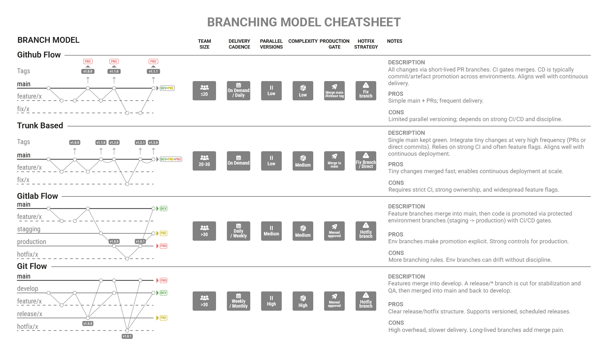
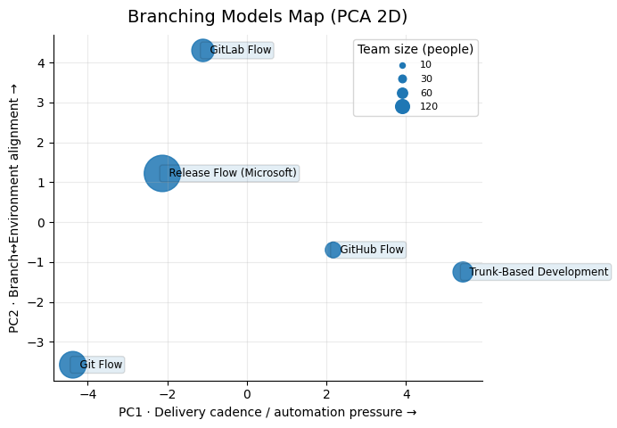
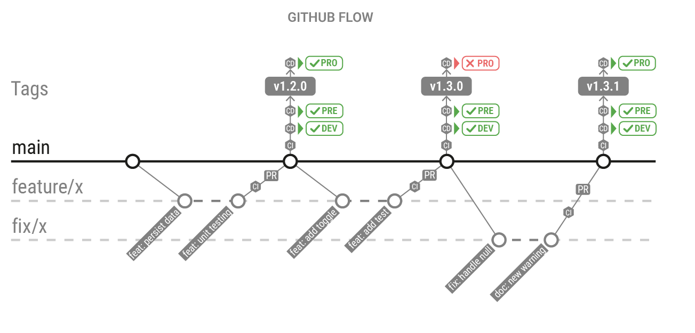
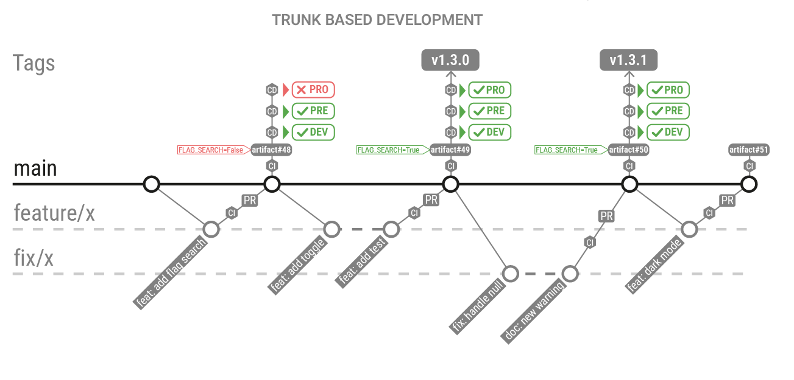
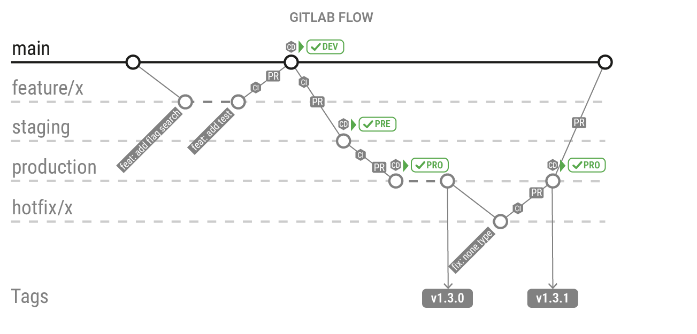
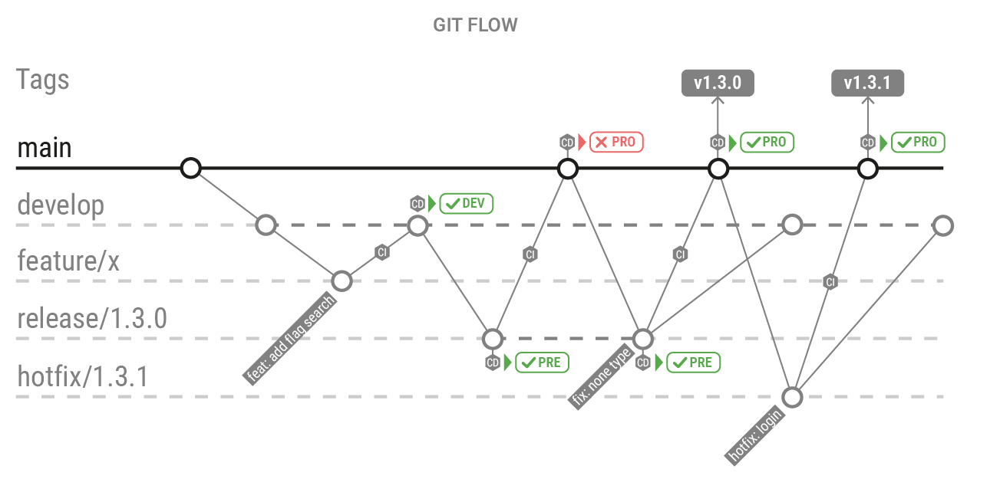

# Branching model cheatsheet

In this post, I wanted to capture something that often feels complex and open to interpretation — branching models within a release flow. My goal is to visualize how these models work and highlight the ones most used in the industry, making it easier to understand and remember their key differences.

---

## Common Branching Models

A **branch model** defines how teams structure their Git repository — how branches are named, used, and merged to organize development and releases. It establishes a clear workflow for parallel work, stabilization, and delivery across different environments.

| Model                        | Main Concept                                                                                                 | Pros                                                      | Cons                                         | Ideal For                                                |
| ---------------------------- | ------------------------------------------------------------------------------------------------------------ | --------------------------------------------------------- | -------------------------------------------- | -------------------------------------------------------- |
| **GitHub Flow**              | Single `main` branch; each change comes from a short-lived feature branch and is deployed once merged.       | Simple, continuous delivery friendly.                     | No parallel versioning or release branches.  | SaaS or teams deploying frequently.                      |
| **Trunk-Based Development**  | Developers commit directly to a shared `trunk` (or `main`), keeping branches short-lived.                    | Fast iteration, easy automation, minimal merge conflicts. | Requires strong testing and CI discipline.   | Agile or DevOps teams practicing continuous integration. |
| **GitLab Flow**              | Combines feature branches with environment or release branches (e.g., `staging`, `production`).              | Integrates well with CI/CD pipelines and environments.    | Slightly more complex branching rules.       | Teams managing multiple deployment stages.               |
| **Git Flow**                 | Uses long-lived branches (`main`, `develop`, `release`, `hotfix`, `feature`) to separate development stages. | Clear structure, supports multiple versions in parallel.  | Heavy maintenance, slower for fast delivery. | Large projects with planned release cycles.              |
| **Release Flow (Microsoft)** | Uses stable release branches that receive features only from validated commits.                              | Predictable releases, easier rollback.                    | Demands careful orchestration and tooling.   | Enterprises managing multiple active releases.           |

Branching models have many different characteristics, so I built a feature table to compare them using most attributes I knew. Then I ran a PCA to reduce it to two dimensions, visualize how close/far the models are, and interpret each axis by the features with the highest weight.

### GitHub Flow

GitHub Flow is a lightweight branching model built around a single long-lived branch `main`. All work happens in short-lived branches created from `main`, validated via Pull Requests (CI + review), and merged back into `main`. Deployments are typically triggered after merge, and environment configuration (e.g., staging/production) lives in the CI/CD pipeline rather than being represented as long-lived environment branches.

!!!tip "Key differentiator"

    Uses a single long-lived `main` with short-lived PR branches, while environments are handled in CI/CD rather than via environment branches.

| Branch Type      | Created From | Merged Into | Purpose                                                                  |
| ---------------- | ------------ | ----------- | ------------------------------------------------------------------------ |
| __main__         | —            | —           | Always releasable; represents the latest validated state of the product. |
| __feature/*__    | main         | main        | Implements a change (feature, fix, refactor) in isolation via a PR.      |

### Trunk-Based Development

Trunk-Based Development is a branching model where developers integrate changes into a shared `trunk` (`main`) very frequently, keeping branches extremely short-lived (or avoiding them entirely). It maximizes integration speed and reduces long-running divergence, typically relying on strong CI, small batch sizes, and feature flags to keep `main` always releasable.

!!!tip "Key differentiator"

    Optimizes for continuous integration by keeping `main` as the single source of truth and minimizing branch lifetime, while environments are handled in CI/CD.

| Branch Type              | Created From | Merged Into | Purpose                                                                 |
| ------------------------ | ------------ | ----------- | ----------------------------------------------------------------------- |
| __main (trunk)__         | —            | —           | Single integration branch; should remain green and releasable.          |
| __feature/*__            | main         | main        | Optional: tiny changes via PR (often same-day), then immediate merge.   |
| __release/* (optional)__ | main         | —           | Optional: cut only when you need stabilization/hardening for a release. |

### Gitlab Flow

GitLab Flow combines short-lived feature branches with **environment branches** (e.g., `staging`, `production`) or **release branches**, creating a clear path from development to deployment. It fits well with CI/CD because merges can map to deployments, while environment rules and protections are enforced in the pipeline and Git settings.

!!!tip "Key differentiator"

    Makes promotion explicit by using environment or release branches (e.g., staging, production) with protections to control what reaches production.

| Branch Type    | Created From | Merged Into                        | Purpose                                                              |
| -------------- | ------------ | ---------------------------------- | -------------------------------------------------------------------- |
| __main__       | —            | —                                  | Integration branch for completed work (often the default branch).    |
| __feature/*__  | main         | main                               | Implements changes via MR + CI before integration.                   |
| __staging__    | main         | production (or promoted)           | Represents the candidate state for staging deployments / validation. |
| __production__ | staging      | —                                  | Represents what is deployed to production (stable + protected).      |
| __hotfix/*__   | production   | production + main (and/or staging) | Urgent fixes applied quickly and then synced back.                   |

### Git Flow

Git Flow is a branching model that separates work into multiple branches, with main for production-ready code and develop for upcoming changes. Features, releases, and hotfixes each get their own temporary branches, providing strong control and stability at the cost of more process overhead.

!!!tip "Key differentiator"

    Separates develop from `main` and uses `release/*` and `hotfix/*` branches to manage structured, versioned releases.

| Branch Type            | Created From | Merged Into        | Purpose                                                              |
| ---------------------- | ------------ | ------------------ | -------------------------------------------------------------------- |
| __main__               | —            | —                  | Holds stable, production-ready code.                                 |
| __develop__            | main         | main (via release) | Holds the next version under development.                            |
| __feature/*__    | develop      | develop            | Used to build and test new features in isolation.                    |
| __release/*__ | develop      | main + develop     | Prepares a version for release: final fixes, versioning, QA.         |
| __hotfix/*__     | main         | main + develop     | Fixes urgent production issues without waiting for regular releases. |

### Release Flow (Microsoft)

Release Flow (popularized by Microsoft) organizes delivery around **stable release branches** maintained in parallel (per version). Features land first in `main`, then are **promoted (often via cherry-pick)** into one or more `release/*` branches only after validation, enabling predictable releases and multi-version support.

!!!tip "Key differentiator"

    Maintains multiple stable `release/*` branches in parallel and only brings in validated changes (typically via cherry-pick) from `main`, enabling predictable releases and multi-version maintenance.

|Branch Type|Created From|Merged Into|Purpose|
|---|---|---|---|
|__main__|—|—|Continuous integration branch (kept green via CI).|
|__release/*__|main (cut)|—|Stable per-version branch; receives only promoted/validated changes.|
|__feature/*__|main|main|Regular development work via PR/MR.|
|__hotfix/* (optional)__|release/*|release/* + main|Urgent fix for a specific version, then synced back to `main`.|
