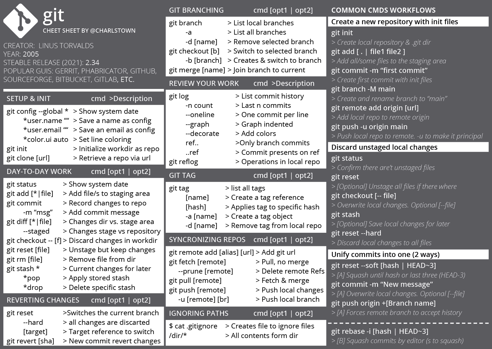

# Git cheatsheet

{ .image-width-24 }

With this post, I wanted to share my latest Git cheatsheet, with my most used commands and common workflows used at my daily projects.


### The Git cheat sheet

{ .image-caption }

[Download the cheatsheet](../../assets/docs/cheatsheet-git.pdf){:download="Git Cheatsheet" .md-button }


## What is Git?

"Git is software for tracking changes in any set of files, usually used for coordinating work among programmers collaboratively developing source code during software development. Its goals include speed, data integrity, and support for distributed, non-linear workflows (thousands of parallel branches running on different systems).


Git was created by Linus Torvalds in 2005 for development of the Linux kernel, with other kernel developers contributing to its initial development. Since 2005, Junio Hamano has been the core maintainer. As with most other distributed version control systems, and unlike most client–server systems, every Git directory on every computer is a full-fledged repository with complete history and full version-tracking abilities, independent of network access or a central server. Git is free and open-source software distributed under the GPL-2.0-only license." [wikipedia](https://en.wikipedia.org/wiki/Git)


## Common Git workflows

In this section I wanted to post common workflow actions, I usually do in my daily work.


### Bring changes from other branch onto current

Here is how you would transplant a topic branch to another, to pretend that you forked the topic branch from the latter branch, using rebase --onto.

{ .image-caption }

**Steps:**

<div class="steps" markdown>

- Run the git branch command to make sure you are at the branch that you want to update.

    ```bash
    git branch
    ```

    ```bash title="Output"
    develop 
    * master 
    ```

- Run a git Fetch to update changes available in the remote repository.

    ```bash
    git fetch
    ```

- Rebase the master branch.

    ```bash
    git rebase master --onto develop
    ```

    ```bash title="Output"
    Successfully rebased and updated refs/heads/master.
    ```

- Push the new changes on the master branch.

    ```bash
    git push
    ```

</div>


### Discard local changes

When you change code in one or more files locally, and you realize you want to go back to the latest repository state, the remote state.

<div class="steps" markdown>

- First we confirm there aren't unstaged files.

    ```bash
    git status
    ```

    ```bash title="output"
    On branch main
    Your branch is up to date with 'origin/main'.

    nothing to commit, working tree clean
    ```

- [Optional] If there are unstaged files we run the next command.

    ```bash
    git reset
    ```

    ```bash title="output"
    Unstaged changes after reset:
    M       PythonGenerators.ipynb
    ```

- Next, we overwrite the local changes. We can add *--FileName* to select a specific file.

    ```bash
    git checkout
    ```

    ```bash title="output"
    M       PythonGenerators.ipynb
    Your branch is up to date with 'origin/main'.
    ```

- Finally we discard the local changes to all files.

    ```bash
    git reset --hard
    ```

    ```bash title="output"
    HEAD is now at 9fbe555 all commits except first
    ```

</div>

### Unify commits into one

For this case I pushed 3 commits due to some mistakes until I finlly had the correct files. To clean **the last three commits** and make them into one you can do the following.

#### The easy way

<div class="steps" markdown>

- Get the lastest commit logs.

    ```bash
    git log --oneline --graph --decorate
    ```

    ```bash title="output"
    * be501b6 (HEAD -> main, origin/main) Files ready  
    * 3f12dce Ups! Readme Updated  
    * ae11087 License and Readme added  
    * 2017231 Init files  
    ```

- Squash until commit hash *2017231 Init files* (not included).

    ```bash
    git reset --soft 2017231
    ```

    ```bash title="output"
    No output
    ```

- Overwrite local changes

    ```bash
    git commit -m "License & Readme added"
    ```

    ```bash title="output"
    [main 92c87b4] License & Readme added
    41 files changed, 816 insertions(+)
    ...
    ```

- Push the local changes

    ```bash
    git push --force
    ```

    ```bash title="output"
    4 files changed, 121 insertions(+), 53 deletions(-)
    ```

</div>

#### The manual way

<div class="steps" markdown>

- Get the lastest commit logs.

    ```bash
    git log --oneline --graph --decorate
    ```

    ```bash title="output"
    * be501b6 (HEAD -> main, origin/main) Files ready  
    * 3f12dce Ups! Readme updated  
    * ae11087 License and Readme added  
    * 2017231 Init files  
    ```

- Squash the commits by editor using git rebase.

    ```bash
    git rebase -i 2017231
    ```

- After git rebase, you'll see an editor like the output shown. With the selected commits and a list of commands. *Press "i" to start editing the file

    ```bash
    pick 92c87b4 License & Readme added
    pick f96f4e5 Ups! License updated
    pick 954518c Files ready

    # Rebase 2017231..954518c onto 2017231 (3 commands)
    ...
    ```

- Change the *pick* commits to *stash* commits you can add an "s" at the begining

    ```bash
    pick 92c87b4 License & Readme added
    s f96f4e5 Ups! License updated
    s 954518c Files ready

    # Rebase 2017231..954518c onto 2017231 (3 commands)
    ...
    ```

- At the next screen you can type the new commit message for the combination of the three commits. Delete the old comments and type the new one.

    ```bash
    # This is a combination of 3 commits.
    # My final commit message
    License & Readme added

    # Please enter the commit message for your changes. Lines starting
    # with '#' will be ignored, and an empty message aborts the commit.
    ```

- To check your new commit combination, run a *git log*.

    ```bash
    git log --oneline --graph --decorate
    ```

    ```bash title="output"
    * ec8cc95 (HEAD -> main) License & Readme added 
    * 2017231 Init files  
    ```

</div>


## Other references and links

- [Git Project](https://git-scm.com/)
- More articles like this here: [Resources](https://carlosgrande.me/category/myworks/resources-cheatsheets/)