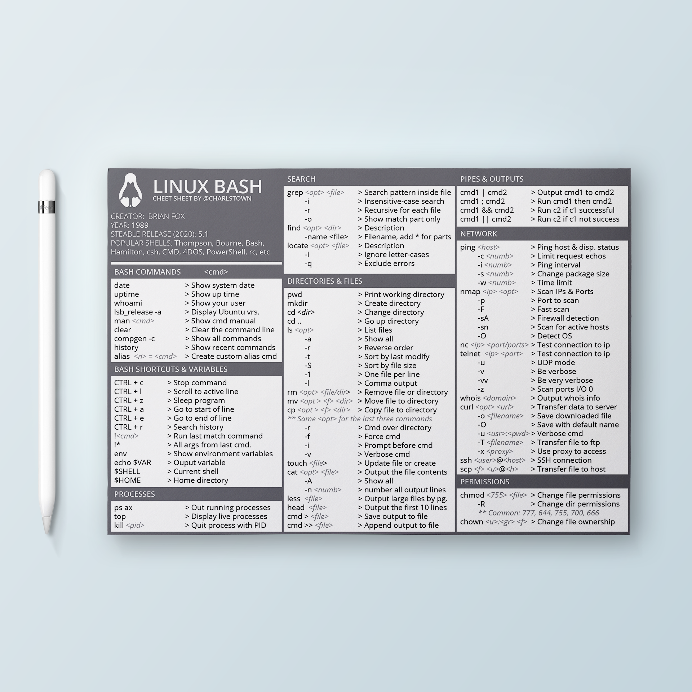

# Linux cheatsheet

With this post, I wanted to share my latest GNU Bash cheatsheet, with my most used commands at my daily projects.

{ .image-width-24 }

### DOWNLOAD THE CHEAT SHEET:

[Download the cheatsheet](../../assets/docs/cheatsheet-linux.pdf){:download="Docker Cheatsheet" .md-button }

## What is Linux-Bash?

"Bash is a Unix shell and command language written by Brian Fox for the GNU Project as a free software replacement for the Bourne shell. First released in 1989, it has been used as the default login shell for most Linux distributions. Bash was also the default shell in all versions of Apple macOS prior to the 2019 release of macOS Catalina, which changed the default shell to zsh, although Bash currently remains available as an alternative shell.

Bash is a command processor that typically runs in a text window where the user types commands that cause actions. Bash can also read and execute commands from a file, called a shell script." [wikipedia](https://en.wikipedia.org/wiki/Bash_(Unix_shell))

## Other references and links

- [GNU Project](https://ftp.gnu.org/)
- More articles like this here: [Resources](https://carlosgrande.me/category/myworks/resources-cheatsheets/)
- Github repository: [cheatsheets](https://github.com/charlstown/CodeCheatsheets)