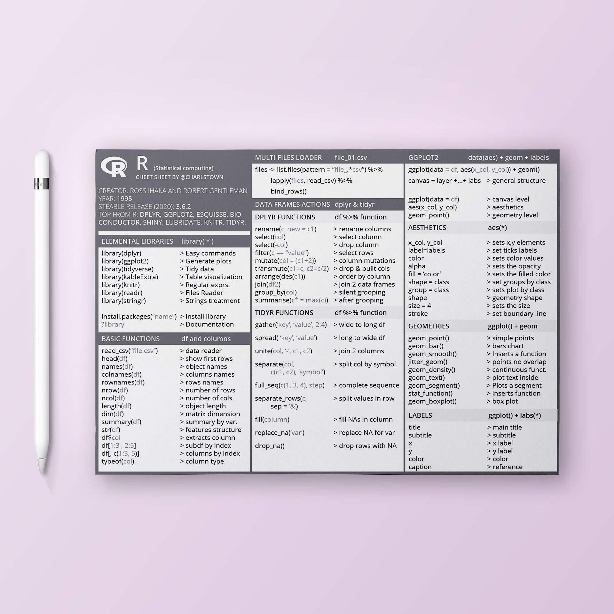
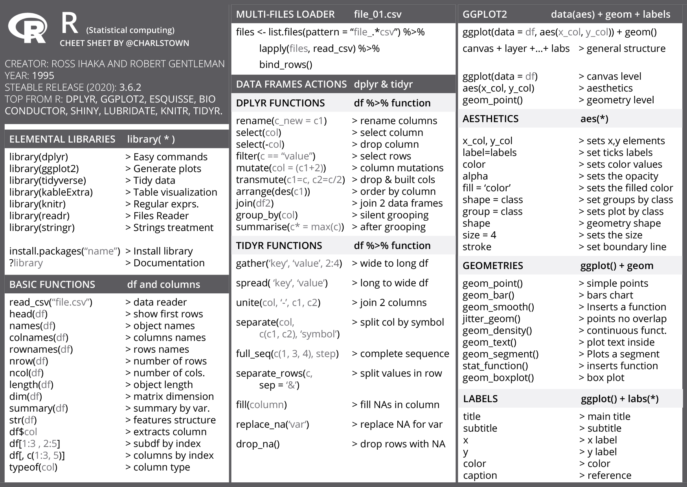

---
short_title: R cheatsheet
description: A handy R programming reference for data structures, transformations, visualization, and commonly used syntax.
date: 2020-03-30
thumbnail: assets/images/resources/cheatsheet-r-portrait.jpeg
social:
  cards_layout_options:
    background_image: docs/assets/images/resources/cheatsheet-r-portrait.jpeg
    background_color: transparent
---

# R cheatsheet

{ .image-width-24 }

I wanted to post my R cheat sheet and some useful functions I use almost every day. As far as I learn more programming languages I'll create more cheat sheets, hope they'll be helpful.

---

## The R cheatsheet

[Download the cheatsheet](../../assets/docs/cheatsheet-r.pdf){:download="Docker Cheatsheet" .md-button }

---

## OTHER LINKS

- Github repository: [cheatsheets](https://github.com/charlstown/CodeCheatsheets)
- More resources like this here: [https://carlosgrande.me/category/resources](https://carlosgrande.me/category/resources)

