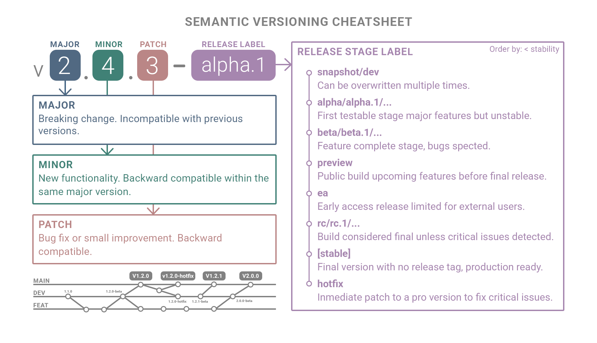

---
short_title: Semantic versioning cheatsheet
description: A simple guide to semantic versioning that explains when to increment major, minor, and patch release numbers.
date: 2025-11-03
thumbnail: assets/images/thumbnails/semantic-versioning-portrait.png
social:
  cards_layout_options:
    background_image: docs/assets/images/thumbnails/semantic-versioning-portrait.png
    background_color: transparent
---

# Semantic Versioning cheatsheet

This post covers a topic I find both fascinating and often confusing: Semantic Versioning and the different release stages that appear as suffixes — and what each one really means. Having a clear and ordered flow of releases is key to maintaining consistency and communication across teams.

I've tried to make this cheatsheet as complete as possible based on my experience managing releases. Of course, there are many other suffixes, labels, and conventions not included here, but I hope it serves as a practical reference for anyone navigating the versioning lifecycle.

---

## Semantic versioning

Semantic Versioning (SemVer) was formalized by Tom Preston-Werner in 2013 as a standardized way to communicate software changes clearly through version numbers.

### 1. Release version

Each part of the version number communicates the scope of change and helps teams understand what to expect from an update.

It defines the structure **MAJOR.MINOR.PATCH**, ensuring that each increment conveys the scope and impact of modifications across releases.

| Component | Meaning | When to Increase |
|------------|----------|------------------|
| **MAJOR** | Breaking changes; incompatible with previous versions. | When compatibility is broken or functionality is removed. |
| **MINOR** | New features; backward compatible. | When adding functionality without breaking existing behavior. |
| **PATCH** | Fixes or small improvements; backward compatible. | When resolving bugs or applying minor updates. |

### 2. Release stage

Each suffix indicates a specific maturity stage in the software's lifecycle — ordered from less stable to production-ready.

| Stage                  | Suffix                   | Description                                                                      |
| ---------------------- | ------------------------ | -------------------------------------------------------------------------------- |
| **Snapshot**           | `-snapshot`              | Development build that can be overwritten multiple times under the same version. |
| **Pre-Alpha**          | `-prealpha`              | Very early stage with incomplete or experimental functionality.                  |
| **Alpha**              | `-alpha`, `-alpha.1`     | First testable stage; major features implemented but unstable.                   |
| **Beta**               | `-beta`, `-beta.1`       | Feature-complete stage; focus on testing and fixing bugs.                        |
| **Preview**            | `-preview`, `-preview.1` | Public build showcasing upcoming features before final release.                  |
| **Early Access**       | `-ea`, `-earlyaccess`    | Limited release for external users before general availability.                  |
| **Release Candidate**  | `-rc`, `-rc.1`           | Build considered final unless critical issues are found.                         |
| **Stable (no suffix)** | —                        | Final release without suffix; marks general availability.                        |
| **Hotfix**             | `-hotfix`                | Immediate patch applied to a released version to fix a critical issue.           |

### 3. Distribution labels

**Distribution labels** are labels managed outside Semantic Versioning to indicate release channels or version pointers within a package registry or distribution system. They don't form part of the version number but define how users or systems retrieve specific releases.

| Label        | Meaning                                                         | Typical Use                                                          |
| ---------- | --------------------------------------------------------------- | -------------------------------------------------------------------- |
| **latest** | Points to the most recent or recommended stable release.        | Default label when installing or pulling without specifying a version. |
| **next**   | Points to the upcoming major version or next release line.      | Used to test or preview the next stable version.                     |
| **beta**   | Channel label pointing to the latest *beta* pre-release version.  | Used to distribute pre-release versions under active testing.        |
| **canary** | Points to the most recent automatic build from the main branch. | Used in continuous deployment or rapid iteration pipelines.          |
| **edge**   | Points to the most cutting-edge, unstable release.              | Used for nightly or experimental builds.                             |
| **stable** | Points to the current production-ready release.                 | Ensures installations use a validated, stable version.               |
| **lts**    | Points to a version under long-term support and maintenance.    | Preferred for enterprise or long-lived environments.                 |

### 4. Release stage Vs distribution labels

Release Stage labels define a version's development phase inside the Semantic Versioning scheme (e.g., -alpha, -beta, -rc), while Distribution labels are external pointers in a registry (e.g., latest, next, lts) that control which version is served to users.

Example:

| Version         | Stage (SemVer)      | Distribution Label | Description                                                                        |
| --------------- | ------------------- | ---------------- | ---------------------------------------------------------------------------------- |
| `2.0.0-alpha.3` | Pre-release         | `beta`           | The label **beta** currently points to the latest pre-release available for testing. |
| `1.9.0`         | Stable release      | `latest`         | The label **latest** points to the most recent stable production version.            |
| `1.8.2`         | Stable (maintained) | `lts`            | The label **lts** points to the long-term supported release still under maintenance. |
| `2.0.0-rc.1`    | Release candidate   | `next`           | The label **next** points to the candidate for the upcoming major version.           |

