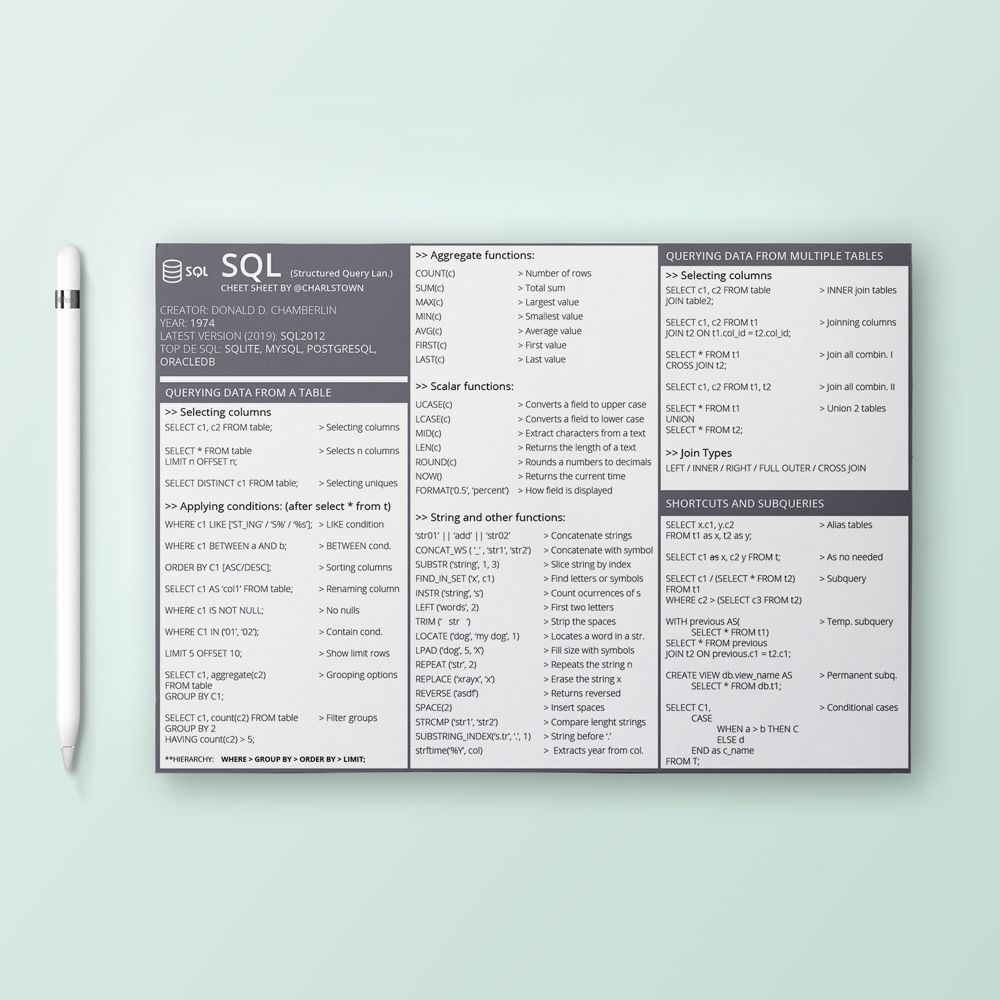
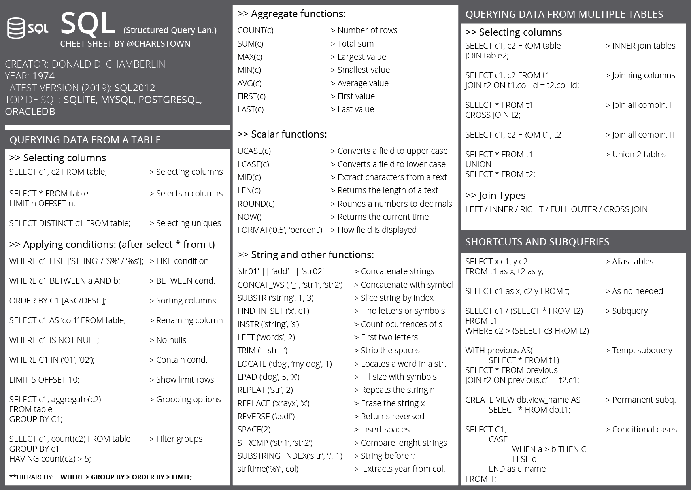

# SQL cheatsheet

{ .image-width-24 }

In this post I wanted to share some helpful codes I learned from SQL and my own SQL cheat sheet. As far as I learn more programming languages I'll create more cheat sheets, hope they'll be helpful.

---

## The SQL cheatsheet

{ .image-caption }

{ .image-caption }


[Download the cheatsheet](../../assets/docs/cheatsheet-sql.pdf){:download="Docker Cheatsheet" .md-button }


## Example scripts

Here are some SQL scripts to get a better understanding of the cheat sheet and its application.


### Python library sqlite 3

This way shows how to read SQL from python with the library sqlite3.

```python
import sqlite3
# creates de connection
conn = sqlite3.connect("factbook.db")

# you can create a Cursor object and call its execute() 
c = conn.cursor()

# write the query and call it
q = '''SELECT * FROM sqlite_master LIMIT 5;'''
c.execute(q)

```

This  other way shows how to call a query using pandas library and save it as a data frame.

```python
import sqlite3
import pandas
conn = sqlite3.connect("factbook.db")

q = "SELECT * FROM sqlite_master WHERE type='table';"
pd.read_sql_query(q, conn)
```


### Subqueries

This code shows how to use a subquery as a condition.


```sql
SELECT Major, Unemployment_rate FROM recent_grads
WHERE Unemployment_rate < (SELECT AVG(Unemployment_rate) FROM recent_grads)
ORDER BY Unemployment_rate;
```

In this code it's shown how to make multiples subqueries in different situations.


```sql
SELECT 
COUNT(CAST(ShareWomen AS float)) / (SELECT CAST(COUNT(ShareWomen) AS float) FROM recent_grads) AS proportion_abv_avg 
FROM recent_grads
WHERE ShareWomen > (SELECT AVG(ShareWomen) FROM recent_grads);
```


### Multiple tables Joins

This example shows how to join multiple tables by different keys applying some conditions.

```sql
SELECT t.track_id, t.name track_name, m.name track_type, t.unit_price, i.quantity FROM track t
JOIN invoice_line i ON i.track_id = t.track_id
JOIN media_type m ON t.media_type_id = m.media_type_id
WHERE i.invoice_id = 4;
```

*Picture retrieved from the SQL course www.dataquest.io*


The next code below shows a multi-join operation using subqueries and *group by* among others.

```sql
SELECT am.title album, a.name artist, i.tracks_purchased  FROM album am
JOIN (SELECT album_id, sum(quantity) as tracks_purchased FROM track t
JOIN invoice_line i ON t.track_id = i.track_id
GROUP BY album_id) i ON i.album_id = am.album_id
JOIN artist a ON a.artist_id = am.artist_id
ORDER BY i.tracks_purchased DESC
LIMIT 5;
```


### CASE, WITH and VIEW clauses

The *CASE* clause allows to create a temporal column modifying its content using conditionals. This example shows how to use *CASE* clause and join operations with subqueries.

```sql
SELECT
    (c.first_name || ' ' || c.last_name) customer_name,
    i.number_of_purchases,
    i.total_spent,
    CASE
        WHEN total_spent < 40 THEN 'small spender'
        WHEN total_spent >= 40 and total_spent <= 100 THEN 'regular'
        ELSE 'big spender'
    END customer_category
FROM customer c
JOIN (SELECT customer_id, SUM(total) total_spent, COUNT(invoice_id) number_of_purchases FROM invoice
      GROUP BY customer_id
```

The *WITH* clause creates a temporal subquery that can be used as another table. This example shows how to use *WITH* clause in a multi-join operation.

````sql
WITH customers_usa AS 
    (
        SELECT * FROM customer_usa
        INTERSECT
        SELECT * FROM customer_gt_90_dollars
    )
SELECT
    em.first_name || ' ' || em.last_name AS employee_name,
    COUNT(cusa.customer_id) customers_usa_gt_90
    FROM employee em
LEFT JOIN customers_usa cusa ON cusa.support_rep_id = em.employee_id
WHERE em.title = 'Sales Support Agent'
GROUP BY 1 ORDER BY 1;
````

The *VIEW* clause works as the *WITH* clause allowing to save the new table for other queries. The next example shows how to create a *VIEW* and call it after.

````sql
/* view creation */
CREATE VIEW chinook.customer_gt_90_dollars AS
    SELECT 
        c.*
    FROM customer c
    JOIN
        (
        SELECT customer_id, SUM(total) as total FROM invoice
        GROUP BY customer_id
        ) t ON t.customer_id = c.customer_id
    WHERE t.total > 90;

/* calling the view table */
SELECT * FROM chinook.customer_gt_90_dollars;
````

---

## OTHER LINKS

- Github repository: [cheatsheets](https://github.com/charlstown/CodeCheatsheets)
- A nice website to learn SQL: [https://www.codecademy.com/](https://www.codecademy.com/ "https://www.codecademy.com/")
- Another nice website to learn SQL: [https://www.dataquest.io/](https://www.dataquest.io/ "https://www.dataquest.io/")
- More resources like this here: [https://carlosgrande.me/category/resources](https://carlosgrande.me/category/resources "https://carlosgrande.me/category/resources")
