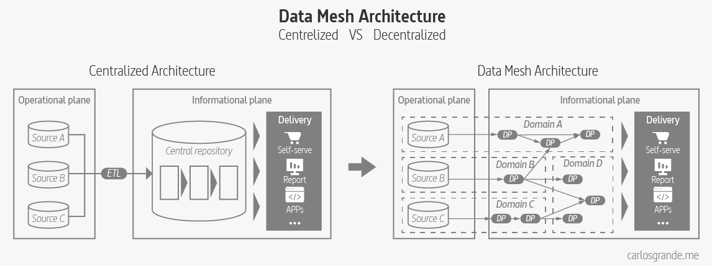
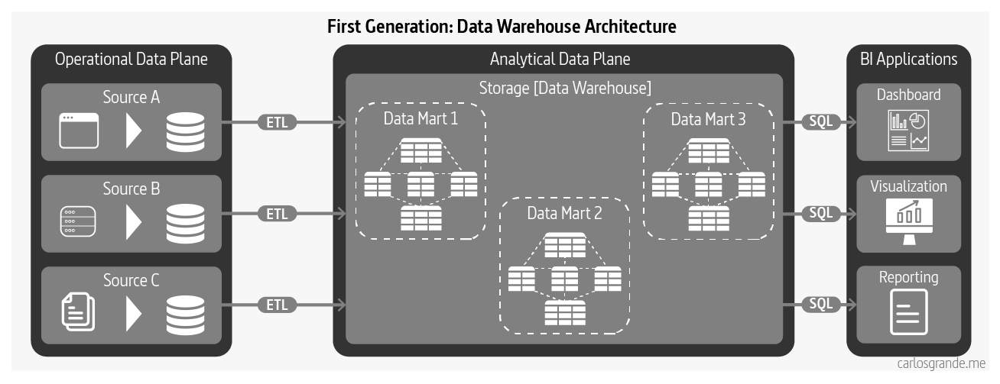
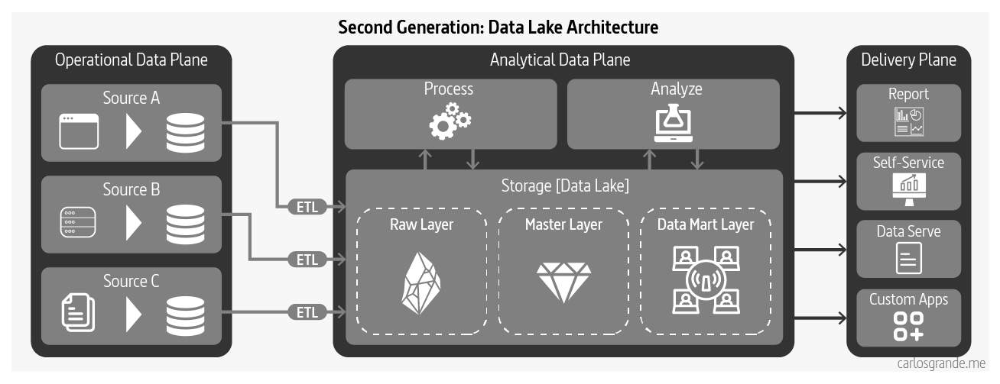
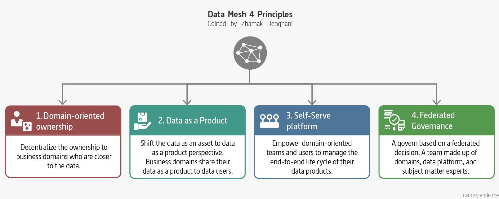

# My data mesh thesis

{ .image-width-24 }

I wanted to write a post with my thesis about the  **Data Mesh** paradigm coined by **Zhamak Dehghani**. To be honest, I’m still wondering what a Data Mesh is.

Looking at different articles, videos and talking to other people wondering the same thing, you realize some ideas differ considerably. It seems that the Data Mesh paradigm has some abstract ideas, and hence it has different interpretations. Although if I would like to say what a Data Mesh is in a short definition, I would pick the following:

> Data meshes are a decentralization technique of the ownership, transformation & serving of data. It is proposed as a solution for centralized architectures, where growth is limited by its dependencies and complexity.

{ .image-caption }

The goal of this article is to try and bring some clarity to all concepts associated with a **Data Mesh**, including an end to end storytelling with a thesis structure. This is just my public personal attempt to make sense of all the information I have found about this matter.

---

## 1. Context


### 1.1 First Generation: Data Warehouse Architecture

**Data warehousing architecture** today is **influenced by early concepts** such as facts and dimensions formulated **in the 1960s.** The architecture intends to flow data from operational systems to business intelligence systems that traditionally have served the management with operations and planning of an organization. While data warehousing solutions have greatly evolved, many of the original characteristics and assumptions of their architectural model remain the same. (Dehghani, 2022)

{ .image-caption }


### 1.2 Second Generation: Data Lake Architecture

Data lake architecture was introduced in 2010 in response to challenges of data warehousing architecture in satisfying the new uses of data; access to data based on data science and machine learning model training workflows, and supporting massively parallelized access to data. 

Unlike data warehousing, **data lake** assumes no or very little transformation and modeling of the data upfront; it attempts to **retain the data close to its original form.** Once the data becomes available in the lake, the architecture gets extended with elaborate transformation pipelines to model the higher value data and store it in lakeshore marts.

**This evolution** to data architecture **aims to improve** ineffectiveness and friction introduced by **extensive upfront modeling that data warehousing demands.** The upfront transformation is a blocker and leads to slower iterations of model training. Additionally, it alters the nature of the operational system’s data and mutates the data in a way that models trained with transformed data fail to perform against the real production queries. (Dehghani, 2022)

{ .image-caption }


### 1.3 Third Generation: Multimodal Cloud Architecture

The third and current generation data architectures are more or less similar to the previous generations, with a few modern twists:

- **Streaming for real-time** data availability with architectures such as Kappa
- Attempting to **unify the batch and stream processing** for data transformation with frameworks such as Apache Beam
- Fully **embracing cloud based managed services** with modern cloud-native implementations with isolated compute and storage
- **Convergence of warehouse and lake**, either extending data warehouse to include embedded ML training, e.g. Google BigQuery ML, or alternatively build data warehouse integrity, transactionality and querying systems into data lake solutions, e.g., Databricks Lakehouse

The third generation data platform is addressing some of the gaps of the previous generations such as real-time data analytics, as well as reducing the cost of managing big data infrastructure. However it suffers from many of the underlying characteristics that have led to the limitations of the previous generations. (Dehghani, 2022)

{ .image-caption }


## 2. Principles

There are four principles that can capture what supports the logical architecture and operating model of Data Mesh.

{ .image-caption }


### 2.1 Domain-oriented ownership

This principle **aim to decentralize the ownership of sharing analytical data to business domains who are closest to the data** — either are the source of the data or its main consumers. Decompose the data artefacts (data, code, metadata, policies) - logically - based on the business domain they represent and manage their life cycle independently. (Dehghani, 2022)


### 2.2 Data as a Product

This simply means **applying widely used product thinking to data** and, in doing so, making data a first-class citizen: supporting operations with its owner and development team behind it.

Existing or new business domains become accountable to share their data as a product served to data users – data analysts and data scientists. Data as a product introduces a new unit of logical architecture called, data product quantum, controlling and encapsulating all the structural components — data, code, policy and infrastructure dependencies — needed to share data as a product autonomously. (Dehghani, 2022)


### 2.3 Self-serve Data Platform

The principle of creating a self-serve infrastructure is to **provide tools and user-friendly interfaces so that generalist developers can develop analytical data** products where, previously, the sheer range of operational platforms made this incredibly difficult.

A new generation of self-serve data platform to empower domain-oriented teams to manage the end-to-end life cycle of their data products, to manage a reliable mesh of interconnected data products and share the mesh’s emergent knowledge graph and lineage, and to streamline the experience of data consumers to discover, access, and use the data products. (Dehghani, 2022)


### 2.4 Federated Computational Governance:

This is an inevitable consequence of the first principle. Wherever you deploy decentralised services—microservices, for example—it’s essential to introduce overarching rules and regulations to govern their operation. As Dehghani puts it, it’s crucial to "maintain an equilibrium between centralisation and decentralisation".

**A data governance operational model that is based on a federated decision** making and accountability structure, with a team made up of domains, data platform, and subject matter experts — legal, compliance, security, etc. It creates an incentive and accountability structure that balances the autonomy and agility of domains, while respecting the global conformance, interoperability and security of the mesh. The governance model heavily relies on codifying and automated execution of policies at a fine-grained level, for each and every data product. (Dehghani, 2022)


## 3. Data Mesh Architecture

### 3.1 Data Product

A **data product** consists of the **code** including pipelines, the **data** itself including metadata and the **infrastructure** required to run the pipelines. The goal is to have application code and data pipelines code under the same domain owned by the same team. As you can see, we are shifting responsibility to the people who actually understand the domain and create the data, instead of “data” owners in the data plane that usually struggle to understand the data and create friction between teams. This means that **the people who change the application and within the data, are in charge of owning that change** using schema versioning and documentation to broadcast the data evolution to the different stakeholders. This ensures that data schema changes can be implemented easily by the data creators instead of data analysts trying to adapt to changes after the fact.

**Data as a product inverts the model of responsibility** compared to the past paradigms. In data lake or data warehousing architectures the accountability to create data with expected quality and integrity resides downstream from the source; in the case of data warehouse the accountability remains with the warehouse team, and in the case of the lake it’s left with the consumers.

{ .image-caption }


### 3.2 Roles

The idea behind the **Domain Ownership** principle is to use **Domain Driven Design** in the data plane alongside the operational plane to close the gap between the two planes. The goal is to split teams around business domains being each team fully cross functional, but not only on the operational level (**DevOps**) but also on the analytical level. Each team should have a data owner, data engineers and QA teams that not only validate mircroservices but also data quality.

Following the Zhamak Dehghani book we find two specific key roles related to a data product domain:

- **Data product developer roles**: A group of roles responsible for developing, serving and maintaining the domain’s data products as long as the  data products remain to exist and serve its consumers. Data product developers will be working alongside regular developers in the domain. Each domain team may serve one or multiple data products.

  Key domain specific objects: 

  - Transformation code, the domain-specific logic that generates and maintains the
    data
  - Tests to verify and maintain the domain’s data integrity.
  - Tests to continuously monitor that the data product meets its quality guarantees.
  - Generating data products meta-data such as its schema, documentation, etc.

- **Data product owner**: A role accountable for the success of domain’s data products in delivering value, satisfying and growing the data consumers, and defining the lifecycle of the data products.

  Domain **data product owners must have a deep understanding of who the data users are**, how they use the data,and what are the native methods that they are comfortable with consuming the data. The conversation between users of the data and product owners is a necessary piece for establishing the interfaces of data products.

- **Data Mesh Architect**: A role responsible for the infrastructure team, with the big picture of the Data Mesh, ensuring the data is self-served and acting as the link between the infrastructure layer and the Federated Governance team.

Following the Data Mesh layer Architecture we would have three team types:

- **Data infrastructure teams** (located on the infrastructure plane): Providing the underliying infrastructure required to build, run and monitor data products.
- **Data Product teams** (located on the Data Product developer plane): Supporting the common data product developer journey. They are conformed by the Data Product Developer roles and a Data Product Owner.
- **Federated Computatinal Governance Team** (located on the mesh supervision plane): maintaining an *equilibrium between centralization and decentralization*; what decisions need to be localized to each domain and what decisions should be made globally for all domains.

In a data mesh, **each data product team is in charge of dealing with the data related to the team domain.** They must gather the data and move it to the right storage so it can be easily consume by data users. Data engineers will be part of the team and they may use stream engines to move the data and perform ETL or run data pipelines in a batch or micro batch fashion. The key is that a **data pipeline is simply an internal complexity** and implementation of the data domain and is handled internally within the domain instead of having separate data engineering teams.

On this next visualization, I tried to reflect the teams and roles involved in a Data Mesh. These roles are not exclusive, they may be conditioned by the company, the organizational structure, and the platform differing considerably, but **it's important to highlight the different layers and the teams to which they belong**.

{ .image-caption }


### 3.3 Self-Serve Platform

Data Mesh’s fourth principle, self-serve data infrastructure as a platform, exists. It is not that we have any shortage of data and analytics platforms and technologies, but we need to make changes to them so that they can scale out sharing, **accessing and using analytical data, in a decentralized manner**, for a new population of generalist technologists. This is the key differentiation of data platforms that enable a Data Mesh implementation.

We need **self-service data platforms** that can easily **scale and can be self provisioned**. Standard tooling is required to provide a good experience to data users. This includes monitoring, observability, security, etc. This is something indispensable in the OLTP world, but somehow it is often missing in the data world where lack of observability creates data quality issues and security vulnerabilities. Although tools were created to overcome these issues, they are focused on solving a specific problem using a new tool instead of reusing the concepts and tooling from the OLTP world. We are used to implement static code analysis, container image scanners, metrics, logs etc for our code, but checking the data and metadata for quality issues, generating change logs, lineage, etc is often missing in the OLAP world.

{ .image-caption }


### 3.4 Data Governance

A data mesh implementation requires a governance model that embraces decentralization, interoperability through global standardization, and an automated execution of decisions in the platform. The idea is to create a team to maintain an **equilibrium between centralization and decentralization**; that is what decisions need to be localized to each domain and what decisions should be made globally for all domains.

Data mesh’s federated governance, embraces change and multiple bounded contexts. A supportive organizational structure, incentive model and architecture is necessary for the federated governance model to function in order to arrive at global decisions and standards for **interoperability**, while respecting autonomy of local domains, and implement global policies effectively.

The idea is to **localize decisions as close to the source as possible** while keeping interoperability and integration standards at a global level, so the mesh components can be easily integrated. In a data mesh, tools can be used to enforce global policies such as GDPR enforcement or access management and also local policies where each domain sets its own policies for their data products such as access control or data retention.

| Pre Data Mesh Governance                                     | Data Mesh Governance                                         |
| ------------------------------------------------------------ | ------------------------------------------------------------ |
| Centralized team                                             | Federated team                                               |
| Responsible for data quality                                 | Responsible for defining how to model what constitutes quality |
| Responsible for data security                                | Responsible for defining aspects of data security i.e. data sensivity levels for the platform to build in and monitor automatically |
| Responsible for complying with regulation                    | Responsible for defining the regulation requirements for the platform to build in and monitor automatically |
| Centralized custodianship of data                            | Federated custodianship of data by domains                   |
| Responsible for global canonical data modeling               | Responsible for modeling polysemes, data elements that cross the boundaries of multiple domains |
| Team is independent from domains                             | Team is made of domains representatives                      |
| Aiming for a well defined static structure of data           | Aiming for enabling effective mesh operation embracing a continuously changing and dynamic topology of the mesh |
| Centralized technology used by monolithic lake/warehouse     | Self-serve platform technologies used by each domain         |
| Measure success based on number or volume of governed data (tables) | Measure success based on the network effect, the connections representing the consumption of data on the mesh |
| Manual process with human intervention                       | Automated processes implemented by the platform              |
| Prevent error                                                | Detect error and recover through platform's automated processing |


### 3.5 Data Mesh Architecture

There are many applied Data Mesh architectures, some are more decentralized than others, and we have different tools and services. Even though there isn't a Data Mesh architecture itself, we can define and relate their main components.

#### Storage

**Deep Store:** a Repository store to make data addressable using URLs, access control, versioning, encryption, metadata, and observability. Where you can easily monitor and govern the data stored in a data lake.

New modern engines have been created to be able to unify real time and batch data and perform OLAP queries with very low latency. As an example, Apache Druid can ingest and store massive amounts of data in a cost efficient way, minimizing the needs for data lakes.

**Data Warehouse / Data Virtualization:** A fast data layer in a relational database used for data analysis, particularly of historical data.

The main advantage of Data Virtualization is speed-to-market, where we can build a solution in a fraction of the time it takes to build a data warehouse.  This is because you don’t need to design and build the data warehouse and the ETL to copy the data into it, and also don’t need to spend as much time testing.

#### Stream engine platform

A stream engine platform such as Kafka or Pulsar to migrate to microservices and unify batch and streaming. This is the first step in order to close the gap between OLTP and OLAP workloads, both can use the streaming platform either to develop event driven microservices or to move data.

These platforms will allow you to duplicate the data in different formats or databases in a reliable way. This way you can start serving the same data in different shapes to match the needs of the downstream consumers.

#### Metadata and Data Catalogs

A collection of metadata, combined with data management and search tools, that helps analysts and other data users to find the data that they need, serves as an inventory of available data, and provides information to evaluate fitness data for intended uses.

#### Query Engines

This type of tools focus on querying different data sources and formats in an unified way. The idea is to query your data lake using SQL queries like if it was a relational database, although it has some limitations. Some of these tools can also query NoSQL databases and much more. Query engines are the slowest option but provide the maximum flexibility.

Some query engines can integrate with data catalogs and join data from different data sources.

{ .image-caption }


## 4. Data Mesh Implementation

Currently, we have many kinds of Data Meshes, some highly centralized and others more de-centralized. Migrating to a decentralized architecture is difficult and time consuming, it takes a long time to reach the right level of maturity to be able to run it at a scale. Although there are technical challenges, the main difficulty is trying to change the organization mindset.


### 4.1 Data Mesh Investment Factors

Data Mesh is difficult to implement because of the de-centralized nature, but at the end, it is required in order to solve the scalability issues that companies are currently facing. Centralized architectures work better for small companies or companies which are not data driven.

Only implement a data mesh if you have difficulties scaling, team friction, data quality issues, bottlenecks and governance/securities problems. You must also have a Big Data problem with huge amounts of structure and unstructured data.

In my opinion, to be able to decide if your company needs the Data Mesh paradigm, there are so many factors you should analyze before taking the step. That said, after reading different articles, there are three main factors to keep in mind:

- The **number of data sources** your company has to feed the analytical Data Platform.
- The **size of your data team**, how many data analysts, data engineers, and product managers.
- The number of **data domains** your company has. How many functional teams (marketing, sales, operations, etc.) rely on your data sources to drive decision-making, and how many products does your company have?

{ .image-caption }

There is an excellent article from **Barr Moses** about Data Mesh. She proposes a [simple calculation to determine if it makes sense for your organization to invest in a data mesh.](https://towardsdatascience.com/what-is-a-data-mesh-and-how-not-to-mesh-it-up-210710bb41e0)


### 4.2 Building a Data Mesh

In their blogs, Javier Ramos and Sven Balnojan have done an excellent job explaining the different steps required to build a data mesh. I really recommend checking their articles to get more details.

- [Data Mesh Applied by Sven Balnojan](https://towardsdatascience.com/data-mesh-applied-21bed87876f2)
- [Building a Data Mesh: A beginners guide by Javier Ramos](https://itnext.io/introduction-to-data-mesh-59e6f3a4c15e)

I have tried to summarize the different steps to decentralize your architecture and, start building a Data Mesh.

<div class="steps" markdown>

- Addressable data

    **Adress your data** by standardizing path names and using the REST approach to name the data products using resource names, and add SLAs to the end points and monitor them to make sure the data is always available.

    *Example:*
    ```bash
    s3://my-domain/data-service-a/resource/date.
    ```

    **Re route your query engines and BI tools** to use the new data products which are independent and addressable.

    The **data infrastructure team** will be in charge of this step, still using a centralized approach.  


- Discoverability (Metadata and Data Catalog)

    Create a space to find the new data source with the following capabilities:

    - **Search, discover and “add to the cart”** for data within your enterprise. 
    - **Request access and grant access to data products** in a way that is usable to data owners and consumers without the involvement of a central team.

    In this step, **work on the data product features** adding tests for data quality, lineage, monitoring, etc.


- Step 3 : Decentralize and implement DDD

    Now we can start adding nodes to our data mesh. 

    - **Migrate the ownership** into the domain team creating the data moving towards a de centralized architecture. Each team must own their data assets, ETL pipelines, quality, testing, etc.
    - **Introduce the federated governance** for data standardization,security and interoperability, by introducing DataOps practices and improving observability and self services capabilities. This way you can unify your OLTP and OLAP processes and tooling.

</div>

Once you have created your first “data microservice”, repeat the above process breaking the legacy data monolith into more decentralized services.


## 5. Case Studies

### 5.1 Zalando

An excellent presentation by Max Schultze and Arif Wider, about the Zalando analytics cloud journey. The presentation begins with their legacy analytics and how they manage to evolve this legacy from the ingestion, storage, and serving layer.

[:material-arrow-right: Data Mesh in Practice: How Europe's Leading Online Platform for Fashion Goes Beyond the Data Lake by Max Schultze (Zalando)](https://www.youtube.com/watch?v=eiUhV56uVUc)

### 5.2 Intuit

A great post from Tristan Baker about the followed strategy at Intuit. They have migrated from an on-premise architecture of centrally-managed analytics data sets and data infrastructure tools to a fully cloud-native set of data and tools. Tristan will take you through a full articulation of their vision, inherent challenges, and strategy for building better data-driven systems at Intuit.

[:material-arrow-right: Intuit’s Data Mesh Strategy](https://medium.com/intuit-engineering/intuits-data-mesh-strategy-778e3edaa017)

### 5.3 Saxo Bank

An outstanding post by Sheetal Pratik about the Saxo Journey. They show how they implement the Data Mesh paradigm and focus on the Governance Framework and Data Mesh architecture. The post has very clear diagrams to explain their points.

[:material-arrow-right: Enabling Data Discovery in a Data Mesh: The Saxo Journey](https://blog.datahubproject.io/enabling-data-discovery-in-a-data-mesh-the-saxo-journey-451b06969c8f)

### 5.4 JP Morgan Chase

An AWS blog co-authored with Anu Jain, Graham Person, and Paul Conroy from JP Morgan Chase.

They provide a blueprint for instantiating data lakes that implements the mesh architecture in a standardized way using a defined set of cloud services, we enable data sharing across the enterprise while giving data owners the control and visibility they need to manage their data effectively.

[:material-arrow-right: How JPMorgan Chase built a data mesh architecture to drive significant value to enhance their enterprise data platform](https://aws.amazon.com/es/blogs/big-data/how-jpmorgan-chase-built-a-data-mesh-architecture-to-drive-significant-value-to-enhance-their-enterprise-data-platform/)

### 5.5 Kolibri Games

A presentation by António Fitas, Barr Moses and, Scorr O'Leary. They talks about the evolution of teams on the data/engineering side as well as the pain points of their setup at that point, and discuss how to evaluate whether data mesh is right for a company and how to measure the return on investment of data mesh, especially the increase in agility and the increase in the number of decisions you deem "data driven".

[:material-arrow-right: Kolibri Games' Data Mesh Journey and Measuring Data Mesh ROI](https://www.youtube.com/watch?v=31BTUYaVSqw)

### 5.6 Netflix

A presentation by Justin Cunningham about the Keystone Platform’s unique approach to declarative configuration and schema evolution, as well as our approach to unifying batch and streaming data and processing covered in depth.

[:material-arrow-right: Malla de datos de Netflix: procesamiento de datos componibles - Justin Cunningham](https://www.youtube.com/watch?v=TO_IiN06jJ4)

### 5.7 Adevinta

An excellent post by Xavier Gumara Rigol, about how Adevinta evolved from a centralised approach to data for analytics to a data mesh by setting some working agreements.

[:material-arrow-right: Building a data mesh to support an ecosystem of data products at Adevinta](https://medium.com/adevinta-tech-blog/building-a-data-mesh-to-support-an-ecosystem-of-data-products-at-adevinta-4c057d06824d)

### 5.8 HelloFresh

In this blog, Clemence W. Chee describes their journey of implementing the Data Mesh principles by showing the different phases they have faced.

[:material-arrow-right: HelloFresh Journey to the Data Mesh](https://engineering.hellofresh.com/hellofresh-journey-to-the-data-mesh-7fe590f26bda)


## 6. Conclusion

Data Mesh isn't a static platform nor an architecture. **Data Mesh is a product continuously evolving**, and it may have different interpretations, but the core principles always remain. Domain-driven design, decentralization, data ownership, automation, observability, and federated governance.

The main important aspect, as Zhamak Dehghani mentions, is to stop thinking about data as an asset, like something we want to keep and collect. The new way of imaging the data should shift from an asset to a product. The moment we think about data as a product, we start delighting the experience of the consumers, **shifting the perspective from the producer collecting data to the producer serving the data.**

Start building a Data Mesh can be overwhelming. First, we need to understand this is an evolutionary path starting from your own company vision and introduce the Mesh principles slowly. We may start by **select two or three source-aligned use cases**, locating the domain working backwards from the use case to the sources and **empower those teams to start serving those data products**. Then, think about the **platform capabilities** we need and put the platform team in place to start building this first generation Data Mesh. Finally, we iterate with new use cases moving towards the Data Mesh vision.


## 7. Data Mesh Vocabulary

Data Mesh is a complex paradigm with many abstract terms. At the next table, I tried to extract the main vocabulary around this topic.


| Word                        | Definition                                                   |
| --------------------------- | ------------------------------------------------------------ |
| **Data Mesh**               | A data mesh is a set of read-only products, designed for sharing the data on the outside for non-real-time consumption/analytics.  They are shared in an interoperable way so you can combine data from multiple domains owned by each domain team. |
| **Data Domain**             | A business domain, where experts analyze data and build reports themselves, with minimal IT support. A data domain should create and publish their data as a product for the rest of the business to consume as well. |
| **Data Product**            | A Data Product is a collection of datasets concerning a certain topic which has risen to fulfill a certain purpose, yet which can support multiple purposes or be used as building block for multiple other data products. |
| **Data Product Owner**              | A role accountable for the success of domain’s data products in delivering value, satisfying and growing the data consumers, and defining the lifecycle of the data products. |
| **Data Mesh Architect**     | A role responsible for the infrastructure team, with the big picture of the Data Mesh, ensuring the data is self-served and acting as the link between the infrastructure layer and the Federated Governance team. |
| **Source-aligned domain**   | Analytical data reflecting the business facts generated<br/>by the operational systems. This is also called native data product. |
| **Aggregated domain**       | Analytical data that is an aggregate of multiple upstream domains. |
| **Consumer-aligned domain** | Analytical data transformed to fit the needs of one or multiple specific use cases and consuming applications. This is also called fit-for-purpose domain data. |
| **Inside data**             | Refers to the encapsulated private data contained within the service itself. As a sweeping statement, this is the data that has always been considered "normal"—at least in your database class in college. The classic data contained in a SQL database and manipulated by a typical application is inside data. |
| **Outside data**            | Data on the outside refers to the information that flows between these independent services. This includes messages, files, and events. It's not your classic SQL data. |
| **Architectural Quantum**   | Smallest unit of architecture that can be independently deployed with high functional cohesion, and includes all the structural elements required for its function. |
| **IDP**                     | Input data ports to the data product.                        |
| **ODP**                     | Output data ports from the data product.                     |


## 8. Discovery Roadmap

To elaborate this Thesis, I have been recollecting links and resources about the Data Mesh paradigm. I wanted to share the discovery path I've followed to understand the Data Mesh implications.

### 8.1 Zhamak Dehghani

- [How to Move Beyond a Monolithic Data Lake to a Distributed Data Mesh](https://martinfowler.com/articles/data-monolith-to-mesh.html)
- [Data Mesh Principles and Logical Architecture](https://martinfowler.com/articles/data-mesh-principles.html)
- [Introduction to Data Mesh: A Paradigm Shift in Analytical Data Management by Zhamak Dehghani (Part I)](https://www.starburst.io/resources/datanova-2021/?wchannelid=d4oyeh306b&wmediaid=1z50qr8fh6)
- [How to Build a Foundation for Data Mesh: A Principled Approach by Zhamak Dehghani (Part II)](https://www.starburst.io/resources/datanova-2021/?wchannelid=d4oyeh306b&wmediaid=3sb7nbjc7f)  


### 8.2 Introductory Content

- [Data Mesh Score calculator](https://towardsdatascience.com/what-is-a-data-mesh-and-how-not-to-mesh-it-up-210710bb41e0)
- [Decentralizing Data: From Data Monolith to Data Mesh with Zhamak Dehghani, Creator of Data Mesh](https://www.youtube.com/watch?v=-ubu2WjnJjw)
- [Data Mesh: The Four Principles of the Distributed Architecture by Eugene Berko](https://eleks.com/blog/data-mesh-distributed-architecture/)
- [How to achieve Data Mesh teams and culture?](https://futurice.com/blog/how-to-achieve-data-mesh-teams-and-culture) 
- [Decentralizing Data: From Data Monolith to Data Mesh with Zhamak Dehghani, Creator of Data Mesh](https://www.youtube.com/watch?v=-ubu2WjnJjw&t=2282s)


### 8.3 Deep Dive

- [Anatomy of Data Products in Data Mesh](https://docs.google.com/presentation/d/1XnQHYuVe9rxVs-kLLPTZhBBIhqNAhCu8U2T8mKrxZVA/edit#slide=id.ge4e19f328c_0_50)
- [Building a Data Mesh: A beginners guide](https://itnext.io/introduction-to-data-mesh-59e6f3a4c15e)
- [Data Mesh Applied: Moving step-by-step from mono data lake to decentralized 21st-century data mesh.](https://towardsdatascience.com/data-mesh-applied-21bed87876f2)
- [There’s More Than One Kind of Data Mesh: Three Types of Data Meshes](https://towardsdatascience.com/theres-more-than-one-kind-of-data-mesh-three-types-of-data-meshes-7cb346dc2819)
- [Building a successful Data Mesh – More than just a technology initiative](https://www.linkedin.com/pulse/building-successful-data-mesh-more-than-just-nazia-shahrin/)
- [How the \**ck (heck) do you build a Data Mesh?](https://cinchy.tv/all-content/799)
- [Data Mesh architecture patterns](https://towardsdatascience.com/data-mesh-architecture-patterns-98cc1014f251)
- [Data Mesh: Topologies and domain granularity](https://towardsdatascience.com/data-mesh-topologies-and-domain-granularity-65290a4ebb90)


## Acknowledgements

I am so grateful to **[Data Mesh Learning Community](https://datameshlearning.com/)** founded and run by Scott Hirleman. I appreciate the help from the community, the meetups, and the resources published and organized. It has been a great point to start researching for this thesis.

I also wanted to acknowledge all the authors from my sources for sharing their knowledge.

---

## References and links

- Dehghani, Z. *Data Mesh: Delivering Data-Driven Value at Scale* (1st ed.). O’Reilly.
- [Data Mesh Learning Community](https://datameshlearning.com/)
- [Building a Data Mesh: A beginners guide](https://itnext.io/introduction-to-data-mesh-59e6f3a4c15e)
- [What is a Data Mesh and How Not to Mesh it Up](https://towardsdatascience.com/what-is-a-data-mesh-and-how-not-to-mesh-it-up-210710bb41e0)
- [More Resources like this here](https://carlosgrande.me/#resources-cheatsheets/)