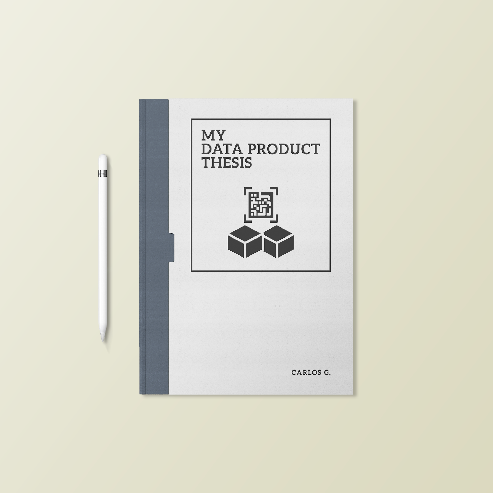
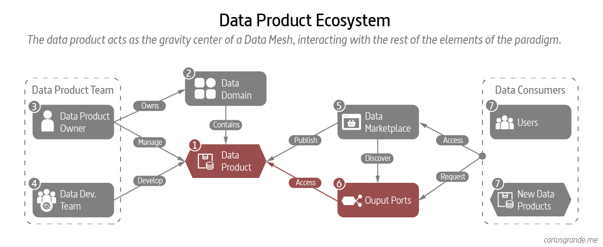
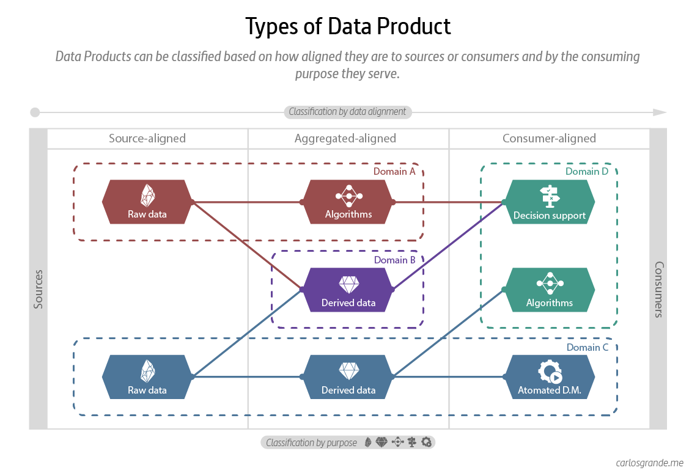
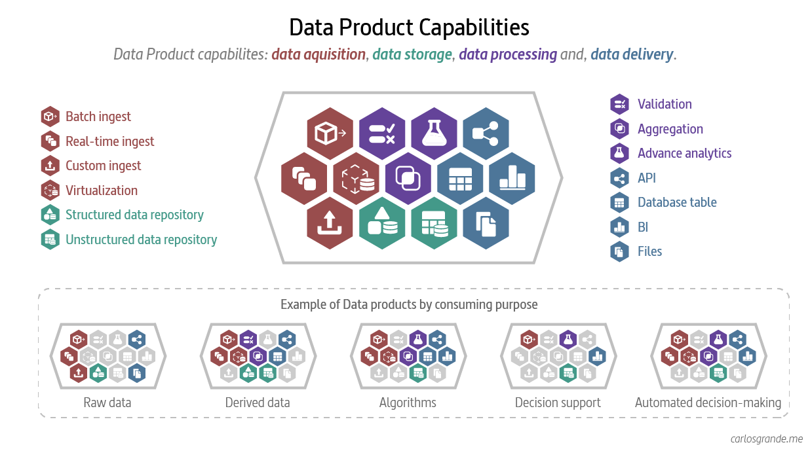

# My data product thesis

{ .image-width-24 }

After the good reception of the [My Data Mesh Thesis](my-data-mesh-thesis.md) article, I wanted to go down a bit into the detail of the central component of the Data Mesh paradigm, the Data Product.

During the Data Mesh presentations we had in my company, I realized that the concept of data product was not completely understood. The Data Mesh paradigm was well understood, but when we focused on the data product, questions arose about whether it was a set of tables,  infrastructure or a Data Lake on a smaller scale.

With this post I intend to focus on the Data Product within the Data Mesh paradigm to clarify its mission, architecture and scope.

---

## 1. What is a Data Product

When we think of data in an analytical context, we imagine a set of tables in a repository, which has gone through a cleaning process guaranteeing quality and value to its consumers.

On the other hand, if we think of a product, we understand a product as a set of characteristics and attributes that a buyer accepts to satisfy some needs.

But how can we treat data as a product?
If we try to think of data as a product, we can establish a series of assumptions:

- The type of product will be intangible.
- Your buyer will be a consumer.
- You always have to add value or respond to a need.
- It will have some attributes that define and limit it.
- The distribution channel will be direct and online.
 
If we review these five assumptions and look for a simile in the market, we find business models based on eCommerce through a managed marketplace such as (Amazon, eBay, Etsy, etc.). To apply this simile in a data context, we must abandon the conception of data as a set of tables and start thinking of data as a product under a name, with defined attributes, exposed through a platform and that a consumer accepts with quality and value.

> **A data product is a collection of datasets, metadata, code, and policies concerning a certain topic and serving a certain purpose in a self-serve manner. Even though, it can support multiple purposes or be used as a building block for multiple other data products.**

## 2. Architecture of a Data Product

Data as a product introduces a new unit of logical architecture called, data product quantum, controlling and encapsulating all the structural components — data, metadata, code, policy and infrastructure dependencies — needed to share data as a product autonomously. (Dehghani, 2022)

A Data product is the smallest unit of architecture that can be independently deployed with high functional cohesion, and includes all the structural elements required for its function.

> **From an architectural point of view, we can divide a data product in five components: the product, the input ports, the control ports, the discovery ports, and the output ports.**

**The product**: is the core building block conformed by a collection of datasets, metadata, code, and policies concerning a certain topic and supported by the platform. It is the product with a value and quality itself.

**The input ports:** the receiving mechanism for data that will constitute the data product. The input ports define the format and protocol in which data can be read. We distinguish here between operational source systems and other data products, which might be either internal or coming from other domains.

**The control ports:** Monitoring, logs, metrics to manage and observe the data product and the public and self-description (ownership, organizational unit, license, version, expiration date, etc.) of the Data Product reachable through the marketplace.

**The output ports:** define the format and consumption protocol in which data can be exposed. For example, the output port can be a database table, file, API, or reports. It can be accessed to a final consumer or by multiple other data products.

{ .image-caption }

## 3. Data Products in a Data Mesh ecosystem

The data product (1) is the most important independent unit of the Data Mesh paradigm. To get a better understanding of what it means, we must comprehend the elements interacting within the Data Mesh ecosystem. Recall that a data product belongs within a domain (2) where we can find other data products (7). Besides, a data product is managed by a Data Product Owner (3) and maintained and developed by a data product developer team (4). It is common to find a team of developers across multiple domains and data products, but there should always be a single data product owner per domain.

Regarding its relationship with consumers (7), the data product is related to them through a marketplace (5) where they are published to be discovered. Once a consumer has located the data product that interests him, he can request access to the output ports (6) available in the data product.

{ .image-caption }

## 4. Types of Data Products

There isn't just one type of data product, as each data product may have different requirements and capabilities. We can classify them based on how aligned they are to consumption or origins and by the purpose they serve.

### 4.1 Classification by data alignment

Compared to traditional architectures, the Data Mesh paradigm does not seek a "Single Source of Truth." It is essential to consider that in a Data Mesh architecture, the concept of the golden record is discarded in order to provide data domains that are independent of each other and publish their fully interoperable data products. In this way, data products break the silos of traditional architectures and can be more or less aggregated.

- **Source-aligned:** Analytical data reflecting the business facts generated by the operational systems. This is also called native data product.
- **Aggregated:** Analytical data that is an aggregate of multiple upstream data products.
- **Consumer-aligned:** Analytical data transformed to fit the needs of one or multiple specific use cases and consuming applications. This is also called fit-for-purpose data.

### 4.2 Classification by consuming purpose

Simon O'Regan makes a great classification of data product typologies based on their purpose. In this article Designing Data Products by Simon O'Regan, you can see in-depth this classification of types of data products. 

- **Raw data:** exposed data as it is in the operational systems with small processing or cleansing steps, most of the processing work is done on the consumer's side.
- **Derived data:**  data exposed after being processed and enriched on the platform side.
- **Algorithms:** data run through an algorithm returning information or insights.
- **Decision support:** data exposed as relevant information in an easy-to-digest format to the consumer to help them with decision-making. (dashboards, reports, etc.)
- **Automated decision-making:** Here we outsource all of the intelligence within a given domain, allowing the algorithm to do the work and present the user with the final output. (E.g.: Netflix product recommendations or Spotify’s Discover Weekly).

{ .image-caption }

## 5. Designing a Data Product

In my experience the best way to design a data product is through its capabilities. Data products, after all, are published to serve different use cases and therefore do not have a fixed structure. They can respond to batch, streaming, advanced analytics, reporting needs or even be a mix of the above.

Following this approach, one of the best ways I have found to design a data product is by dividing its capabilities into its three levels of data life cycle: data aquisition, data Processing and, data delivery.

### 5.1 Data acquisition

Data acquisition is the process of acquiring data for immediate use or storage in a repository.

Data can be streamed in real time, ingested in batches or virtualized. In real-time data ingestion, each data item is imported as the source emits it. When data is ingested in batches, data items are imported in discrete chunks at periodic intervals of time. When data is virtualize, data is organized in a logical layer across the disparate systems.

**Capabilities:**

- Batch ingest
- Real-time ingest
- Virtualization

### 5.2 Data storage

Data storage is the retention of information using technology specifically developed to keep that data and have it as accessible as necessary. A data store is a repository for persistently storing and managing collections of data.

**Capabilities:**

- Structured data repository
- Unstructured data repository

### 5.3 Data processing

Data processing is the collection and manipulation of data to produce meaningful information.

**Capabilities:**

- Validation
- Aggregation
- Advance analytics

### 5.4 Data delivery

Data delivery is the process of sharing data as a product to a consumer or another Data Product.

**Capabilities:**
- API
- Database table
- BI (Reporting, dashboards and visualizations)
- Files

{ .image-caption }

## 6. Identifying a Data Product

A great approach to start identifying data products is to introduce the principle of the data domain, selecting those domains with use cases close to the origins where your data is produced (orders, customers, suppliers, products, etc.) After unlocking these use cases by giving them an address and a directory, we allow consumers to discover them.

There are several publications that discuss in depth how data products should be identified. I recommend leaning on these three publications:

- [**Thoughtworks:**](https://www.thoughtworks.com/insights/articles/data-mesh-in-practice-product-thinking-and-development) the Thoughtworks publication explains the difference between a data asset and a data product and proposes a template to define the scope of a data product.
- [**Agilelab**](https://www.agilelab.it/how-to-identify-data-products-welcome-data-product-flow/): the Agilelab team identifies data products by analyzing business processes. In their article they show Alberto Brandolini's Event Storming technique and his Data Product Flow methodology.
- [**INNOQ:**](https://www.datamesh-architecture.com/data-product-canvas) the INOQ team proposes a canvas to define a data product. The proposed canvas is suitable for working collaboratively on data products design.

## 7. Data as a Product

Data products are “the smallest unit of architect that can be independently deployed and managed.” In the book Data Mesh, Delivering Data-Driven Value at Scale, Zhamak Dehghani says that Data Products are “discoverable, understandable, trustworthy, addressable, interoperable, and composable, secure, natively accessible, and valuable on its own”. She is applying widely used product thinking to a data domain.

- **Discoverable**: a centralized discoverability service allowing data consumers to discover all available data products with their meta information such as their owners, source of origin, lineage, sample datasets, etc.
- **Understandable:** they can be independently discovered, understood and consumed.
- **Addressable:** a unique address following a global convention that helps its users to programmatically access it.
- **Secure:** Data products ensure that all data is secure both at-rest and in-motion, applying access control policies centrally but applied at the time of access to each individual dataset product.
- **Interoperable:** the ability to correlate data across domains following certain standards and harmonization rules.
- **Trustworthy:** the owners of the data products must provide an acceptable Service Level Objective around the truthfulness of the data. The target value or range of a data integrity (quality) indicator vary between domain data products.
- **Natively accessible:** access to the discoverability service is open and native to potential consumers throughout the organization.
- **Self-valuable:** data products must have a value on their own without dependencies on other data products.

### 7.1 Product thinking in practice

Product thinking is the journey from the problem space of the users to the solution space of the business. The goal of this journey is to reduce the gap between users and the business. 

When I talk at work about serving data as a product, I like to start with an example like the one in the image below. We can see an amazon product on the front of its marketplace, with which we are all familiar. From this point, if we translate Dehgani's product thinking principles into this example, we can see how each of them fits with the way Amazon offers its products.

{ .image-caption }

### 7.2 Serving data as a product

As a first exercise, we can reconfigure the Amazon product delivery screen, but rethinking how it would be in a data marketplace. When solve this exercise we discover a screen similar to this one.
 
> **The heart of a data product is how data is served to consumers, from discovery to consumption. The goal is to reduce the gap between consumers and data.**

{ .image-caption }

## 8. Data product domain model

The core idea behind the data mesh concept: Domain-oriented decentralization for analytical data. A data mesh architecture enables domain teams to perform cross-domain data analysis on their own and interconnects data, similar to APIs in a microservice architecture. The domain teams own and know their domain, including the information needs of the business. They ingest, process, analyze and deliver data on their own.

While domains reside in a logical dimension, data products reside in a technical one aligned with platform capabilities. Being separated into two different dimensions allows data products to be self-contained and interoperable, permitting domains to grow and change over the life of the platform.

> **Data domains are high level categories of data based on a logical grouping of items of interest to the organization, or areas of interest within the organization. A domain where experts analyze data and build reports themselves, with minimal IT support. A data domain should create and publish their data as a product for the rest of the business to consume as well.**

{ .image-caption }

## 9. Conclusion

To conclude, I would like to emphasize that a Domain and a Data Product are two components of the Data Mesh paradigm that work on different planes. While the Domain is a logical category at the organization level, the data product is a product with technical and infrastructure dependencies. In my experience, when we talk about the data product, we must consider the platform and the technologies we use when defining its scope. On the other hand, the data domain resides at a much higher level and is not limited by these decisions.

I would also like to comment that ussually we approach Data Mesh as if it were a migration. In my belief, it's a mistake to come it in this way since a radical change is not necessary at all levels of the organization. It is better to proceed with developing a product with an agile methodology allowing you to take small but valuable steps. You can start generating the first decentralized domain, with an owner and a federated government to publish the first data product. In this way, more and more data products can be federated and pivoted toward the Data Mesh model that best fits our organization. 

To finish, let us remember that the final objective of the Data Product is to reduce the gap between the data and its consumers. We shouldn't value the Data Product for its content (the data), the principal value of a Data Product lies in its delivery and in the way in which it is received by its consumers. 

## 10. Terminology

At the next table, I tried to extract the main vocabulary about Data Products.

| Term | Definition |
|------|------------|
| **Data Domain** | Data domains are high level categories of data based on a logical grouping of items of interest to the organization, or areas of interest within the organization. |
| **Data Product** | It is a collection of datasets, metadata, code, and policies concerning a certain topic and serving a certain purpose in a self-serve manner. |
| **Input data ports** | Ports as receiving mechanism for data that will constitute the data product. The input ports define the format and protocol in which data can be read.  |
| **Control data ports** | Ports to provide monitoring, logs, metrics to manage and observe the data product and the public and self-description of the Data Product reachable through the marketplace. |
| **Output data ports** | Ports to define the format and consumption protocol in which data can be exposed. |
| **Source-align** | Data product with analytical data reflecting the business facts generated by the operational systems. |
| **Aggregated-align** | Data product with analytical data that is an aggregate of multiple upstream data products. |
| **Consumer-align** | Data product with analytical data transformed to fit the needs of one or multiple specific use cases and consuming applications. |
| **Data acquisition** | It is the process of acquiring data for immediate use or storage in a repository. |
| **Data processing** | Data processing is the collection and manipulation of data to produce meaningful information. |
| **Data storage** | Data storage is the retention of information using technology specifically developed to keep that data and have it as accessible as necessary. |
| **Data delivery** | Data delivery is the process of sharing data as a product to a consumer or another Data Product |
| **Product thinking** | Product thinking is the journey from the problem space of the users to the solution space of the business. The goal of this journey is to reduce the gap between users and the business. |

---

## References and links

- [My Data Mesh Thesis](https://carlosgrande.me/my-data-mesh-thesis/)
- [Designing Data Products by INNOQ](https://www.datamesh-architecture.com/data-product-canvas)
- [Designing Data Products: The 15 faces of Data Products are a little bit different.](https://towardsdatascience.com/designing-data-products-b6b93edf3d23) 
- [The Anatomy of a Data Product](https://towardsdatascience.com/the-anatomy-of-a-data-product-d3140f068311) 
- [Data as a product vs data products. What are the differences?](https://towardsdatascience.com/data-as-a-product-vs-data-products-what-are-the-differences-b43ddbb0f123)
- [Applying Data Mesh principles to an IoT data architecture](https://www.acagroup.be/en/blog/applying-data-mesh-principles-to-an-iot-data-architecture/)
- [The Fundamentals of Building Better Data Products](https://www.mindtheproduct.com/fundamentals-building-better-data-products/#:~:text=As%20I%20see%20it%20there,products%2C%20and%20data%20as%20insight.) 
- [Product Thinking 101 by Naren Katakam](https://uxplanet.org/product-thinking-101-1d71a0784f60)
- [More Resources like this here](https://carlosgrande.me/#resources-cheatsheets/)
