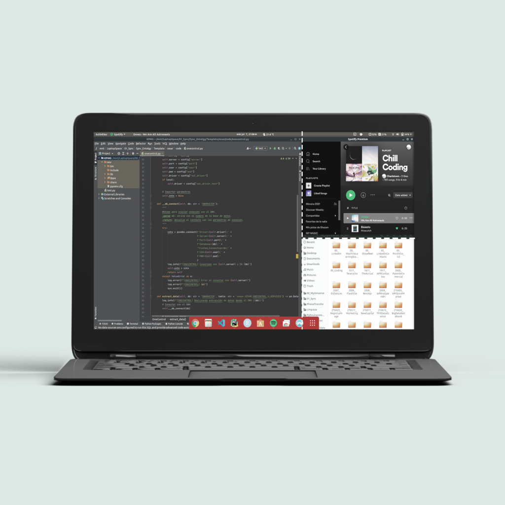

# Screen splitter

{ .image-width-24 }

With this post, I would like to show my best screen splitters for Windows and Linux. A screen splitter helps me to organize my windows and tasks on the screen, and be more productive. It takes some time to get used to it, but once you get to it, they are your best allies and you could never go back to a regular screen.

## My favorite Screen Splitter for windows

**Big Thanks to @IvanYu** for developing this stunning windows desktop screen splitter, and give it for free!!

You can download this software from [here](http://https://www.ivanyu.ca/#/windock/ "here").

Sometimes we don't have admin rights to install software. So for these occasions, you can download the portable version [here](https://www.ivanyu.ca/windock-portable).

WinDock is easy to use. Follow these steps to design your ideal configuration.

1. Create a **new profile** and activate it.
2. **Add rules** using specific corners, edges, or areas.
3. **Snap your windows** against your selected regions and enjoy.

{ .image-caption }

## My favorite Screen Splitter for Ubuntu

**Big Thanks to @negesti** for developing this stunning Ubuntu desktop screen splitter, and give it for free!!

You can download this software from [here](https://extensions.gnome.org/extension/39/put-windows/ "here").

PutWindows is more complicated to configure. It works by three defined sizes that will be used when you move a window to the same direction multiple times or using numeric commands like **start + number**. The number refers to a position on your screen. Once the rules are created it is so intuitive. Follow these steps to design your ideal configuration.

1. Go to section **Width & Height**.
2. Select the **three positions for each direction** N, S, E, W.
3. Go to section **Keyboard Shortcuts**.
4. **Customize your own triggered commands** and enjoy.

{ .image-caption }

## My daily windows profile

My daily configurations are two, the first one (A) divides a third of the screen and half of the third. The second one (B) divides the screen into three columns.

**Configuration A:** Allows me to focus on one main window while I have two auxiliary windows for uses like Spotify, the internet, or open directories.

**Configuration B:** Allows me to work in parallel with three windows. It is very efficient for comparing files and multitask works.

[My Daily configurations](../../assets/images/resources/screen-splitter-fav-configuration.png)

---

## References and links
- [Ivan Yu personal site.](https://www.ivanyu.ca/)
- [Ivan Yu Github.](https://github.com/ivanme)
- [PutWindows Github](https://github.com/negesti/gnome-shell-extensions-negesti)
- [Negesti Github](https://github.com/negesti)
- [More Resources](https://carlosgrande.me/category/resources/)