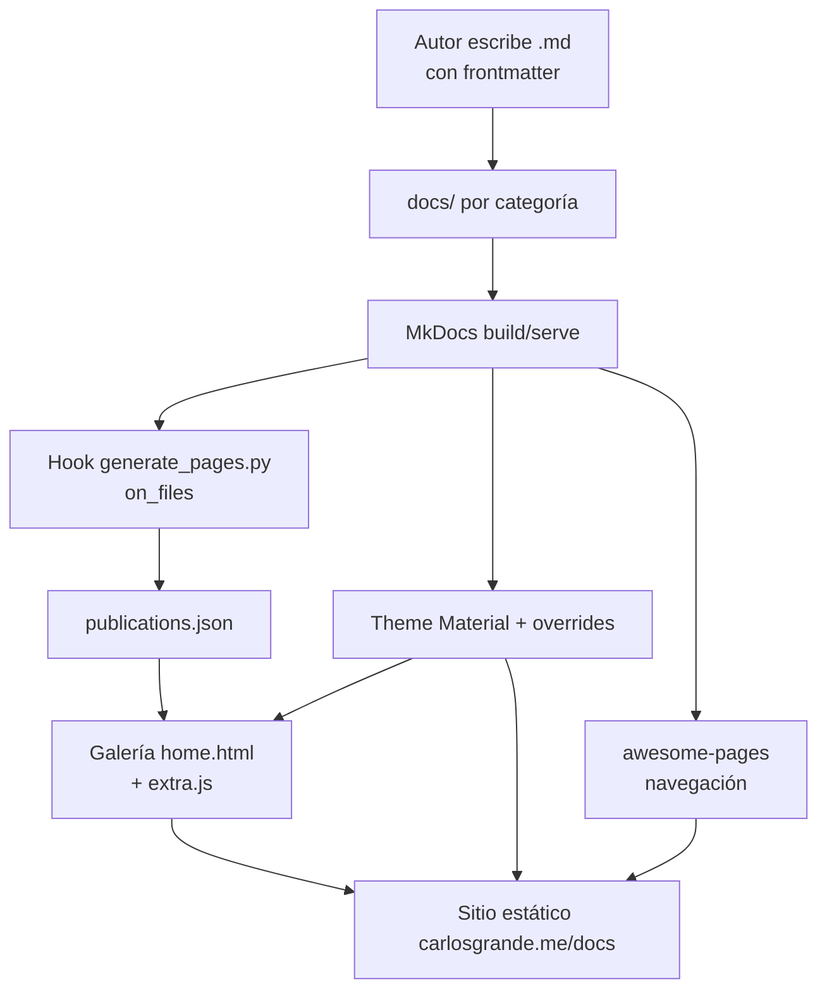

# ProductSpec — carlosgrande.me/docs

> [!abstract] Metadata
> | | |
> |---|---|
> | **Status** | 🟡 Draft |
> | **Owner** | Carlos Grande (@Charlstown) |
> | **Created** | 2026-06-13 |
> | **Updated** | 2026-06-13 |
> | **Version** | v0.1 |

---

## 🎯 Vision

Un sitio de documentación personal —el *cheat sheet* de vida de Carlos Grande— donde notas, proyectos, referencias y recursos sobre coding, data architecture, data science, visualización y business se publican como Markdown y se descubren a través de una galería que se genera sola.

---

## 🔥 Problem Statement

| Pain | Root Cause |
|------|-----------|
| El conocimiento técnico personal (apuntes, cheatsheets, proyectos) queda disperso en notas privadas y nunca se hace público ni reutilizable | No existe un canal propio de publicación con baja fricción; cada plataforma externa impone su formato y su ritmo |
| Mantener un índice o portfolio actualizado a mano es tedioso y se desincroniza del contenido real | El listado de publicaciones y el contenido viven separados, sin una fuente de verdad común |
| Publicar una nota nueva suele exigir tocar navegación, índices y plantillas | Falta de convenciones: cada pieza de contenido se trata como un caso especial |
| Un lector que llega al sitio no tiene una forma visual y ordenada de explorar qué hay disponible | Sin una galería ordenada por fecha y categoría, el contenido permanece oculto en la jerarquía de carpetas |

---

## 👤 Target User

- 🎯 **Primary — Carlos Grande (autor / curador)**: publica notebooks, cheatsheets, proyectos y referencias como su base de conocimiento pública. Escribe en Markdown, quiere que publicar sea tan simple como añadir un archivo con frontmatter.
- 👥 **Secondary — Visitantes / lectores técnicos**: personas que descubren el sitio buscando recursos de data, coding, visualización o business y exploran la galería de publicaciones.
- 🌍 **Stretch — Contribuidores externos**: terceros que, siguiendo las guías de `contributing.md`, podrían proponer correcciones o contenido vía pull request.

---

## 💎 Design Principles

- **Content-first / baja fricción** — Añadir un `.md` con su frontmatter en la carpeta de categoría correcta debe bastar para publicar. Si publicar requiere tocar navegación o índices, algo está mal diseñado.
- **Convención sobre configuración** — La estructura de carpetas (`notebooks/`, `projects/`, `references/`, `resources/`) y el frontmatter estandarizado (`short_title`, `date`, `thumbnail`) gobiernan el comportamiento. No hay casos especiales por pieza de contenido.
- **Automatización del descubrimiento** — La galería y el índice de publicaciones se derivan automáticamente del frontmatter en tiempo de build; nunca se mantiene un listado a mano que pueda desincronizarse.
- **Estética Material consistente** — Todo el contenido respeta el theme Material, su paleta (negro + teal, light/dark) y un tono/formato uniforme entre categorías, para que la experiencia sea coherente independientemente de quién o cuándo se escribió.

---

## 🏗️ Architecture



- **Contenido (`docs/`)** — Fuente de verdad de todo lo publicado, en Markdown con frontmatter. No contiene lógica; solo contenido y assets.
- **MkDocs + plugins** — Orquesta el build del sitio estático. No define el contenido ni el estilo visual final; solo ensambla.
- **Hook `generate_pages.py`** — En el evento `on_files`, recorre las páginas de contenido y emite `publications.json` con título, fecha, categoría, link y thumbnail. No renderiza HTML ni decide navegación; solo produce el índice de datos.
- **`publications.json`** — Índice de datos consumido por la galería. No es editado a mano; es un artefacto regenerable.
- **Theme Material + `overrides/`** — Aporta layout, paleta y plantillas personalizadas (home, about-me, hero). No genera datos de contenido.
- **Galería (`home.html` + `extra.js`)** — Renderiza visualmente las publicaciones leyendo `publications.json`. No conoce la jerarquía de carpetas; solo consume el índice.
- **`awesome-pages`** — Resuelve la navegación a partir de la estructura de carpetas. No toca el contenido ni la galería.

---

## 🛠️ Interfaces

El producto no expone APIs ni CLIs propias: las "interfaces" son los puntos de contacto del autor y del lector con el sistema.

### Publicar contenido (autor)

Crear un archivo Markdown bajo la carpeta de categoría correspondiente, con el frontmatter requerido. El build lo recoge automáticamente.

| Param | Type | Default | Description |
|-------|------|---------|-------------|
| `short_title` | string | ✳️ required | Título corto mostrado en la galería; si falta, se usa el primer `# H1` |
| `description` | string | `none` | Descripción (placeholder por convención) |
| `date` | date `YYYY-MM-DD` | ✳️ required | Fecha de publicación; ordena la galería (descendente) |
| `thumbnail` | path | ✳️ required | Imagen de portada relativa a `docs/` para la galería |

!!! warning "Efecto de build"
    Al guardar y reconstruir, `generate_pages.py` reescribe `docs/assets/publications.json`. Es un artefacto generado: no editarlo a mano.

### Categorías de contenido (autor)

Cada categoría es una carpeta bajo `docs/` y determina el agrupado en la galería y la navegación.

| Categoría | Carpeta | Uso |
|-----------|---------|-----|
| **Notebooks** | `docs/notebooks/` | Apuntes técnicos (coding, data science, data architecture, business) |
| **Projects** | `docs/projects/` | Proyectos y aplicaciones propias |
| **References** | `docs/references/` | Artículos y case studies de referencia |
| **Resources** | `docs/resources/` | Cheatsheets, plantillas, tools, thesis |

### Explorar el sitio (lector)

- **Home / Galería** — Lista visual de publicaciones ordenadas por fecha, con thumbnail, título y categoría.
- **Navegación por pestañas** — Acceso por categoría vía `navigation.tabs` del theme.
- **Búsqueda** — Buscador integrado del theme (`search.suggest`, `search.highlight`).
- **About me** — Página personal del autor (`overrides/about-me.html`).

---

## ⚙️ Configuration

La configuración vive en `mkdocs.yml` (estructura, theme, plugins, extensiones) más variables globales en su bloque `extra`. No hay `.env` ni secretos en este proyecto estático.

| Variable | Default | Description |
|----------|---------|-------------|
| `site_name` | `carlosgrande.me` | Nombre del sitio, usado por el hook para construir links |
| `repo_url` | `https://github.com/charlstown/carlos-grande-me` | Repositorio del proyecto |
| `theme.palette` | black / teal (light+dark) | Paleta Material con toggle claro/oscuro |
| `extra.links.self-host` | `url` | Variable global expuesta vía `markdownextradata` (placeholder) |
| `extra.links.learning-host` | `url` | Variable global expuesta vía `markdownextradata` (placeholder) |

> Mínimo para arrancar: con `mkdocs.yml` presente y las dependencias de `requirements.txt` instaladas, `mkdocs serve` levanta el sitio sin configuración adicional.

---

## 🩺 Operations

### Healthcheck

- **Local**: `python -m mkdocs serve -w overrides` debe arrancar el servidor de desarrollo y servir en `http://127.0.0.1:8000` sin errores en consola.
- **Build**: `mkdocs build` debe completar generando `site/` y un `docs/assets/publications.json` actualizado con `version` igual a la fecha del build.
- **Señal de éxito**: la galería del home muestra las publicaciones más recientes ordenadas por fecha.

### Logging

- El build de MkDocs emite a stdout/stderr (capturados en `mkdocs_out.txt` / `mkdocs_err.txt` cuando se redirige).
- Los hooks personalizados (`generate_pages.py`, `ignore_file_autoreload.py`) no implementan logging propio: errores de parseo de frontmatter o de fechas se propagan como excepciones del build.
- No hay niveles de log configurables más allá del verbosity nativo de MkDocs (`--verbose`).

---

## 📦 Deliverables

| Deliverable | Description |
|:-----------:|-------------|
| 💻 **Source code** | Sitio MkDocs: `docs/` (contenido + assets), `hooks/`, `overrides/`, `mkdocs.yml` |
| 🌐 **Sitio estático** | Salida `site/` publicada en carlosgrande.me/docs |
| 🖼️ **Galería de publicaciones** | `publications.json` generado + `home.html` + `extra.js` |
| 📚 **README** | Descripción, instalación y uso (`README.md`) |
| 🤝 **Guías de contribución** | `contributing.md`, `code_of_conduct.md`, `LICENSE` |
| 🤖 **Vault de specs/tooling** | `.claude/` (skills, agentes, comandos) y `specs/` para el flujo de trabajo asistido |

---

## 🗂️ Project Structure

> [!abstract]- File tree
> ```
> carlos-grande-me-docs/
> ├── docs/
> │   ├── index.md                 # Home (template home.html)
> │   ├── about-me.md              # Página About me
> │   ├── notebooks/               # Apuntes (business, coding, data-architecture, data-science)
> │   ├── projects/                # Proyectos propios
> │   ├── references/              # articles + case-studies
> │   ├── resources/               # cheatsheets, templates, thesis, tools
> │   └── assets/                  # images, stylesheets, javascripts, publications.json
> ├── hooks/
> │   ├── generate_pages.py        # Genera publications.json (evento on_files)
> │   └── ignore_file_autoreload.py# Evita recargas infinitas en serve
> ├── overrides/                   # Plantillas Material personalizadas
> │   ├── home.html · about-me.html · main.html
> │   └── partials/hero.html · toc-item.html
> ├── specs/                       # Specs del proyecto (este vault)
> ├── .claude/                     # Skills, agentes y comandos del autor
> ├── mkdocs.yml                   # Configuración del sitio
> ├── requirements.txt             # Dependencias Python
> ├── CLAUDE.md                    # Reglas para agentes IA
> ├── contributing.md · code_of_conduct.md · LICENSE
> └── README.md
> ```

Estado actual del contenido: **12** notebooks · **4** projects · **13** references · **17** resources.

---

## 🚫 Out of Scope

- **Backend dinámico / base de datos** — El sitio es estático generado por MkDocs; no hay servidor de aplicación ni persistencia en runtime.
- **Comentarios, cuentas o interacción de usuarios** — No se gestiona estado del visitante; la experiencia es de solo lectura.
- **CMS / editor visual** — La autoría es por Markdown directo; no se construye una interfaz de edición.
- **Multidioma** — Todo el contenido es en inglés (regla de `CLAUDE.md`); no hay i18n.
- **Edición manual de `publications.json`** — Es un artefacto generado; modificarlo a mano está fuera del modelo.

---

## 🔮 Future

- **Filtros y tags en la galería** — Permitir filtrar publicaciones por categoría o etiqueta más allá del orden por fecha.
- **Feed RSS / sitemap enriquecido** — Aprovechar `publications.json` para exponer un feed de novedades.
- **Métricas de lectura** — Analítica ligera respetuosa con la privacidad sobre qué contenido se consume.
- **Plantillas de contenido por categoría** — Scaffolding asistido (vía skill `new-post`) consolidado para cada tipo de publicación.

---

## ❓ Discovery

- [ ] ¿La rama de publicación es `develop` → `main`, o el deploy sale directamente de `main`? (afecta a las reglas de `CLAUDE.md` / `contributing.md`)
- [ ] ¿`extra.links.self-host` y `learning-host` deben apuntar a URLs reales o son placeholders permanentes?
- [ ] ¿El "vault" de `.claude/` (skills/agentes) cuenta como parte versionada del producto o como tooling local del autor?
- [ ] ¿Se desea un criterio formal de "definition of done" para una publicación (thumbnail obligatorio, longitud mínima, revisión)?
