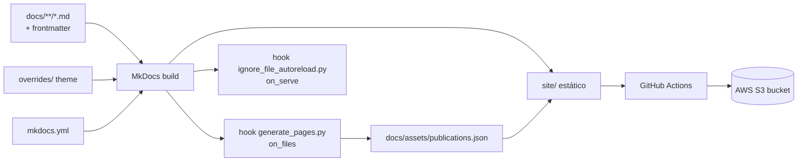
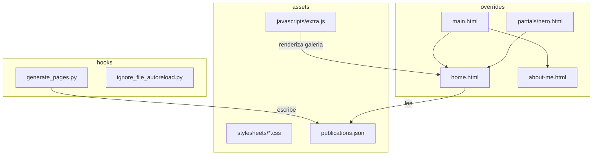
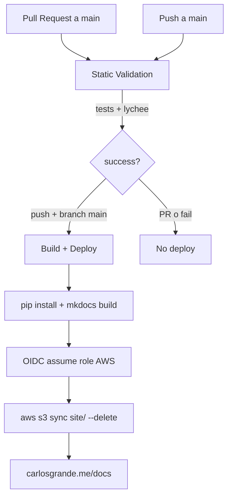

> [!abstract] Metadata
> | | |
> |---|---|
> | **Status** | 🟡 Draft |
> | **Owner** | Carlos Grande (@Charlstown) |
> | **Created** | 2026-06-13 |
> | **Updated** | 2026-06-13 |
> | **Version** | v0.1 |
> | **ProductSpec** | [[ProductSpec]] |

## 📌 Scope

Este documento describe el cómo técnico del sitio de documentación estático carlosgrande.me/docs: su stack MkDocs Material, los hooks de build que generan el índice de publicaciones, el theme personalizado y el pipeline de CI/CD que despliega a AWS S3. El qué y el porqué viven en [[ProductSpec]]. Quedan fuera de este TechSpec la infraestructura AWS no versionada en el repo (CloudFront, DNS, IAM más allá de lo referenciado por los workflows) y el contenido editorial de las páginas.

## 🧱 Tech Stack

| Componente | Tecnología | Versión | Rationale |
|------------|------------|---------|-----------|
| Generador de sitio | MkDocs | sin pin (badge README: 1.4) | Generador estático Markdown, estándar para docs |
| Theme | mkdocs-material | sin pin | Theme con galería, búsqueda, light/dark y navegación por tabs |
| Extensiones Markdown | pymdown-extensions | sin pin | Admonitions, tabs, superfences (Mermaid), arithmatex (KaTeX) |
| Variables globales | mkdocs-markdownextradata-plugin | sin pin | Expone `extra:` de `mkdocs.yml` dentro del Markdown |
| Navegación | mkdocs-awesome-pages-plugin | sin pin | Deriva la navegación desde la estructura de carpetas |
| Lightbox galería | mkdocs-glightbox | sin pin | Zoom/lightbox de imágenes |
| Parsing frontmatter | PyYAML | sin pin | Lectura de frontmatter en `generate_pages.py` |
| Runtime build (CI) | Python | 3.9 (CI) | Versión fijada en `actions/setup-python` del workflow |
| Math rendering | KaTeX | v0 (CDN unpkg) | Render de fórmulas vía `arithmatex` + KaTeX desde CDN |
| Testing JS (dev) | Vitest + jsdom | vitest ^2.1.8 · jsdom ^25.0.1 | Tests unitarios de componentes JS del cliente (p. ej. `ReadingProgress`) en entorno jsdom |
| Testing E2E (dev) | Playwright | @playwright/test ^1.49.0 | Tests end-to-end de galería y reading-progress en navegador real |

> [!tip] Dependencias de runtime directas
> `mkdocs` · `mkdocs-material` · `pymdown-extensions` · `mkdocs-markdownextradata-plugin` · `mkdocs-awesome-pages-plugin` · `mkdocs-glightbox` · `pyyaml`. Ninguna está pinneada en `requirements.txt`: el build resuelve siempre la última versión compatible (ver [[#📐 ADRs (Architecture Decision Records)|ADR-002]]).

## 🏗️ Module Design

### Topología de build y deploy



### Grafo de módulos de la aplicación



#### `hooks/generate_pages.py` — Generador del índice de publicaciones
Recorre las páginas de contenido en el evento `on_files` y emite `docs/assets/publications.json` con id, src, categoría, link, título, fecha y thumbnail, ordenado por fecha descendente. La escritura está protegida por un guard de hash MD5: solo sobreescribe el fichero si el contenido nuevo difiere del existente, evitando que el watcher de MkDocs detecte un cambio espurio y dispare un bucle infinito de live-reload.

#### `hooks/ignore_file_autoreload.py` — Watcher de overrides en serve
Añade un watch explícito de `overrides/` durante `mkdocs serve` sin mutar internals del servidor para no romper el live reload.

#### `overrides/` — Theme Material personalizado
Plantillas que sobrescriben el theme base: `home.html` (galería), `about-me.html`, `main.html` (que además sobreescribe el bloque `content` para inyectar la fecha de publicación sobre el H1) y `partials/hero.html`, `partials/toc-item.html`, `partials/post-date.html` (componente de fecha de publicación, condicionado a `page.meta.date`).

#### `docs/assets/javascripts/extra.js` — Render de la galería en cliente
Anima y pinta las tarjetas de publicaciones en el home a partir de los datos de `publications.json`.

#### `docs/assets/javascripts/components/ReadingProgress.js` — Barra de progreso de lectura
Componente cliente (clase ESM con `mount/update/destroy` y guard `isPostPage`) que pinta una línea fina fija bajo el header midiendo el scroll sobre `article.md-content__inner`. Se inicializa desde `docs/assets/javascripts/reading_progress.js` (entry `type: module`, registrado en `extra_javascript`) y se estila en `docs/assets/stylesheets/reading_progress.css`. Solo se monta en páginas de post. La fecha de publicación, en cambio, se resuelve en build (Jinja) vía `overrides/partials/post-date.html` + `docs/assets/stylesheets/post-date.css`.

#### `mkdocs.yml` — Configuración del sitio
Define theme, paleta, extensiones Markdown, plugins, hooks, assets y variables globales (`extra:`).

## 🔄 Integration Mapping

| Operación interna | Método | Servicio externo | Notas |
|-------------------|--------|------------------|-------|
| Deploy del sitio (prod) | `aws s3 sync site/ s3://$S3_BUCKET --delete` | AWS S3 | Hosting estático desde `main`; `--delete` purga ficheros obsoletos |
| Deploy de preview (dev) | `mkdocs gh-deploy --force --remote-branch gh-pages` | GitHub Pages | Preview/staging desde `dev`; sirve desde la rama `gh-pages` / raíz (`/`) |
| Credenciales de deploy | `configure-aws-credentials@v4` (OIDC) | AWS IAM (GitHub OIDC) | Asume rol `role/<AWS_ROLE_NAME>` sin claves estáticas |
| Validación de enlaces | `lycheeverse/lychee-action@v2` | Hosts externos enlazados | Comprueba links en `docs/**/*.md` y `overrides/**/*.md` |
| Render de fórmulas | `<script>` CDN | unpkg.com (KaTeX v0) | CSS y JS de KaTeX cargados desde CDN en runtime de página |
| Iconos/emojis | build-time | twemoji (Material) | Generados a SVG en build, sin llamada en runtime |

> [!warning] Comportamientos no obvios
> El sync a S3 usa `--delete`: cualquier objeto en el bucket que no esté en `site/` se elimina. La validación de enlaces (lychee) está configurada con `fail: false` y solo anota warnings, nunca bloquea el deploy. La CDN frente a S3 (CloudFront) no está versionada en el repo: *TBD*.

## ⚠️ Error Handling

### Errores esperados

| Fuente | Error | Acción | Descripción |
|--------|-------|--------|-------------|
| `generate_pages.py` | Frontmatter YAML inválido | Excepción de build | `yaml.safe_load` lanza y MkDocs aborta el build |
| `generate_pages.py` | `date` ausente o mal formada | Orden inconsistente | El sort tolera `date is None` empujándolo al final; formato erróneo puede romper el orden |
| MkDocs build | Plantilla/override inválida | Build falla | Error de Jinja en `overrides/` detiene el build |
| CI lychee | Enlace roto | Warning anotado | `fail: false`: no bloquea, solo anota `::warning` |
| CI deploy | Credenciales OIDC inválidas | Job falla | `configure-aws-credentials` aborta si el rol no asume |

### Propagación

Al ser un sitio estático no hay propagación de errores en runtime hacia un usuario final: los errores se manifiestan en tiempo de build (consola de MkDocs / logs de GitHub Actions). Un build fallido en `Static Validation` impide que se dispare `Build + Deploy` (dependencia `workflow_run` con `conclusion == 'success'`).

## 🩺 Healthcheck

- **Local**: `python -m mkdocs serve -w overrides` arranca en `http://127.0.0.1:8000` sin trazas de error.
- **Build**: `python -m mkdocs build` completa generando `site/` y un `docs/assets/publications.json` con `version` igual a la fecha del build.
- **Producción**: el sitio responde en carlosgrande.me/docs y la galería del home muestra las publicaciones recientes. *No hay endpoint `/health` propio* (hosting estático).

## 📋 Logging

No hay librería de logging dedicada. La observabilidad se apoya en:

| Evento | Nivel | Campos |
|--------|-------|--------|
| Build MkDocs | INFO/WARNING | stdout/stderr (capturable en `mkdocs_out.txt` / `mkdocs_err.txt`) |
| Hooks Python | — | Sin logging propio; errores como excepciones |
| CI Static Validation | GitHub Actions log | Resultado de tests + warnings de enlaces lychee |
| CI Unit Tests (`unit-tests.yml`) | GitHub Actions log | Resultado de `npm test` (Vitest) en push/PR |
| CI Build Smoke (`build-smoke.yml`) | GitHub Actions log | Salida de `mkdocs build --strict` en PR a `main` |
| CI E2E (`e2e.yml`) | GitHub Actions log | Resultado de `npm run test:e2e` (Playwright) en release/milestone |
| CI Deploy | GitHub Actions log | Salida de `aws s3 sync` |

El verbosity se controla con flags nativos de MkDocs (`--verbose`).

## 🧪 Testing Strategy

### Unit Tests

| Módulo | Qué se testea | Mock/stub |
|--------|---------------|-----------|
| `ReadingProgress` (`tests/unit/reading-progress.test.js`) | `isPostPage` (exclusión de home/about/índices, detección de post real), `mount`/`update` (0% en posts cortos, clamp a 100%) | jsdom: `window.scrollY`, `window.innerHeight` y geometría del contenido |
| `Gallery` (`tests/unit/gallery.test.js`) | Render de tarjetas de publicaciones a partir de `publications.json` | jsdom: DOM del home y datos de publicaciones |
| `FilterMenu` (`tests/unit/filter-menu.test.js`) | Filtrado de publicaciones por categoría en la galería | jsdom: DOM del menú de filtros |
| `LazyLoader` (`tests/unit/lazy-loader.test.js`) | Carga diferida de imágenes/recursos de la galería | jsdom: `IntersectionObserver` y nodos de imagen |

### E2E Tests

Suite end-to-end con Playwright que ejerce el sitio en un navegador real (Chromium) levantando un `mkdocs serve` como `webServer` (config en `playwright.config.js`). Se ejecuta con `npm run test:e2e` (→ `playwright test`):

| Spec | Qué se testea |
|------|---------------|
| `tests/e2e/gallery.spec.js` | Render y comportamiento de la galería del home en navegador real |
| `tests/e2e/reading-progress.spec.js` | Barra de progreso de lectura sobre una página de post real |

### Integration Tests

Los unit tests corren ahora en su propio workflow dedicado `unit-tests.yml` (`on: [push, pull_request]`), no solo embebidos en `Static Validation`. El workflow `Static Validation` sigue detectando tests (pytest o `npm test`) y ejecutándolos si existen; la verificación se completa con build correcto + validación de enlaces con lychee. Los hooks Python (`generate_pages.py`) aún no tienen tests.

### Tools

- **Framework unitario**: Vitest + jsdom para JS (config en `vitest.config.js`, script `npm run test`). El `include` está acotado a `tests/unit/**` y `exclude` los e2e, de modo que Vitest solo corre la suite unitaria. pytest para los hooks Python sigue *TBD*.
- **Framework E2E**: Playwright (config en `playwright.config.js`, script `npm run test:e2e`) sobre Chromium, con `mkdocs serve` como `webServer`.
- **Build estricto**: `npm run test:build` → `mkdocs build --strict`, que convierte los warnings de build en fallo.
- **Validación de enlaces**: `lycheeverse/lychee-action@v2` sobre `docs/**/*.md` y `overrides/**/*.md`.
- **Cobertura**: sin target definido.

## 🔌 Deployment



Comando de build (CI):

```bash
python -m pip install --upgrade pip
pip install -r requirements.txt
python -m mkdocs build
```

### Workflows de CI

Además de `Static Validation` y `Build + Deploy`, el repo incluye tres workflows de testing:

- `unit-tests.yml` — corre `npm test` (Vitest) en cada `push` y `pull_request`.
- `build-smoke.yml` — corre `mkdocs build --strict` en `pull_request` contra `main`, fallando ante cualquier warning de build.
- `e2e.yml` — corre `npm run test:e2e` (Playwright) en eventos de `release` (`published`) y `milestone` (`closed`).

### Deploy de preview a GitHub Pages desde `dev`

Independiente del deploy de producción a S3 (`main`), el workflow `deploy-dev-ghpages.yml` publica un preview/staging en GitHub Pages en cada `push` a `dev`. Ejecuta `mkdocs gh-deploy --force --remote-branch gh-pages`, que construye el sitio y lo empuja a la rama `gh-pages`. GitHub Pages sirve desde el origen rama `gh-pages` / raíz (`/`); esta configuración del origen es un paso manual de una sola vez en los ajustes del repo (Settings → Pages → branch `gh-pages`, carpeta `/`). El flag correcto es `--remote-branch gh-pages` (no `--branch`).

### Environment variables (secrets de GitHub Actions)

| Variable | Propósito |
|----------|-----------|
| `AWS_ACCOUNT_ID` | Construye el ARN del rol a asumir vía OIDC |
| `AWS_ROLE_NAME` | Nombre del rol IAM asumido en el deploy |
| `AWS_REGION` | Región de AWS para las credenciales |
| `S3_BUCKET_NAME` | Bucket destino del `s3 sync` |

### Local development

```bash
pip install -r requirements.txt
python -m mkdocs serve -w overrides
```

## 📦 Dependencies

Runtime (`requirements.txt`, sin pin de versión):

```
mkdocs
mkdocs-material
pymdown-extensions
mkdocs-markdownextradata-plugin
mkdocs-awesome-pages-plugin
mkdocs-glightbox
pyyaml
```

Dev:

```
# package.json (devDependencies): vitest ^2.1.8, jsdom ^25.0.1,
#   @playwright/test ^1.49.0
# CI usa: actions/checkout@v4, actions/setup-python@v5 (py3.9),
# actions/setup-node@v4 (node 20),
# aws-actions/configure-aws-credentials@v4, lycheeverse/lychee-action@v2
```

Las actualizaciones de las propias GitHub Actions están automatizadas por Dependabot (`.github/dependabot.yml`): version updates semanales del ecosistema `github-actions`, con `target-branch: dev` y `commit-message.prefix: "[update]"`.

## 📐 ADRs (Architecture Decision Records)

### ADR-001: Índice de publicaciones generado por hook en build

**Decision**: Generar `publications.json` con un hook `on_files` de MkDocs en lugar de mantener el listado a mano o con un plugin externo.
**Context**: Se necesitaba una fuente de datos para la galería derivada del frontmatter real. Alternativas: editar un JSON manualmente (se desincroniza) o usar un plugin de blog. Un hook propio da control total sobre el formato y el filtrado por categoría.
**Consequences**:
- (+) El índice nunca se desincroniza del contenido; cero mantenimiento manual.
- (+) Formato a medida consumible por `extra.js`.
- (-) Lógica de parsing propia que mantener (frontmatter, fechas, categorías).
- Mitigación: el hook es pequeño y aislado en `hooks/generate_pages.py`.

### ADR-002: Dependencias sin pin de versión

**Decision**: `requirements.txt` lista las dependencias sin fijar versión.
**Context**: Prioriza recibir siempre las últimas mejoras de mkdocs-material sin mantenimiento de pins.
**Consequences**:
- (+) Builds siempre actualizados sin tocar el repo.
- (-) Riesgo de rotura por cambios incompatibles aguas arriba; builds no reproducibles.
- Mitigación: `Static Validation` corre en cada push/PR a main antes del deploy.

### ADR-003: Hosting estático en S3 con OIDC, sin claves estáticas

**Decision**: Desplegar con `aws s3 sync` autenticando vía GitHub OIDC asumiendo un rol IAM.
**Context**: Evitar almacenar claves AWS de larga vida como secretos. Alternativas: claves IAM estáticas (más riesgo) o GitHub Pages (menos control sobre dominio/infra).
**Consequences**:
- (+) Sin secretos de credenciales de larga vida en el repo.
- (+) Control total del bucket y del dominio.
- (-) Requiere configurar el trust de OIDC en IAM fuera del repo.

> [!note] Actualización
> S3 sigue siendo el deploy de producción (desde `main`). Adicionalmente, la rama `dev` usa GitHub Pages como entorno de preview/staging vía `deploy-dev-ghpages.yml` (ver [[#🔌 Deployment]]); no reemplaza a S3 en producción.

### ADR-004: Deploy disparado por `workflow_run` encadenado

**Decision**: `Build + Deploy` se ejecuta solo tras el éxito de `Static Validation` en push a `main`.
**Context**: Garantizar que no se despliega contenido sin pasar validación, y no desplegar en PRs.
**Consequences**:
- (+) Gate de calidad antes de publicar.
- (-) Acoplamiento entre dos workflows; un fallo de orquestación puede impedir el deploy.

## ⚠️ Known Limitations

- Sin pin de versiones: builds no totalmente reproducibles (tradeoff de ADR-002).
- Cobertura de tests parcial: existe suite unitaria JS (Vitest) para componentes del cliente, pero los hooks Python (`generate_pages.py`) siguen sin tests; la validación de contenido se limita a build + comprobación de enlaces.
- La validación de enlaces no bloquea (`fail: false`): se pueden publicar enlaces rotos como warnings.
- Inconsistencia documentada entre el flujo de ramas (`contributing.md`/`CLAUDE.md` indican trabajar desde `develop`) y el CI. Matiz: ya no es estrictamente cierto que el CI solo despliegue desde `main` — existe un deploy de preview a GitHub Pages desde `dev` (`deploy-dev-ghpages.yml`), aunque el deploy de producción a S3 sigue saliendo de `main`.
- La capa CDN/dominio frente a S3 no está versionada en el repo.

## ❓ Discovery

- [ ] ¿Conviene pinnear versiones (o usar un lockfile) para builds reproducibles, o se mantiene el modelo siempre-última?
- [ ] ¿El deploy de producción debe seguir saliendo de `main` o alinearse con el flujo `develop → main` de las guías? (Ya existe un preview en GitHub Pages desde `dev`.)
- [ ] ¿Hay CloudFront u otra CDN frente a S3 que deba documentarse aquí o en un infra-spec aparte?
- [ ] ¿Se adopta pytest para testear los hooks (`generate_pages.py`), dado que `Static Validation` ya lo ejecutaría?
- [ ] ¿La validación de enlaces debería pasar a bloqueante (`fail: true`) en algún momento?
